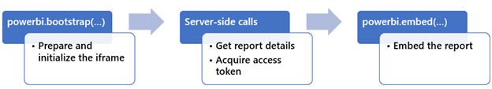
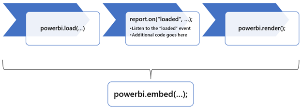

You can use two techniques to optimize the embedding experience: *Bootstrap* and *Phased embedding*.

## Use bootstrap

Achieve faster embedding performance by using the `powerbi.bootstrap(embedContainer, config)` function. This function prepares and initializes the `iframe` element before all required configuration parameters are set. The `powerbi.embed(embedContainer, config)` function should be called once all configuration parameters are set.

The following code shows how to prepare and initialize the `iframe` element for a Power BI report.

```javascript
powerbi.bootstrap(embedContainer, { type: 'report' });
```

Consider using bootstrap when your app's web page first loads. While that happens, server-side calls retrieve the Power BI content details and access token. When the server-side calls complete, embed the Power BI content.

> [!div class="mx-imgBorder"]
> 

> [!NOTE]
> It's not possible to use the bootstrap function when embedding paginated reports.

For more information, see [Use bootstrap for better performance](/javascript/api/overview/powerbi/bootstrap-better-performance/?azure-portal=true).

## Use phased embedding

When the Power BI content to embed is on a different page of your app, there's an alternative technique to speed up embedding and improve the user experience.

> [!NOTE]
> When embedding on the *same page*, we recommend the bootstrap technique (described earlier) because it's faster.

Use the `powerbi.preload(config)` function to pass in a minimal configuration object comprising only the `type` and `embedUrl` properties. The `embedUrl` value should be a base URL, meaning it doesn't need a specific artifact ID. Preloading helps speed up embedding by downloading the scripts required to embed Power BI content before the user navigates to the page.

```javascript
// Building the configuration object
let config = {
    type: 'report',
    embedUrl: 'https://app.powerbi.com/reportEmbed',
};

let element = powerbi.preload(config);
```

The `preloaded` event fires when the preload is complete

```javascript
element.on('preloaded', function () {
    ...
});
```
Use the `powerbi.load(embedContainer, config)` function to dynamically change the settings in the `div` element before the content is displayed. For example, you can use this function to get information about the report pages and then determine which page to show to the user. If you use this function, you must also call the `powerbi.render()` function to show the embedded content.

Together, the `load` and `render` functions achieve the same result as the `embed` function.

> [!div class="mx-imgBorder"]
> 

Although you must use the `load` and `render` functions together, `preload` is independent of them. You can use the `embed` function to show the embedded object after preload. You can also utilize the full-phased procedure by calling `preload`, `load`, and `render`, in that order.

For more information, see [Use phased embedding](/javascript/api/overview/powerbi/phased-embedding/?azure-portal=true).

For other optimization topics, see [Best practices for faster performance in Power BI embedded analytics](/power-bi/developer/embedded/embedded-performance-best-practices/?azure-portal=true).