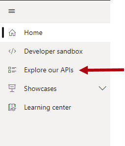
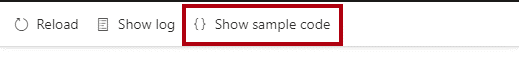
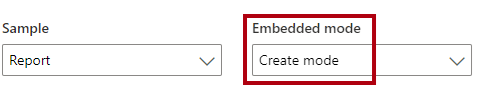

Power BI reports are the most commonly embedded content type because of the large number of visual types (including AI and custom visuals) and interactive features.

You can embed a Power BI report in three different modes:

-   Embed an existing Power BI report
-   Edit an embedded report
-   Embed a new Power BI report

For each mode, you can set many configuration object properties to specify precisely how the app presents the report. The `type` property of the configuration object is always set to **report**.

## Embed an existing report

When embedding an existing report, use a configuration object of type `IReportLoadConfiguration`. In addition to the required properties (described in Unit 1), your app can set the following optional properties.

-   `contrastMode` and `theme` - Optional. Control the theme and contrast level that your embedded content uses. By default, any content that you embed appears with the default theme and with zero contrast. You can override this behavior by configuring a specific theme or contrast level. For more information, see [Themes and high-contrast mode](/javascript/api/overview/powerbi/configure-report-settings?azure-portal=true#themes-and-high-contrast-mode).
-   `pageName` - Optional. Controls which page of the embedded report appears initially. When not set, it will open the selected page when the author last saved the report.
-   `filters` - Optional. Sets filter state. Consider setting filter state based on the app context, perhaps to filter by the sales region of the app user. For more information, see [Control report filters](/javascript/api/overview/powerbi/control-report-filters/?azure-portal=true).
-   `slicers` - Optional. Like filters, it's possible to set slicer state. For more information, see [Control report slicers](/javascript/api/overview/powerbi/control-report-slicers/?azure-portal=true).
-   `bookmark` - Optional. Apply a specific [bookmark](/power-bi/consumer/end-user-bookmarks/?azure-portal=true).
-   `datasetBinding` - Optional. Connects the report to a different dataset that defines the data schema that the embedded report connects to. For more information, see [Bind datasets dynamically to a report](/javascript/api/overview/powerbi/bind-report-datasets/?azure-portal=true).
-   `permissions` - Optional. Grants operations that the user can do. Operation options include create, view, edit, save, or save a copy of the report. Editing and creating reports is covered later in this unit.
-   `viewMode` - Optional. Determines whether the report opens in view mode (default) or edit mode. As described above, your app must grant edit permissions to enable edit mode.
-   `settings` - Optional. Adjusts the appearance and behavior of the report. You can show and expand open panes to work with bookmarks, fields, filters, page navigation, selection, sync slicers, or visualizations. You can also set the [layout type to mobile view](/javascript/api/overview/powerbi/mobile/?azure-portal=true), or set locale settings, which specify the language and formatting of the report. For more information, see [Customize settings](/javascript/api/overview/powerbi/configure-report-settings?azure-portal=true#customize-settings).

> [!NOTE]
> In many instances, it's possible to change settings after the report loads, perhaps in response to user interactions.

Experience how your app can embed a Power BI report by going to the [Power BI embedded analytics playground](https://playground.powerbi.com/?azure-portal=true) and working through the following instructions.

> [!NOTE]
> The Power BI embedded analytics playground is a website that helps you learn, explore, and try out Power BI embedded analytics. It includes a developer sandbox for hands-on experiences that use the client APIs with sample Power BI content or your own content. Code snippets and showcases are available for you to explore, too.
>
>For more information, see [What is the Power BI embedded analytics playground?](/power-bi/developer/embedded/power-bi-playground/?azure-portal=true)

In the left pane, select **Explore our APIs**.

> [!div class="mx-imgBorder"]
> 

In the content pane, notice the **Sample** dropdown list and the adjacent **Embedded mode** dropdown list. By default, both dropdown lists are set to display a Power BI report in view mode.

> [!div class="mx-imgBorder"]
> 

To view how the report was embedded, select **Show sample code** in the upper left of the pane.

> [!div class="mx-imgBorder"]
> 

In the code snippet window, scan through the code by vertically scrolling from top to bottom. Look for the lines of code that create the configuration object and embed the report (about halfway down).

```javascript
// Create the embed configuration object for the report
// For more information see https://go.microsoft.com/fwlink/?linkid=2153590
let config = {
    type: 'report',
    tokenType: models.TokenType.Embed,
    accessToken: accessToken,
    embedUrl: embedUrl,
    id: embedReportId,
    permissions: permissions,
    settings: {
        panes: {
            filters: {
                visible: true
            },
            pageNavigation: {
                visible: true
            }
        }
    }
};

// Get a reference to the embedded report HTML element
let embedContainer = $('#embedContainer')[0];

// Embed the report and display it within the div container.
report = powerbi.embed(embedContainer, config);```
```

Notice that the configuration object sets the filters and page navigation panes to visible.

## Edit an embedded report

To allow the user to edit an embedded report, use a configuration object of type `IReportLoadConfiguration`. Set the `viewMode` property to `models.ViewMode.Edit`.

For information about access token permissions to edit a report, see [Create, edit, and save an embedded report](/javascript/api/overview/powerbi/create-edit-report-embed-view/?azure-portal=true). When the user has `Copy` permission, they can save of copy of the report by using **Save As**.

In the Power BI embedded analytics playground, in the **Embedded mode** dropdown list, select **Edit mode**.

> [!div class="mx-imgBorder"]
> 

The embedded report now has the action bar across the top of the report. It includes the **Save** command, which is located in the far right of the report. Now, it's possible to change the report and (attempt to) save the edited report.

> [!NOTE]
> Attempting to save the report in the Power BI embedded analytics playground will produce an error because it's a sample app.

Open the code snippet window, and locate the statement that creates the **config** object. Notice that the **viewMode** property is set to **Edit**.

```javascript
viewMode: models.ViewMode.Edit,
```

Select **Cancel** to close the code snippet window.

## Embed a new report

To embed a new report, use a configuration object of type `IReportCreateConfiguration`. The properties in this interface are similar to those of the report load configuration object, with the following two exceptions:

-   `datasetId` - Required. The DatasetID that the new report connects to.

-   `embedUrl` - Required. The embed URL of the dataset.

You must set the `permissions` property to allow creating a report (`Create` and `All`).

For information about access token permissions to create and save a report, see [Create, edit, and save an embedded report](/javascript/api/overview/powerbi/create-edit-report-embed-view/?azure-portal=true).

In the Power BI embedded analytics playground, in the **Embedded mode** dropdown list, select **Create mode**.

> [!div class="mx-imgBorder"]
> 

The embedded report now has the action bar across the top of the report. It includes the **File** menu, which is located in the far left of the report. Now, it's possible to (attempt to) save the report.

> [!NOTE]
> Attempting to save the report in the Power BI embedded analytics playground will produce an error because it's a sample app.

Open the code snippet window, and locate the statement that creates the **embedCreateConfiguration** object. Notice that the code sets the **datasetId** property.

```javascript
// This object is used when calling powerbi.createReport.
let embedCreateConfiguration = {
    tokenType: models.TokenType.Embed,
    accessToken: accessToken,
    embedUrl: embedUrl,
    datasetId: embedDatasetId,
};
```

Select **Cancel** to close the code snippet window.

For a complete description on embedding Power BI reports, see [Embed a report](/javascript/api/overview/powerbi/embed-report/?azure-portal=true).
