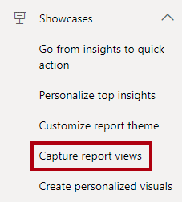
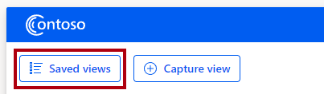
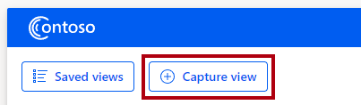
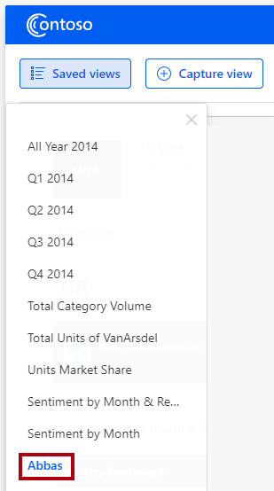

In this unit, you'll explore the **Capture report views** showcase. This showcase demonstrates how to use the client APIs to apply and create bookmarks.

In the Power BI Embedded Analytics Playground menu, select the **Capture report views** showcase.

> [!div class="mx-imgBorder"]
> 

In the embedded Power BI report, in the upper left, select the **Saved views** button.

> [!div class="mx-imgBorder"]
> 

The list of *views* is actually bookmarks. The `bookmarksManager.getBookmarks` function has retrieved the report's bookmark collection.

Select any bookmark to apply it to the report, and then notice that the page updates with a new state. The `bookmarksManager.apply` function has applied the bookmark to the report.

In the **Manufacturer** slicer, select the first manufacturer, **Abbas**.

> [!div class="mx-imgBorder"]
> 

Select the **Capture view** button.

> [!div class="mx-imgBorder"]
> 

In the dialog window, beneath **Enter a name for this view**, enter **Abbas**.

> [!div class="mx-imgBorder"]
> 

Select **Save**. The `bookmarksManager.capture` function has created a personal bookmark.

Return to the saved views, where the Abbas bookmark appears at the bottom of the list.

> [!div class="mx-imgBorder"]
> 

For more information, see [Capture report views showcase](/javascript/api/overview/powerbi/showcase-bookmarks/?azure-portal=true).
