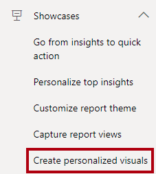
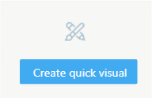
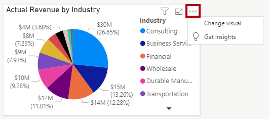

You'll now explore the **Create personalized visuals** showcase. This showcase demonstrates using the authoring APIs to create personalized visuals.

1. In the playground menu, select the **Create personalized visuals** showcase.

> [!div class="mx-imgBorder"]
> 

1. In the embedded Power BI report, at the bottom right, select the **Create quick visual** button.

> [!div class="mx-imgBorder"]
> 

1. In the **Create quick visual** window, choose a visuals type, set the fields, and optionally format the visual, perhaps by including a specific title. When you've completed the setup, select **Create**.

> The app used the `createVisual` function to add a new visual with a default layout to the page.

1. Hover the cursor over the new visual, and then at top right, select the ellipsis to open the visual's context menu. (Your visual may look different to the one below.)

> [!div class="mx-imgBorder"]
> 

> The app used the `updateSettings` function to pass in new settings that define a command extension. For more information, see [Modify menu commands for a report visual](/javascript/api/overview/powerbi/change-visual-commands/?azure-portal=true).

1. Select the **Change visual** command. In the **Create quick visual** window, set up a different visual, and then select **Create**.

> Notice that the app replaced the visual with the new setup.

For a more detailed explanation, including access to the code, see [Quickly create personalized visuals showcase](/javascript/api/overview/powerbi/showcase-visual-creator/?azure-portal=true).
