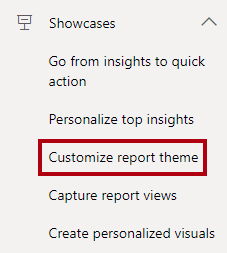
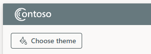
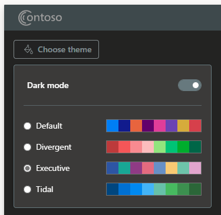

You'll now explore the **Customize report theme** showcase. This showcase demonstrates using the client APIs to allow users to choose the report theme and background mode.

In the playground menu, select the **Customize report theme** showcase.

> [!div class="mx-imgBorder"]
> 

In the embedded Power BI report, at the top left, select the **Choose theme** button.

> [!div class="mx-imgBorder"]
> 

Enable dark mode, and then select a different theme.

> [!div class="mx-imgBorder"]
> 

Notice that the theme changes. The app used the `applyTheme` function to apply the theme changes.

For a more detailed explanation, including the access to the code, see [Customize report colors and mode showcase](/javascript/api/overview/powerbi/showcase-themes/?azure-portal=true).
