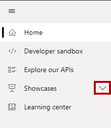
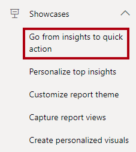
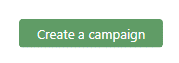

You'll now explore the **Go from insights to quick action** showcase. Contoso, a sales company, needs to target sending coupons or discount vouchers to specific customers. This showcase demonstrates how Contoso achieved that requirement by using event handling and visual data export.

1. In the playground, in the menu (located at the left), select the Home icon to return to the home page.

   > [!div class="mx-imgBorder"]
   > 

1. If the browser prompts you about losing changes, select **OK**.

1. In the menu, select the first icon to expand open the menu.

   > [!div class="mx-imgBorder"]
   > 

1. In the menu, expand open the **Showcases** group.

   > [!div class="mx-imgBorder"]
   > 

1. Select the **Go from insights to quick action** showcase.

   > [!div class="mx-imgBorder"]
   > 

   Notice the embedded Power BI report, which includes various slicers across the top, and a table visual of customers beneath. Use any of the slicers to filter the table visual, so that it results in a small subset of customers.

1. Select the **Create a campaign** button.

   > [!div class="mx-imgBorder"]
   > 

   The report raised the `buttonClicked` event and the app responded by opening a dialog window. The dialog window used the `exportData` function to retrieve the customers from the report's table visual.

   The dialog window allows users to optionally deselect customers and then select either **Send coupon** or **Send discount**. The app is responsible for recording and sending coupons or discount vouchers to the selected customers.

For a more detailed explanation, including access to the code, see [Go from insights to quick action showcase](/javascript/api/overview/powerbi/showcase-export-events/?azure-portal=true).
