You use the Power BI client APIs to embed Power BI content by using JavaScript or TypeScript. It's a client library that provides programmatic control of the entire embedding experience.

> [!NOTE]
> To learn about the basics of the Power BI client APIs and how they're used to embed Power BI content, work through the Embed Power BI content module.

Beyond embedding Power BI content, the client APIs let your app:

- Apply operations to content, like adding a report filter.

- Work with events, so your app can respond to user actions made in a report, like a button selection.

- Interact with bookmarks, either applying them or creating new ones.

- Produce dynamic report layouts, which provide control to users to customize the report experience.

- Create personalized report visuals.

- Drive an in-context analytics workflow.

### Apply operations

There are many operations your app can apply to embedded content. They include general operations, like reloading or refreshing a report. They also include entering or exiting full screen mode, or reapplying the settings that the app applied in the configuration object when first embedding the content.

Beyond general operations, there are page navigation operations. There are also filter and slicer operations, which allow your app to determine or set filter/slicer state. There are also data operations that allow export of visual data, and menu operations that extend menus with new custom commands.

You'll now experience some operations by going to the [Power BI embedded analytics playground](https://playground.powerbi.com/?azure-portal=true) and working through the following instructions.

> [!NOTE]
> The Power BI embedded analytics playground is a website that helps you learn, explore, and try out Power BI embedded analytics. It includes a developer sandbox for hands-on experiences that use the client APIs with sample Power BI content or your own content. Code snippets and showcases are available for you to explore, too.
>
> For more information, see [What is the Power BI embedded analytics playground?](/power-bi/developer/embedded/power-bi-playground/?azure-portal=true)

In the left pane, select **Developer sandbox**.

> [!div class="mx-imgBorder"]
> 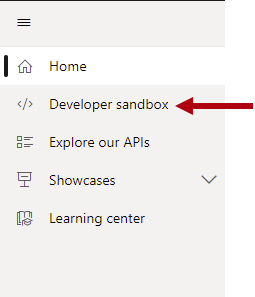

When prompted, select the **Use sample** button to start by using a sample report.

> [!div class="mx-imgBorder"]
> 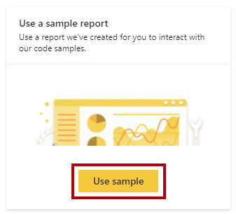

> [!TIP]
> Notice that you can also select your own report sourced from the Power BI service, or use an embed token that your development app generates. In this activity, continue to use the sample report.

Notice that the playground embeds a sample report. Notice also above the report that there's the code pane, which contains the code required to embed the report.

In the **Embedded Report APIs** pane (located at the left), expand open the **General Operations** group.

> [!div class="mx-imgBorder"]
> 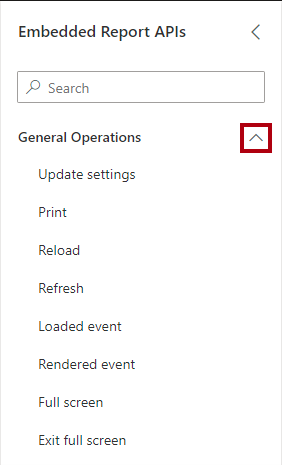

To update the code, from the **Embedded Report APIs** pane, drag the **Full screen** operation and drop it at the last line (line 94) in the code pane.

> [!div class="mx-imgBorder"]
> [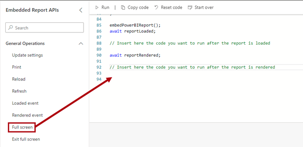](../media/developer-sandbox-drag-full-screen-to-code-pane.png#lightbox)

Review the code fragment added to the code pane. Then, to run the code, on the menu bar (located above the code pane), select **Run**.

> [!div class="mx-imgBorder"]
> 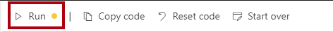

The report renders in full screen mode. To exit full screen mode, press **Escape**.

Now you'll programmatically modify the report's date slicer. In the **Embedded Report APIs** pane, expand open the **Filters & Slicers** group.

> [!div class="mx-imgBorder"]
> 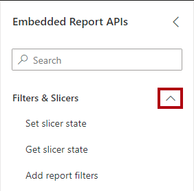

Drag the **Set slicer state** operation to the code pane, dropping it beneath the last line of code. Then review the 43 lines of code you added to the code pane. Run the code, and notice that the report continues to open in full screen mode, and that the **Date** slicer date range is now set to October 12, 2014 - November 28, 2014.

> [!div class="mx-imgBorder"]
> 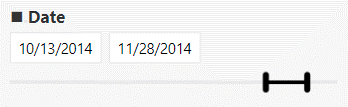

To exit full screen mode, press **Escape**.

> [!TIP]
> The playground provides an effortless way to discover operations and evaluate them without the need to develop an app. Remember, you can explore these operations by using the sample report or your own report.

### Work with subscribable events

Events communicate between embedded Power BI content and your app. An app can raise events in response to automated actions, like the rendering of a report, or user actions, like a button selection.

It means your app can respond in a meaningful way when the report loads (which raises the `loaded` event) or renders (`rendered` event). For more information, see [Use phased embedding](/javascript/api/overview/powerbi/phased-embedding/?azure-portal=true).

Your app can respond when a user interacts with an embedded Power BI report. It can subscribe to the events raised by the following user actions:

- Selection of a report button (`buttonClicked` event).

- Selection of a command extension, which is a custom command your app adds to the context menu (`commandTriggered` event).

- Selection of a hyperlink (`dataHyperlinkClicked` event).

- Selection of a data point, like a column of a column chart visual (`dataSelected` event).

- Selection of a report visual (`visualClicked` event).

- Report page change (`pageChanged` event).

Consider the potential to enhance your app. At Tailspin Toys, their sales app can write back customer notes of interest to the app database. When a user selects a report button, the app opens a dialog window prompting them to enter their notes. The app persists the entered data and refreshes the report to show the new data represented in the report visuals.

Later units of this module demonstrate how an app responds to various events.

There are other events for dashboards, dashboard tiles, the Q&A experience, and reports embedded in mobile view, too. For more information, see [How to handle events](/javascript/api/overview/powerbi/handle-events/?azure-portal=true).

### Interact with bookmarks

[Bookmarks](/power-bi/desktop-bookmarks/?azure-portal=true) allow users to capture the state of a Power BI report page, including filters and the visibility state of report elements. When applied, a bookmark restores the captured state to the report page. It's possible to *play* a series of bookmarks like a slide show, which can be a helpful story-telling device when presenting to an audience.

In your app, you can programmatically control bookmarking experiences. It's possible to:

- Manage bookmarks by applying, capturing, or playing them.

- Apply a bookmark or return to the current viewing session.

- Enter or exit bookmarks slide show mode.

- Show or hide the **Bookmarks** pane.

- Retrieve a list of bookmarks.

- Access bookmarks and their properties, perhaps to present them in a dropdown list.

Here are the bookmark operations available to explore in the playground.

> [!div class="mx-imgBorder"]
> 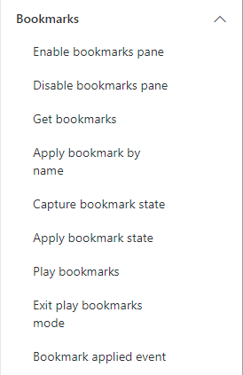

At Tailspin Toys, their sales app allows users to capture the current state of an embedded report page as a *personal bookmark*. A personal bookmark is visible only to the user that created it, and allows them to return to a specific view of interest. The app persists personal bookmark metadata in the app database, and presents a dropdown list of personal bookmarks so the user can reapply them.

A later unit of this module demonstrates how an app can use bookmarks.

For more information, see [Enhance your users' experience with bookmarks](/javascript/api/overview/powerbi/report-bookmarks/?azure-portal=true).

### Produce dynamic report layouts

Use the layout APIs to let users select which visuals and layouts they want to see.

Here are the layout operations available to explore in the playground.

> [!div class="mx-imgBorder"]
> 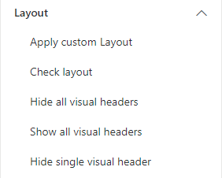

At Tailspin Toys, the sales app allows users to define page size, canvas scale, and pages layout. Within the pages layout, it lets them specify a visual layout for each visual. It allows them to show or resize visuals of interest, and hide other visuals.

A later unit of this module demonstrates how an app can personalize the report layout.

For more information, see [Personalize a report layout](/javascript/api/overview/powerbi/custom-layout/?azure-portal=true).

### Create personalized report visuals

The Power BI client API includes the **powerbi-report-authoring** package. It's an extension of the **powerbi-client** library for programmatically creating and personalizing visuals, and authoring a Power BI report after it's loaded. It also allows your app to edit embedded Power BI reports.

Use the `addPage` function to add an authoring page, and the `createVisual` function to add a new visual with a default layout to the authoring page.

Here are the authoring operations available to explore in the playground.

> [!div class="mx-imgBorder"]
> 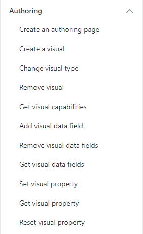

At Tailspin Toys, the sales app provides a guided experience that allows users to set up and personalize new visuals.

A later unit of this module demonstrates how an app can allow users to create personalized visuals.

For more information, see [Report authoring overview](/javascript/api/overview/powerbi/report-authoring-overview/?azure-portal=true).

### Drive an in-context analytics workflow

The app embeds Power BI content in the `div` element, hosting the content within an `iframe` element. The `iframe` element creates a separation between the app and the embedded content, making sure the data is secure. The client APIs always communicate securely between the app and the embedded content. Because communication is bidirectional, your app can drive an in-context analytics workflow.

1. The user navigates within the app.

1. The app shows a Power BI report that's filtered to a specific view.

1. The user interactively filters data in the report.

1. The user selects a button to perform an action.

1. The app responds by running some code.

> [!div class="mx-imgBorder"]
> [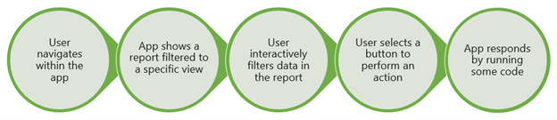](../media/in-context-analytics-workflow.png#lightbox)
