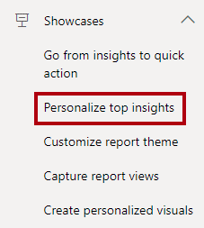
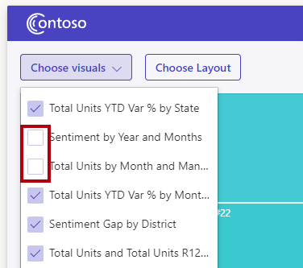
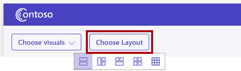

You'll now explore the **Personalize top insights** showcase. This showcase demonstrates using the authoring and layout APIs to allow users to choose which visuals and layouts they want to see.

1. In the playground menu, select the **Personalize top insights** showcase.

   > [!div class="mx-imgBorder"]
   > 

1. In the embedded Power BI report, use the vertical scrollbar to scroll to the bottom of the report. Notice that the report page layout contains nine visuals.

1. At the top left of the page, select **Choose visuals**, and then in the checklist, deselect one or two visuals.

   > [!div class="mx-imgBorder"]
   > 

   > Notice that the deselected visuals no longer appear on the page. The app used the authoring APIs to set visual properties to either hide or show a visual.

1. Next, select the **Choose Layout** button, and then select the first layout option.

   > [!div class="mx-imgBorder"]
   > 

   > Notice how the report page layout changes. Try the other layout options, too. The app used the `updateSettings` function to update a settings object with a modified `customLayout` property.

For a more detailed explanation, including access to the code, see [Personalize top insights showcase](/javascript/api/overview/powerbi/showcase-layout/?azure-portal=true).
