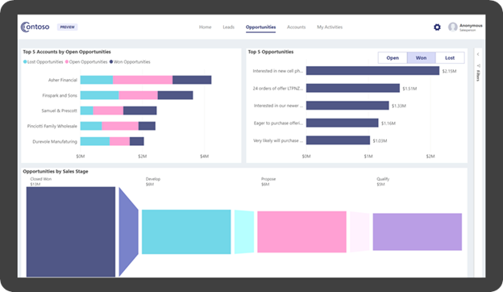

In the digital workplace, embedded analytics should occur within the user's natural workflow, without the need to switch to another app. This way, users have direct access to in-context insights, helping them make decisions based on facts instead of opinions.

At a minimum, embedded analytics requires data, visualizations, and apps. The common challenge that app developers must solve is how to visualize data. Essentially, two visualization options are available: *build or buy*.

The build option might seem promising, but it has three strong disadvantages: it's time consuming, expensive, and it requires a shift of focus from what app developers typically do. Buying visualizations (as a service) can be more effective because it offers faster time to market. It's also cost-effective when it uses a robust and comprehensive analytics service.

## Power BI embedded analytics

Microsoft Power BI is a leading data analytics service. Today, many people are familiar with Power BI because they interact with reports in the Power BI service or Power BI mobile apps. The great news for developers is that any type of Power BI content can be programmatically embedded in their apps.

> [!div class="mx-imgBorder"]
> 

You can embed Power BI content in any app by using an HTML `iframe` element. Developers rely on web standards, including HTML5 and JavaScript, to achieve embedding and integration with app functionality. Therefore, any internet-connected HTML app can embed Power BI content. Apps can include web apps, mobile apps, and even thick client apps.

Power BI embedded analytics is purpose-built for developers. Client APIs, REST APIs, and SDK resources are available to support different development platforms and languages. Officially, support is available for .NET, .NET Core, JavaScript, and TypeScript.

> [!TIP]
> To evaluate Power BI embedded analytics, or to fast-track your app development, explore the [Embedding setup tool](https://app.powerbi.com/embedsetup/?azure-portal=true). The tool includes sample .NET solutions that you can download to accelerate Power BI embedding development.
>
> For more information, see [Power BI developer samples](https://github.com/microsoft/powerbi-developer-samples/?azure-portal=true). Samples are also available for NodeJS, Python, and Java.
