Developers can embed all Power BI content types in their apps, including real-time content. Content types include:

- Power BI reports
- Power BI report visuals
- Paginated reports
- Dashboards
- Dashboard tiles
- Q&A, for natural language querying

## Power BI reports

Power BI reports deliver interactive analytical experiences that are designed to encourage exploration and discovery. A well-designed report allows report consumers to discover answers to a broad array of questions. Because there are many visual types, including AI and custom visuals, and interactive features, Power BI reports are the most common Power BI content type that's embedded in apps.

> [!TIP]
> To learn how to create compelling Power BI reports, work through the [Design effective reports in Power BI](/learn/paths/power-bi-effective/?azure-portal=true) learn path.

When embedded, Power BI reports offer the full functionality that report consumers expect when interacting with them in the Power BI service. Whether it's page navigation, slicers, filtering, drillthrough, bookmarks, or buttons, even when they're interacting on small factor devices like mobile phones. However, embedded Power BI reports aren't always about consumption. Apps can allow users to edit reports or create new ones, too.

Power BI reports offer even more for the developer. The app can interact with the report, perhaps by applying filters or bookmarks or by adding new context menu options. The inverse is also true. The report can interact with the app by invoking, for example, client-side app logic when a user selects an element of a chart or selects a report button.

Experience what an embedded report looks like by going to the [Power BI embedded analytics playground](https://playground.powerbi.com/?azure-portal=true). There, you can work through the following instructions.

> [!NOTE]
> The Power BI embedded analytics playground is a website that helps you learn, explore, and try out Power BI embedded analytics. It includes a developer sandbox for hands-on experiences that use the client APIs with sample Power BI content or your own content. Code snippets and showcases are available for you to explore, too.

For more information, see [What is the Power BI embedded analytics playground?](/power-bi/developer/embedded/power-bi-playground/?azure-portal=true)

In the left pane, select **Explore our APIs**.

> [!div class="mx-imgBorder"]
> 

In the right side of the content pane, notice the **Sample** dropdown list and the adjacent **Embedded mode** dropdown list. By default, both dropdown lists are set to display a Power BI report in view mode.

> [!div class="mx-imgBorder"]
> 

Beneath the dropdown list is the embedded report. Interact with the report by modifying slicer values. Cross-filter the page by selecting a column in the bottom chart.

To view how the report was embedded, select **Show sample code** in the upper left of the pane.

> [!div class="mx-imgBorder"]
> 

In the code snippet window, scan through the code by vertically scrolling from top to bottom. Look for the line of code that embeds the report (about halfway down).

```javascript
report = powerbi.embed(embedContainer, config);
```

This single line of code uses the client APIs to embed the report in a `div` element by applying specific configuration values. Select **Cancel** to close the code snippet window.

In the **Embedded mode** dropdown list, select **Edit mode**.

> [!div class="mx-imgBorder"]
> 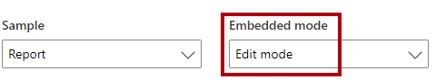

The embedded report now has a menu bar across the top of the report. It includes the **Save** command, which is located in the far right of the report. Now, it's possible to change the report and (attempt to) save the edited report.

> [!NOTE]
> Attempting to save the report in the Power BI embedded analytics playground will produce an error because it's a sample app.

Open the code snippet window, and locate the statement that creates the **config** object. Notice that the **viewMode** property is set to **Edit**.

```javascript
viewMode: models.ViewMode.Edit,
```

Select **Cancel** to close the code snippet window.

## Power BI visuals

It's possible to embed a single report visual that's sourced from a Power BI report. However, you can only view and interact with it. It's not possible to edit or create a single visual. Commonly, the app applies filters to the visual to show data in a specific context. For example, the visual could show monthly sales results of the current year for a specific customer.

In the Power BI embedded analytics playground, in the **Sample** dropdown list, select **Report Visual**.

> [!div class="mx-imgBorder"]
> 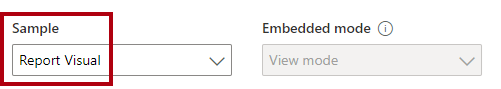

In the report visual, right-click any column and then use the context menu options to interact with the chart.

> [!div class="mx-imgBorder"]
> 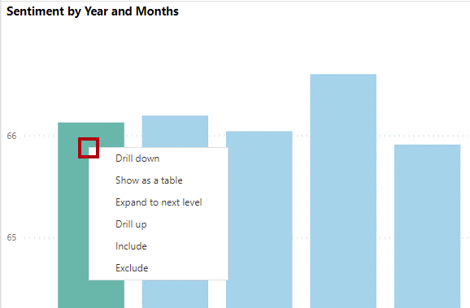

## Paginated reports

It's possible to embed paginated reports. Power BI reports are optimized for exploration and interactivity. But paginated reports are optimized for multipage layouts, printing, or export. They also let you produce highly formatted, pixel-perfect layouts. Therefore, paginated reports are ideal for operational reports, like sales invoices. They're also a good choice when users need to export the report in different formats, including:

- PDF
- Microsoft Word
- Microsoft PowerPoint
- Data formats, including CSV or XML.

In the Power BI embedded analytics playground, in the **Sample** dropdown list, select **Paginated Report**.

> [!div class="mx-imgBorder"]
> 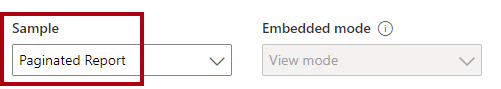

In the paginated report, in the **Order** dropdown list (parameter), select **SO48339** and then select **View report**.

> [!div class="mx-imgBorder"]
> 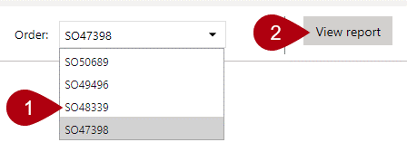

To go to the second report page, on the paginated report menu (located in the upper part of the report), move forward one page.

> [!div class="mx-imgBorder"]
> 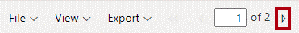

To review the download options, on the paginated report menu, select **Export** to open the options.

> [!div class="mx-imgBorder"]
> 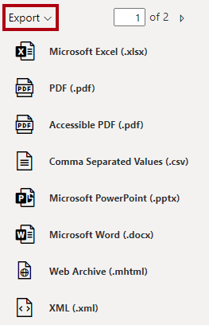

You can export paginated reports as PDF documents and as Microsoft Excel, Word, and PowerPoint files, and more.

## Dashboards

Power BI dashboards provide a way to monitor many metrics in a single view. Dashboards include one or more tiles that display visuals, text, video, and more. Unlike Power BI reports, which emphasize interactivity, dashboards offer a more passive consumption experience. When embedded in an app, the dashboard is almost entirely non-interactive (unless a developer writes code to interact with the app). It's not possible to apply filters to dashboards.

In the Power BI embedded analytics playground, in the **Sample** dropdown list, select **Dashboard**.

> [!div class="mx-imgBorder"]
> 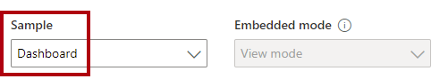

Hover the cursor over any state within the map tile, and notice that a tooltip appears.

> [!div class="mx-imgBorder"]
> 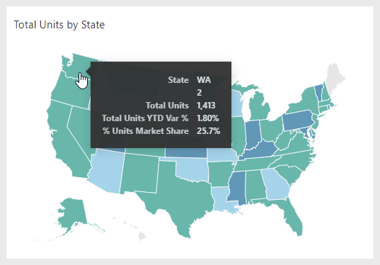

## Dashboard tiles

It's possible to embed a single dashboard tile.

In the Power BI embedded analytics playground, in the **Sample** dropdown list, select **Tile**.

> [!div class="mx-imgBorder"]
> 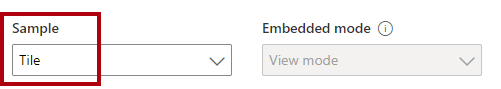

The map tile is embedded, and you can hover the cursor over any state to reveal a tooltip.

## Q&A

The Q&A experience is about natural language querying of a Power BI dataset. Users can enter questions in English (or Spanish in preview) and receive responses as visualizations. It's an ideal catchall capability for when users have questions that can't be answered by published reports or dashboards.

> [!TIP]
> Encouraging the use of Q&A can help reduce the number of reports and dashboards that you need to develop.

> [!div class="mx-imgBorder"]
> 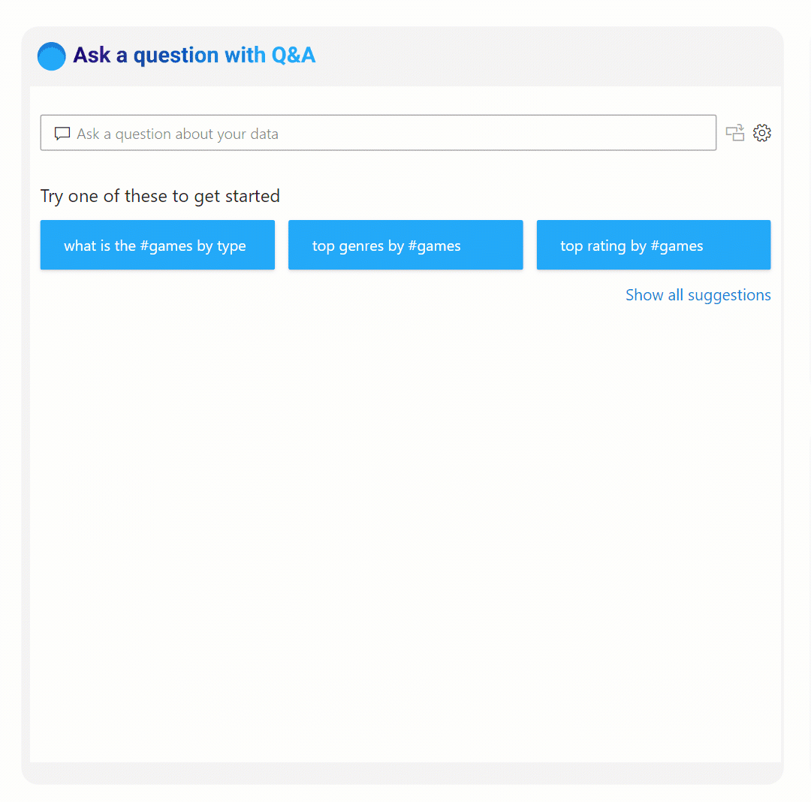

In the Power BI embedded analytics playground, in the **Sample** dropdown list, select **Q&A**.

> [!div class="mx-imgBorder"]
> 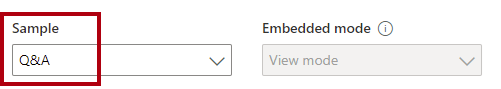

In the upper-left corner of the visual, notice the prepopulated question. Modify the year from **2014** to **2013**, and then select **Enter**.

> [!div class="mx-imgBorder"]
> 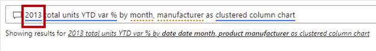

Modify the visual type from **clustered column chart** to **matrix**, and then select **Enter**.

> [!div class="mx-imgBorder"]
> 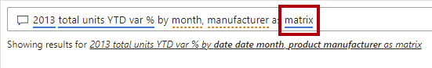

For more information, see [Q&A for Power BI business users](/power-bi/consumer/end-user-q-and-a/?azure-portal=true).
