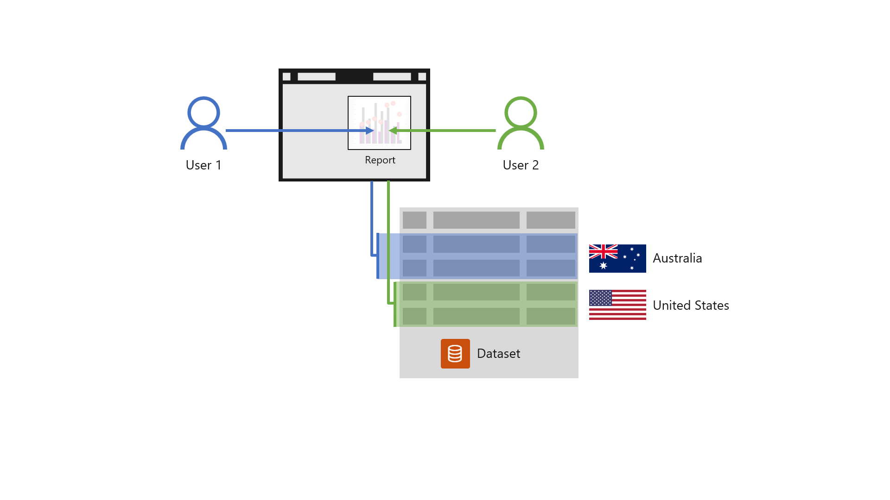

When embedding Power BI content, your app can restrict app user access to specific data. It's commonly achieved by datasets that enforce RLS, which applies filters to model tables.

Consider an app at the Tailspin Toys company that embeds Power BI reports supporting the analysis of its sales efforts. Company policy compels the dataset developers to ensure salespeople see only customer data for their assigned sales region. Sales managers, however, are permitted to see customer data for all sales regions. The dataset developer can create two RLS roles that apply different filters, one for salespeople and one for managers.

Also consider a *multi-tenancy* app. Multiple organizations use a multi-tenancy app, where each organization is a tenant. One approach to ensure a tenant only sees their data is to use a single *multi-customer* database. This approach requires a single workspace comprising one set of Power BI artifacts that are shared across all tenants. RLS securely filters dataset data to ensure organizations only see their data.

> [!NOTE]
> To learn more about multi-tenancy solutions, including a comparison of a separate database for each customer to a multi-customer database, see [Service principal profiles in Power BI Embedded](/power-bi/developer/embedded/embed-multi-tenancy/?azure-portal=true).

To gain a better understanding of how RLS restricts access to data, watch the following video.

<!-- > [!VIDEO https://www.microsoft.com/videoplayer/embed/] -->

> [!div class="mx-imgBorder"]
> 
