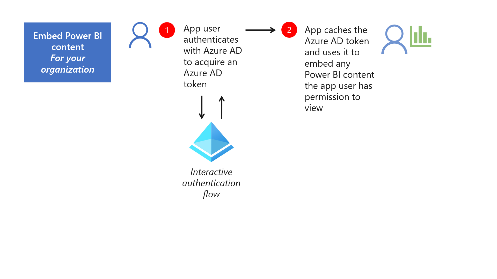
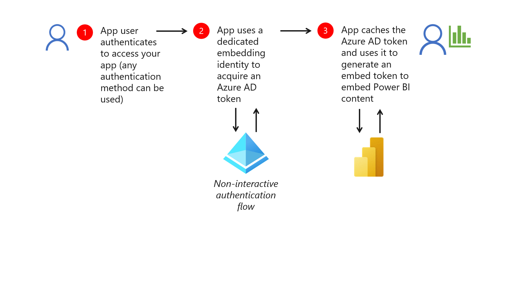
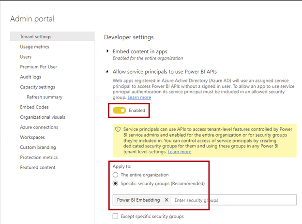

To embed Power BI content in your app, you must develop the app to acquire an *access token*. The type of authentication flow (and access token) depends on the embedding scenario.

> [!NOTE]
> To learn about embedding scenarios, work through the Select a Power BI embedded analytics product module.

When you use either scenario, your app must acquire an Azure AD token. An Azure AD token contains claims to identify granted permissions to the Power BI REST API. It has an expiration time, which is typically one hour. A valid Azure AD token must be present in all API operations.

## Use an interactive authentication flow

To acquire an Azure AD token for the *For your organization* scenario, the app uses an *interactive authentication flow*. An interactive authentication flow means that Azure AD can prompt the user to sign in, by using their username and password and (possibly) by using multi-factor authentication (MFA). Azure AD could also prompt the user to grant more consent to resources (required when first signing in for the app).

> [!NOTE]
> When the app enables use of [single sign-on (SSO)](/azure/active-directory/manage-apps/what-is-single-sign-on/?azure-portal=true), users don't have to sign in every time they use it. The authentication process will cache credentials in a session cookie when the user authenticates the first time, and the app can use these cached credentials until they expire, which by default is after 90 days.

Once acquired, your app should cache the Azure AD token. The app will then use it to embed Power BI content that the user has permission to work with.

Watch the following video that demonstrates the use of an interactive authentication flow.

> [!VIDEO https://www.microsoft.com/en-us/videoplayer/embed/RE4Vozg]

> [!div class="mx-imgBorder"]
> 

You'll learn how to acquire Azure AD tokens in unit 3.

## Use a non-interactive authentication flow

To acquire an Azure AD token for the *For your customers* scenario, the app uses a *non-interactive authentication flow*. App users aren't required to have a Power BI account, and even when they do, they aren't used. So a dedicated Azure AD identity, known as the *embedding identity*, authenticates with Azure AD. An embedding identity can be a *service principal* or a *master user account*.

A non-interactive authentication flow is also known as *silent authentication*. It attempts to acquire an Azure token in a way in which the authentication service can't prompt the user for additional information. Once the app user authenticates with your app (the app can use any authentication method you choose), the app uses the embedding identity to acquire an Azure AD token by using a non-interactive authentication flow.

Once your app acquires an Azure AD token, it caches it and then uses it to generate an *embed token*. An embed token represents facts about Power BI content and how to access them.

Specifically, an embed token describes:

- Claims to specific Power BI content.
- Access level, which you set to view, create, or edit. (The create and edit levels apply only to Power BI reports.)
- Token lifetime, which determines when the token expires.
- Optionally, a claim to a target workspace for saving new reports.
- Optionally, one or more effective identities so Power BI can enforce data permissions.

> [!NOTE]
> To learn about effective identities, work through the Enforce data permissions for Power BI embedded analytics module.

Watch the following video that demonstrates the use of a non-interactive authentication flow.

> [!VIDEO https://www.microsoft.com/en-us/videoplayer/embed/RE4Vozj]

> [!div class="mx-imgBorder"]
> 

You'll learn how to acquire embed tokens in unit 3.

### Use a service principal

Your app can use a *service principal* to acquire an Azure AD token. An Azure service principal is a security identity used by apps. It defines the access policy and permissions for the app in the Azure AD tenant, enabling core features such as authentication of the app during sign in, and authorization during resource access. A service principal can authenticate by using an app secret or certificate. We recommend that you secure service principals by using certificates for your production apps, rather than secret keys, because it's more secure.

When your app's embedding identity is a service principal, a Power BI tenant admin must first:

- Enable use of service principals.
- Register a security group that contains them.

The following image shows the **Developer settings** (found in the tenant settings of the admin portal) where a Power BI admin can enable service principals to use Power BI APIs.

> [!div class="mx-imgBorder"]
> 

> [!Important]
> When an admin allows service principal use with Power BI, the app's Azure AD permissions no longer take effect. From then on, admins manage the app's permissions in the Power BI admin portal.

In Power BI, the service principal must belong to the workspace **admin** or **member** role to embed workspace content. Only [new workspaces](/power-bi/collaborate-share/service-create-the-new-workspaces/?azure-portal=true) support role assignments to a service principal, and personal workspaces aren't supported.

> [!NOTE]
> It's not possible to sign in to the Power BI service by using a service principal.

For more information, see:

- [Application and service principal objects in Azure Active Directory (Service principal object)](/azure/active-directory/develop/app-objects-and-service-principals?azure-portal=true#service-principal-object).
- [Embed Power BI content with service principal and a certificate](/power-bi/developer/embedded/embed-service-principal-certificate/?azure-portal=true)

### Use a master user account

Your app can use a *master user account* to acquire an AD token. A master user account is a regular Azure AD user. In Power BI, the account must belong to the workspace **admin** or **member** role to embed workspace content. It must also have either a [Power BI Pro or Power BI Premium Per User (PPU) license](/power-bi/fundamentals/service-features-license-type#licenses-and-license-types/?azure-portal=true).

> [!NOTE]
> It's not possible to use a master user account to embed paginated reports.

### Compare embedding identity types

We recommend using a service principal for *production* apps. It provides the highest security and for this reason it's the approach recommended by Azure AD. Also, it supports better automation and scale and there's less management overhead. However, it requires Power BI admin rights to set up and manage.

You can consider using a master user account for *development or test* apps. It's easy to set up, and it can sign in to the Power BI service to help troubleshoot issues. However, there's an associated cost because it requires a Power BI Pro or PPU license. Also, a master user account can't require MFA.

In summary, the following table compares the two embedding identity types.

| Item | Service principal | Master user account |
|-|-------------------|---------------------|
| **Azure AD object type** | Service principal | User |
| **Credential management** | Use secrets or certificates with periodic rotation | Do frequent password updates |
| **Power BI tenant settings** | A Power BI admin must allow use of service principals, and we recommend that service principals belong to a dedicated security group | Not applicable |
| **Power BI REST API usage**  | Some admin and dataflows operations aren't supported. You can [enable service principal authentication for read-only admin APIs](/power-bi/enterprise/read-only-apis-service-principal-authentication/?azure-portal=true). | All operations are supported |
| **Power BI service sign in** | Not supported | Supported |
| **Licensing** | Not required | Power BI Pro or PPU |
| **Azure AD recommendation**  | Recommended (especially for production apps) | Not recommended (but may be suited to development or test apps) |
| **Additional information** | | Can't require MFA; Can't embed paginated reports |
