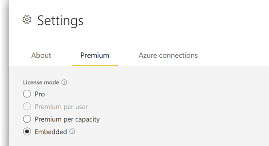

When embedding Power BI content by using the *For your customer* scenario, you need to ensure that content resides in a workspace that has one of the following license modes:

-   **Premium per capacity** - This license mode is available with Power BI Premium.
-   **Embedded** - This license mode is available with Power BI Embedded.

Each license mode option requires the purchase of a billable product that is a *capacity-based* license. A capacity-based license allows you to create *reserved capacities*.

Capacities represent the computational resources that are required to process workloads, such as report rendering and data refresh. *Reserved* capacities are isolated from other customers' workloads, so they offer scale that can deliver dependable and consistent performance.

> [!NOTE]
> It's not possible to use the *For your customer* scenario in production environments with the Power BI free, Power BI Pro, or Power BI Premium per User (PPU) licenses.

## Power BI premium

Power BI Premium, often referred to as Premium, is a capacity-based license.

Premium offers many benefits, such as sharing content with anyone (even outside the organization), and it provides access to many features and capabilities. Of relevance to this module, one Premium feature allows the embedding of content by using the *For your customer* scenario.

To embed Power BI content for your customers by using Premium, make sure that the content resides in a workspace and its license mode is set to **Premium per capacity**. When set to that mode, the workspace is assigned to a Premium capacity.

> [!div class="mx-imgBorder"]
> 

The newer version of Premium, known as Power BI Premium Generation 2 (or Premium Gen2), supports enhanced performance, greater scale, and many other benefits. We recommend that new capacities use Premium Gen2. It's not possible to use the original version of Premium and Premium Gen2 simultaneously.

Premium is available from the Microsoft 365 admin center, and administrators manage it in the Power BI service.

For more information, see the following articles:

-   [What is Power BI Premium?](/power-bi/admin/service-premium-what-is/?azure-portal=true)
-   [What is Power BI Premium Gen2?](/power-bi/admin/service-premium-gen2-what-is/?azure-portal=true)

## Power BI embedded

Power BI Embedded is a capacity-based license. It's designed specifically for using the *For your customer* scenario, meaning that it's a PaaS product for embedding Power BI content. It doesn't include most Premium features, such as sharing content with Power BI free users or Power BI Report Server.

Compared with Premium, Power BI Embedded has other limitations. Specifically, its workspace content can't be:

-   Consumed in the Power BI service.
-   Consumed by Power BI free licensed users.
-   Shared or embedded by using Microsoft SharePoint, Microsoft Teams, or URL embedding, or Publish to web (sometimes known SaaS embedding).

To embed Power BI content for your customers by using Power BI Embedded, make sure that the content resides in a workspace and that its license mode is set to **Embedded**. When set to that mode, the workspace is assigned to a Power BI Embedded capacity.

> [!div class="mx-imgBorder"]
> 

The newer version of Power BI Embedded, also known as Power BI Embedded Generation 2 (or Power BI Embedded Gen2), supports enhanced performance, greater scale, and many other benefits. We recommend that new capacities use Power BI Embedded Gen2.

Power BI Embedded is a Microsoft Azure resource and is available from the Microsoft Azure portal. Administrators manage it through the Azure portal or Windows PowerShell. Unlike Premium, which runs continuously, you can scale Power BI Embedded up or down, and you can pause or resume the service. When the service is paused, billing ceases.

Unique to Power BI Embedded is integration with [Microsoft Azure Monitor](https://azure.microsoft.com/services/monitor/?azure-portal=true). This service can collect, analyze, and act on telemetry data about Power BI Embedded (and other Azure services) to help explain root causes in relation to performance and availability.

For more information, see the following articles:

-   [Power BI Embedded](https://azure.microsoft.com/services/power-bi-embedded/?azure-portal=true)
-   [Power BI Embedded Generation 2](/power-bi/developer/embedded/power-bi-embedded-generation-2/?azure-portal=true)

## Product comparison

The following table compares characteristics of the two embedding products.

|     Characteristics    |     Premium                                                                                                                                                                                                                                                                                                   |     Embedded                                                                                                                                                                                                        |
|------------------------|---------------------------------------------------------------------------------------------------------------------------------------------------------------------------------------------------------------------------------------------------------------------------------------------------------------|---------------------------------------------------------------------------------------------------------------------------------------------------------------------------------------------------------------------|
|     Product            |     Power BI   Premium                                                                                                                                                                                                                                                                                        |     Power BI   Embedded                                                                                                                                                                                             |
|     Product SKU        |     P                                                                                                                                                                                                                                                                                                         |     A                                                                                                                                                                                                               |
|     Use cases          |     Embed content   in apps for internal or external users.     Share content   with Power BI free users.     SaaS embedding   in Microsoft Teams or SharePoint.                                                                                                                                              |     Embed content   in apps for external users only.                                                                                                                                                                |
|     Purchase           |     Microsoft 365 admin center                                                                                                                                                                                                                                                                                |     Azure portal                                                                                                                                                                                                    |
|     Billing            |     Monthly                                                                                                                                                                                                                                                                                                   |     Hourly                                                                                                                                                                                                          |
|     Differences        |     It’s possible to combine   embedding in apps and use the Power BI service within the same capacity.     When enabled, the [Autoscale](/power-bi/admin/service-premium-auto-scale/?azure-portal=true)   feature can automatically add temporary compute capacity when needed.     Includes a license for Power BI   Report Server to support customer-managed reporting.    |     Support is available for full   elasticity, with the ability to scale up or down or to pause or resume the   service.     It’s possible to use the [Azure Resource Manager](/rest/api/resources/?azure-portal=true)   to deploy or manage the service.    |

> [!NOTE]
> The Autoscale feature in Premium and the support for full elasticity in Power BI Embedded are described in the next unit.

## Product selection guidance

Generally, enterprises buy Premium and ISVs buy Power BI Embedded. However, no restrictions are placed on which product a customer can buy.

For example, an enterprise might decide to use Power BI Embedded if they're only interested in developing line of business apps and embedding analytics in them. In this case, they're not interested in using the prepackaged Power BI service.

Conversely, an ISV might want to use Premium to get the extra benefits of the prepackaged Power BI service within their organization, in addition to the ability to embed content in their apps. For example, it makes sense when the ISV has numerous Power BI users who have Power BI free licenses yet need to access shared content.

