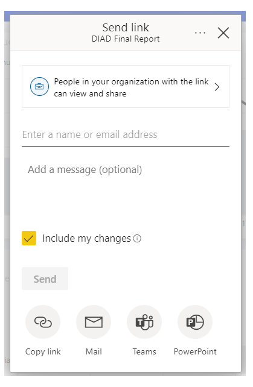

In this lesson, you're going to share a Power BI report on a webpage or share it through email. This feature of Power BI is often referred to as **Publish to web**.

In the Power BI service, select the report that you want to share so that it's displayed on the canvas. Then from the menu, select **Share**. A dialog box will appear so that you can share a link to the report.  

Power BI presents a dialog box where you can:

- Share a link using email, which shows the report as a webpage

- Copy the link to the report

- Share the report using Microsoft Teams

- Embed live data in a Microsoft PowerPoint file

You can paste the email link into a browser and see your report as a webpage. You can interact with that webpage just as you would if you were viewing the report in Power BI. The following image shows a **Publish to web** page when its link was copied directly from that dialog box into a browser.

For more information, see [Publish to web from Power BI](/power-bi/service-publish-to-web/?azure-portal=true).
