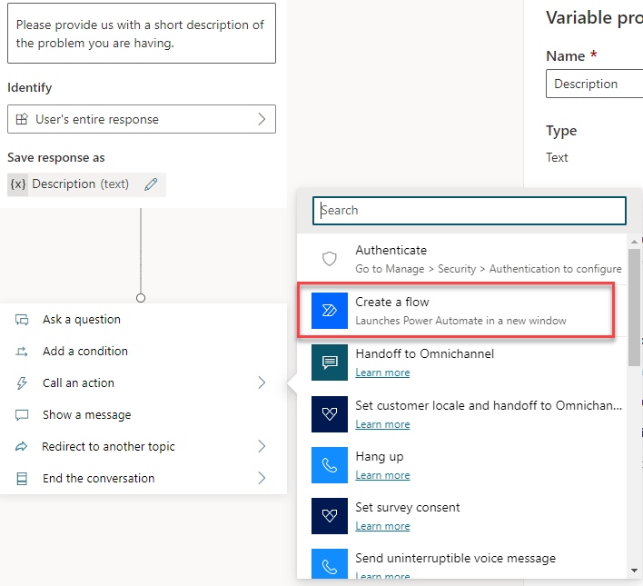
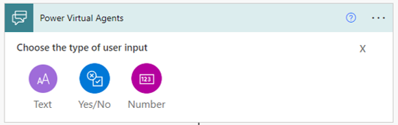
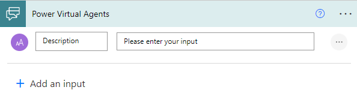
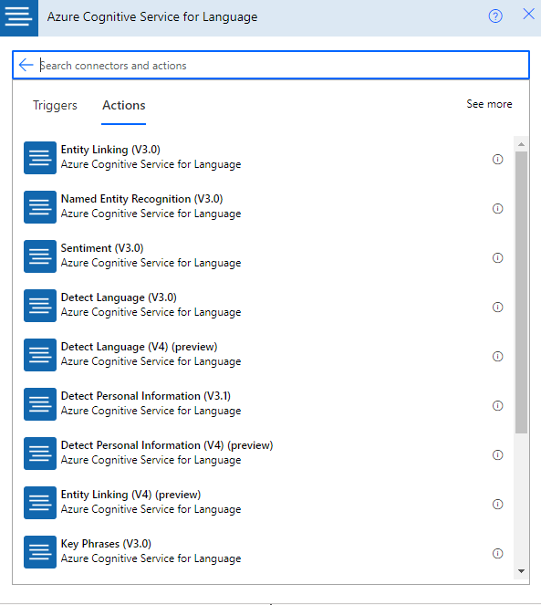
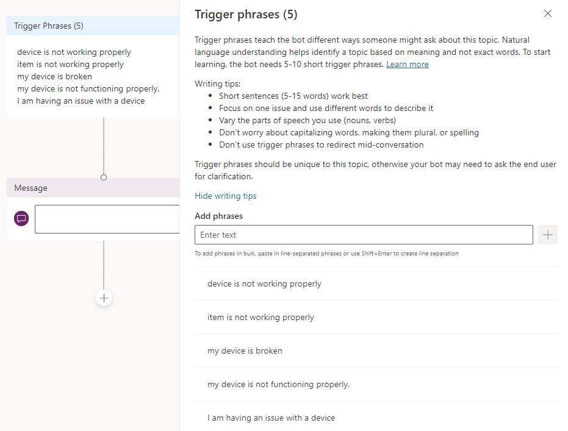
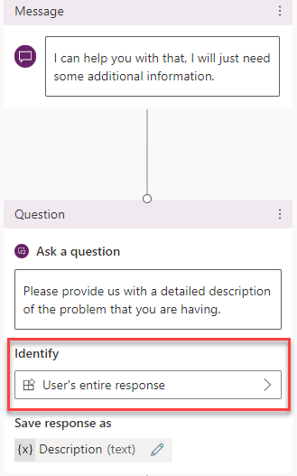
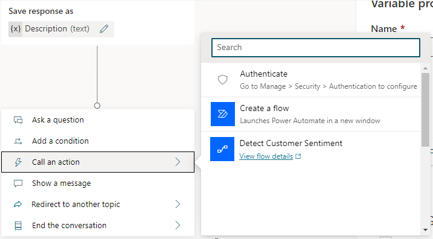
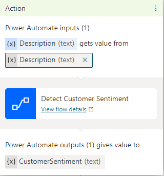

Power Virtual Agents bots can interact with other applications and services by using Microsoft Power Automate flows. Power Automate flows are beneficial for automating activities or engaging with external applications. For example, you could use Power Automate to pass information that's captured from a user and then pass it to Azure Cognitive Services for Language. The information that's returned from the service can be returned to your Power Virtual Agents bot, where it can be used in different conversational nodes.

You can call Power Automate flows from within topics by using the **Call an action** node. You can use flows that already exist in your [Microsoft Power Apps environment](/power-virtual-agents/environments-first-run-experience/?azure-portal=true) or create one from within the Power Virtual Agents [authoring canvas](/power-virtual-agents/authoring-create-edit-topics/?azure-portal=true). Allowing a Power Automate flow to interact with a Power Virtual Agents bot requires a special Power Virtual Agents trigger. This trigger will capture data from the bot and send response information back to the bot.

Power Automate provides the following trigger and action:

- **Power Virtual Agents** - Trigger that specifies input parameters that will be captured from the Power Virtual Agents bot.

- **Return value(s) to Power Virtual Agents** - Action that defines output parameters that are returned to the Power Virtual Agents bot.

When you create a new flow from a Power Virtual Agents bot, a starter template will be loaded that includes the **Power Virtual Agents** trigger and the **Return value(s) to Power Virtual Agents** action. You'll only need to define the necessary input and output parameters and complete the structure of the flow.

> [!div class="mx-imgBorder"]
> 

## Work with input and output parameters

You can use variables that have been defined in your bot to supply values to input parameters and consume values from output parameters. For example, a customer's response to the "Please provide us with a short description of the problem you're having" request could be used as the value for a **Description** input parameter.

### Input parameters

Input parameters represent values that will be captured in the Power Virtual Agents bot and used by the Power Automate flow steps. No limits are placed on the number of input parameters that you can add. However, you can only use number, string, and Boolean types as input parameters with Power Automate flows.

> [!div class="mx-imgBorder"]
> 

Consider what type of data will be required when the input parameter is passed through the flow. For example, if you intend on sending the entire response that a customer enters in response to a question, you might add a Text input. The reason is because the response that a user enters will be a text-based response.

> [!div class="mx-imgBorder"]
> 

When you call a service, you can add information from the input parameter so that the flow understands what text it's analyzing. An Azure Cognitive Services for Language connecter is available that includes different services and features that you can use.

> [!div class="mx-imgBorder"]
> 

When a step to detect the customer sentiment from Azure Cognitive Services for Language is added, the description will be available to pass through so that it knows which text to analyze.

### Output parameters

Output parameters are values from a Power Automate flow that are returned to the Power Virtual Agents bot. Like input parameters, output parameters can be a string, number, or Boolean value.

> [!div class="mx-imgBorder"]
> 

In the previous example, after the flow has received the details from the service, you'll create output parameters to store the details that are returned by Azure Cognitive Services for Language, where the Power Virtual Agents bot can consume the values. For example, if you used the sentiment analysis services, and you wanted to enter the sentiment, you might create a sentiment parameter. The actual details to include will come from the information that's received from Azure Cognitive Services for Language. All flows that are created from the Power Virtual Agents authoring canvas are saved in a default solution in Power Automate, and your bots can use them immediately.

### Call a Power Automate flow as an action from a bot

After your flow has been created, you can initiate it from your bot topic by using the **Call an action** node. When you call the action, you can pass variables to the flow as input parameters. Make sure that you create a topic with appropriate trigger phrases. For example, to create a device issue topic that will use the customer's sentiment service, you might include trigger phrases such as:

- Device isn't working properly

- Item isn't working properly

- My device is broken

- I'm having an issue with a device

> [!div class="mx-imgBorder"]
> 

To identify specific details and capture the customer sentiment, you'll need to pass details that you need to capture, such as the description as a variable, to the Power Automate flow. The simplest way to accomplish this task is with the **Ask a question** node. You'll use the **Identify** field on the question node to define what type of data that you want to capture. For example, you could set one item on the **Identify** field to **Use's Entire response**.

> [!div class="mx-imgBorder"]
> 

After you've defined the questions that you'll use to capture the details, add a new **Call an action** conversation node to the bot by selecting the **Detect Customer Sentiment** flow that you previously created.

> [!div class="mx-imgBorder"]
> 

In the flow configuration, you'll need to map the flow input blocks to the output variables from the question nodes. For example, **Description (text)** gets its value from the **Description (text)** variable that you previously defined.

> [!div class="mx-imgBorder"]
> 

You should be able to observe that the **Device Issue** flow will be run and what output parameters will be returned from it.

Now, you can begin to use the results to tailor the experience, such as having a different path for someone who is unhappy as opposed to someone who is happy. For example, the following image shows that a condition has been inserted that checks the value of the **CustomerSentiment** variable that was created based on your flow. If the **CustomerSentiment** variable reads positive, the bot will display one message; if it reads negative, the bot will display a different message.

> [!div class="mx-imgBorder"]
> 

For more information, see [Use Power Automate flows in Power Virtual Agents](/power-virtual-agents/advanced-flow/?azure-portal=true).
