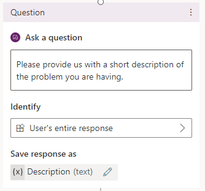

Once you've created and published the Azure Cognitive Service for Language model that you want to use, you'll need be able to call it from a Power Virtual Agent bot. When you create the PVA bot, you'll still follow all the same principals that you would when creating any bot. You need to create topics to handle the conversation with the customer. Items such as entities could be used to enhance the usability and functionality of your bot.

There are various learning modules available on MSLearn to help teach you the basics of creating a bot. For more information, see:

- [Get Started with Power Virtual Agent bots](/training/modules/power-virtual-agents-bots/?azure-portal=true)

- [Manage Topics in Power Virtual Agents](/training/modules/manage-power-virtual-agents-topics/?azure-portal=true)

- [Manage Power Virtual Agents](/training/modules/implement-power-virtual-agents/?azure-portal=true)

- [Enhance Power Virtual Agent bots](/training/modules/enhance-power-virtual-agents-bots/?azure-portal=true)

## Identify the topic you want to use

As mentioned previously in this module, a Power Virtual Agent bot consists of a series of topics that represent different subject areas the bot is able to help with. You can connect to your Azure Cognitive Service for Language from any topic you create. For example, you might have a topic that assists customers with account information and details. In that instance, you might connect to the Personal Identifying Information service to extract personal details that can be used to look up customer information.

Another scenario you might use Azure Cognitive Services for Language is when you want your bot to provide knowledge management capabilities. You might create multiple knowledge article topics in the bot to assist the customer. What happens if none of the topics apply to the customer's question? Many organizations might create a knowledge base that contains hundreds or even thousands of knowledge articles or question and answer pairs. If the system in unable to identify a topic that will work, you could have the PVA bot direct the customer to the bot's fallback topic. The fallback topic is used when the bot can't find an answer. Within the fallback topic, you could include an action that passes the user's text to the Question/Answer service. Once it receives an answer from your knowledge base, it can display it to the user as a message inside the bot.

If you're interested in learning more about creating a fallback topic, you can follow the steps in [Configure the system fallback topic in Power Virtual Agents](/power-virtual-agents/authoring-system-fallback-topic/?azure-portal=true).

## Use the authoring canvas to add an action

When you're designing a topic in Power Virtual Agents, you'll use the authoring canvas to build the messages that will be presented to users, and define how the conversation flows. For example, you might ask the customer to provide you with a brief description of the issue they're having. You might capture the description in a question node. The question node allows you to ask the user a question and then capture their response so it can be used later. For example, in the image below, we're using a question node to capture the customer's description of their problem.

> [!div class="mx-imgBorder"]
> 

The system is capturing the entire response the customer types into the chat window and will store it in a variable called Description. In Power Virtual Agents, variables represent reusable pieces of information that can be use in topics. By storing the information in the Description variable, we can easily use that information later in the topic, such as passing it to another conversation note later in the topic.

Now that we've reviewed some of the initial design elements, let's examine how to call an Azure Cognitive Service for Language service from a topic.
