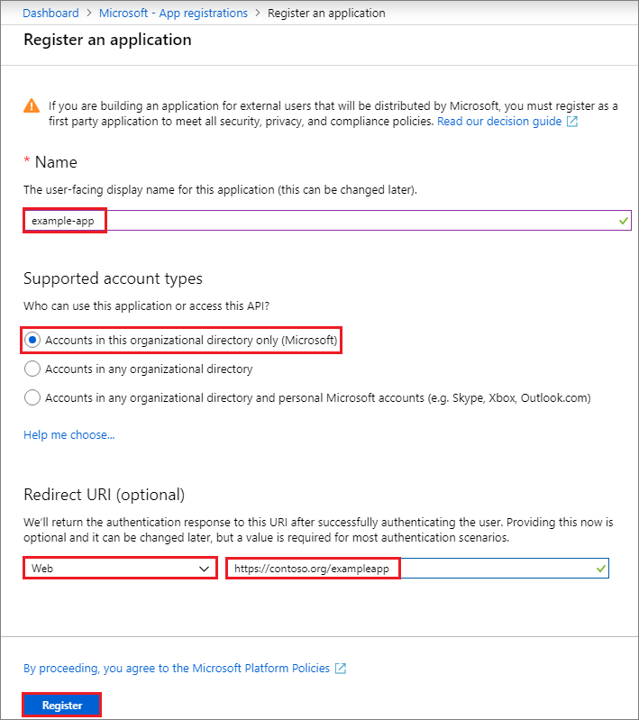
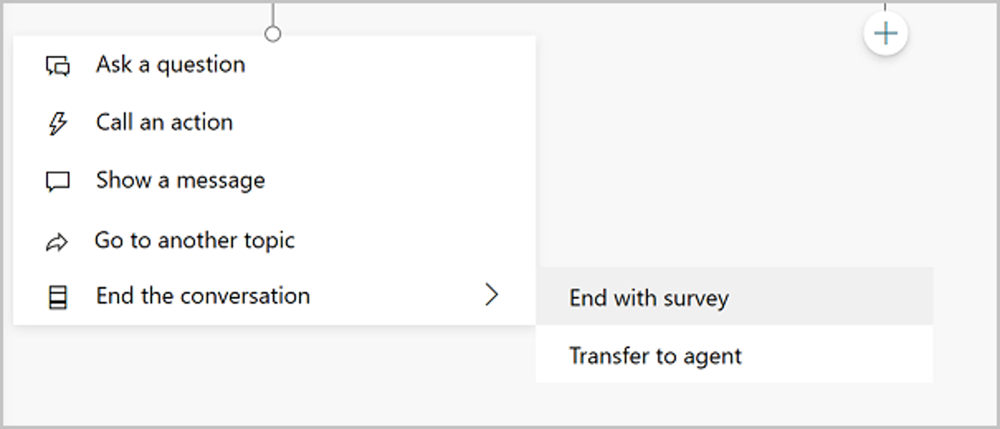
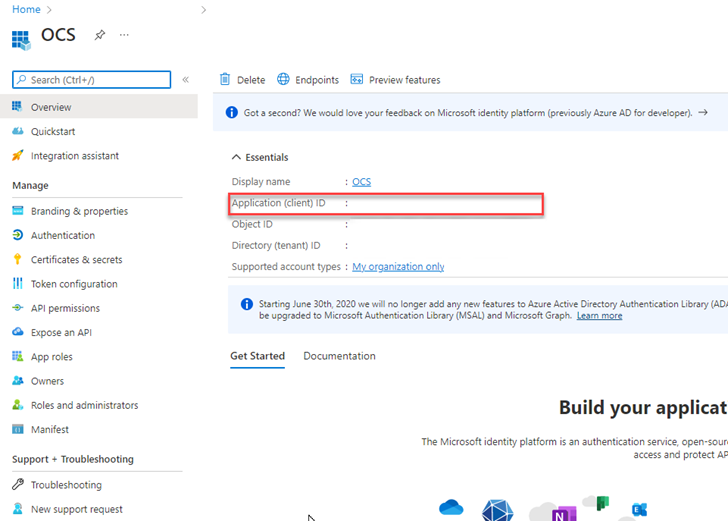
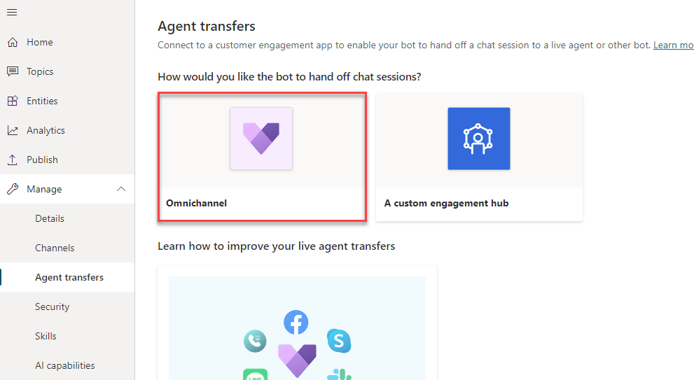
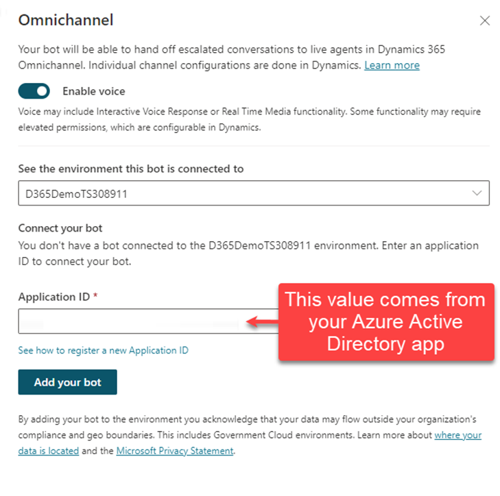
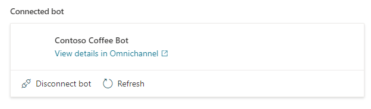

When a customer engages with your organization, a customer service application such as Dynamics 365 Customer Service, will initially receive the item and then either route the item to an individual or to a virtual agent that is being backed by your Power Virtual Agent bot.  Depending on the channel the customer is engaging on, the item will be routed appropriately.  To do this, the system needs to know how to engage with the bot.  For organizations that are leveraging Dynamics 365 Omnichannel for Customer Service.  This is done by creating a bot user in the Omnichannel for Customer Service application.  A bot user is essentially a user in Omnichannel for Customer Service that is supported by an application. In this case, the application is going to be a Power Virtual Agents bot. When conversations are routed to the application user, the Power Virtual Agents bot takes over and provides the necessary interaction with the customer. 
   
Since the bot is an application user, the application that will support the bot needs to be registered in Microsoft Azure Active Directory (Azure AD). Azure AD authenticates the application just as it would a human user. Before a bot can be integrated, you'll need to create an application registration in Azure AD. After the application registration has been defined, a Power Virtual Agents bot can be associated with the registered application.

Only users with necessary permissions can add items in your Azure tenant and make the necessary application registrations. You can create the application registration as follows:
1. Go to the [Azure portal](https://portal.azure.com/?azure-portal=true).
2. Register your apps. Go to **Azure Active Directory** and create a new registration under **App registrations**.
3. Define the three primary areas to create the application registration as follows:
    - **Name** - User-facing name of the application. This information can be changed later if necessary.
    - **Supported account types** - This area defines who can access the application.
    - **Redirect URI (optional)** - This option is the URL where the app is located. This isn't mandatory.
        > [!div class="mx-imgBorder"]
        > 

4. After you've defined the necessary information, select the Register button.

For more information, see [creating an Azure Active Directory Application](/azure/active-directory/develop/howto-create-service-principal-portal#create-an-azure-active-directory-application/?azure-portal=true).

This process will create the initial application registration. For purposes of this learning module, these steps fulfill the necessary requirements to deploy the Power Virtual Agents bot to the application. However, depending on your deployment scenario, technology being used, security policies, and so on, you might need to configure other items in the application.

Additional items that you might want to consider include:

- **Assign a role to the application** - Allows the application to access additional resources in your Azure subscription. For more information, see [Assign a role to the application](/azure/active-directory/develop/howto-create-service-principal-portal/?azure.portal=true#assign-a-role-to-the-application).
- **Certificates and secrets** - Help manage authentication and control application security. For more information, see [Certificates and Secrets](/azure/active-directory/develop/howto-create-service-principal-portal/?azure-portal=true#certificates-and-secrets).
- **Access policies on resources** - Allows you to define additional permissions that your application might need. For more information, see [Configure Access Policies](/azure/active-directory/develop/howto-create-service-principal-portal#configure-access-policies-on-resources/?azure-portal=true#configure-access-policies-on-resources).

Now that you've created an application registration, you can build the Power Virtual Agents bot and configure it to  hand off conversations to Omnichannel for Customer Service.

## Transfer conversations to agents

Two primary components that are involved when a bot transfers to an agent are:
- Telling the bot when to transfer the conversation to an agent.
- Telling the bot where, or to which queue, to transfer the conversation.

## Tell the bot to transfer the conversation to an agent

How a Power Virtual Agents bot tells the bot that it's time to transfer a conversation to an agent is always the same. Power Virtual Agents includes what is referred to as a "conversation node," called **End the conversation**. Conversation nodes are used to interact with the customer. They can display a message, ask customers a question, or direct them to a different topic. The **End the conversation** node signifies the end of the entire conversation and provides two actions that can be initiated:

- **End with survey** - A survey appears that asks the user if their question or issue was answered or resolved correctly.
- **Transfer to agent** - Escalates the conversation [to a live agent](/power-virtual-agents/advanced-hand-off/?azure-portal=true).

    > [!div class="mx-imgBorder"]
    > 

Bot authors can end a conversation and transfer to an agent from within a specific topic. For example, if a customer indicates to the bot that their entire Point of Sale system is down, the bot can automatically call the **End the conversation** node and transfer it to an agent. Another way that this task could be accomplished is by escalating the topic. All bots include a conversation topic called **Escalate**. The Escalate topic includes a message that is presented to the customer and then calls the **End the conversation** node to transfer to an agent. **Escalate** topic is automatically triggered when someone types something like "speak to agent." It could also be triggered from within another topic by selecting **Go to another topic** and then selecting it.

## Configure where to hand off the conversation

The second part of facilitating the transfer to an agent is to configure the bot to send the conversation to a specific Omnichannel for Customer Service instance. Only bots that have been published can be used to ensure that the end-to-end capabilities work as expected. Make sure that you've [published your bot](/power-virtual-agents/publication-fundamentals-publish-channels/?azure-portal=true) prior to validating the integrated experience.

Each bot can only be configured to send conversations to one Omnichannel for Customer Service instance. You can define the Dynamics 365 instance in the individual bot itself. If you need conversations from multiple bots to be sent to a specific Dynamics 365 environment, each bot will need to be configured individually.

The primary component that you need to provide is the application ID for the app that you previously registered in Azure Active Directory. Omnichannel for Customer Service models bots as application users in the application. Modeling bots as application users ensures that the bot can have conversations set to it like a human agent would. It's important that the application ID is unique to your organization (your Microsoft Dataverse organization or environment). Each bot that will interact with the same Omnichannel for Customer Service environment will need to use a different application ID. You might need to create multiple application registrations to support multiple bots.

1. In your [Azure portal](https://ms.portal.azure.com/?azure-portal=true), go to **Azure Active Directory** and select **App registrations**. All registered applications will be displayed.
2. Select the application that you want to use with the bot. The **Application ID** field will be on the application's overview page.
3. Copy the ID and paste it into the Power Virtual Agents **Application ID** field.
    > [!div class="mx-imgBorder"]
    > 

 
## Configure the handoff

1. Expand **Manage** node, and select **Agent** transfers.
This screen allows you to define how the bot will facilitate handoff to different applications like Omnichannel for Customer Service.
2.	Select the Dynamics 365 Omnichannel for Customer Service tile to begin the configuration process.
    > [!div class="mx-imgBorder"]
    > 

 
3.	On the Omnichannel configuration screen, you'll have multiple items that you can configure.
4.	To ensure that your bot to be able to interact through voice such as Interactive Voice Response, or Real Time Media functionality, select **Enable voice**.

    > [!IMPORTANT]
    > You need to ensure that you've installed all the necessary extensions in your environment.  

5. When configuring the connection, you'll need to provide the following information:
    - **Environment this bot is connected to**: Used in scenarios where the bot was previously connected to a Dynamics 365 Instance. This will likely already be filled in. Make sure you select an environment where Omnichannel for Customer Service instance is provisioned. The list shows all available environments, even if Omnichannel for Customer Service isn't provisioned.
    
    - **Application ID**: This will be the Application ID that you copied from Azure Active Directory.
    
    > [!div class="mx-imgBorder"]
    > 

6. After the connection has been established, you can select the **View details in Omnichannel** link to go to the Omnichannel for Customer Service instance and finish the bot configuration. For more information, see [continue configuring the bot connection in Omnichannel for Customer Service](/dynamics365/customer-service/configure-bot-virtual-agent/?azure-portal=true).

## Remove the Omnichannel for Customer Service connection

If you no longer want to hand off conversations from a bot to your Omnichannel for Customer Service environment, you can disconnect it from the environment. If you need to remove the connection with Omnichannel for Customer Service, you can select the **Disconnect bot** option.

> [!div class="mx-imgBorder"]
> 

## Work with content display issues

As you work with the handoff integration, you might find that some items such as emojis and certain types of notes or variables, might not render as intended. One reason could be because of limitations within Omnichannel for Customer Service or the integration between them.

For more information on Omnichannel for Customer Service issues and limitations, see [Omnichannel for Customer Service issues and limitations](/dynamics365/customer-service/configure-bot-virtual-agent/?azure-portal=true#limitations).

For more information on known limitations with PVA integration, see [known limitations with Power Virtual Agents integration](/power-virtual-agents/configuration-hand-off-omnichannel/?azure-portal=true#known-limitations).
