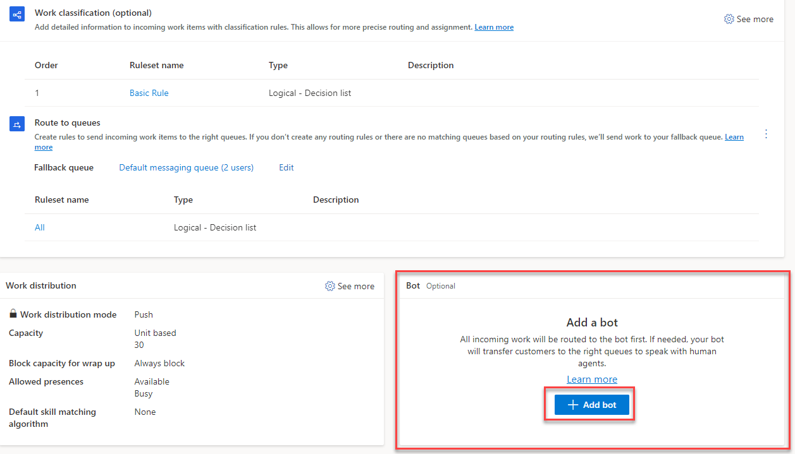
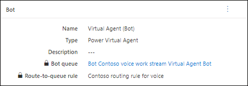

Now that you've the necessary extensions in place, and you've configured the hand off to your preferred customer service application, you're ready to configure the bot for voice.  As mentioned previously, from a design standpoint, there's nothing that you need to do differently when you create the bot.  Items such as topics, entities, and other elements are all designed the same way.  The only real difference is that since the bot is enabled for voice, the text will be spoken to the customer instead of presented on a screen.  

If you're looking to get started building Power Virtual Agent Bots, you can find more information here: 

- [Get Started with Power Virtual Agent bots](/training/modules/power-virtual-agents-bots/?azure-portal=true)
- [Manage Topics in Power Virtual Agents](/training/modules/manage-power-virtual-agents-topics/?azure-portal=true)
- [Manage Power Virtual Agents](/training/modules/implement-power-virtual-agents/)
- [Enhance Power Virtual Agent bots](/training/modules/enhance-power-virtual-agents-bots/?azure-portal=true)

The easiest way to configure a bot for voice is from the Customer Service admin center or Omnichannel admin center applications.  The Customer Service admin center application is leveraged to administer Dynamics 365 Customer Service and omnichannel functionality.  The Omnichannel admin center application is primarily focused on administrating omnichannel functionality.  You can do everything you can do in the Omnichannel admin center application in the Customer Service admin center application.  

You can learn more about both administrative experiences here: 

- [Customer Service admin center](/dynamics365/customer-service/cs-admin-center/?azure-portal=true)
- [Omnichannel admin center](/dynamics365/customer-service/oc-admin-center/?azure-portal=true)

To configure a bot for voice, open a voice channel workstream that has been previously created. You can learn more about configuring a voice workstream here. [Deploy a Voice channel in Dynamics 365 Customer Service](/training/modules/get-started-voice-channel/?azure-portal=true). In the **Add a bot** section, select the Add a bot button.  Here you'll specify the bot that you want to leverage.  

> [!div class="mx-imgBorder"]
> 

Once specified, detailed information about the bot associated with the item will be displayed in the bot section.  
 
> [!div class="mx-imgBorder"]
> 
