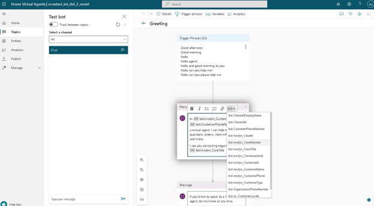

Before we begin, it is important to note that basic behavior of a voice enabled PVA bot is not that different than a traditional bot. From a design standpoint, there is nothing that you need to do differently when you create the bot.  Items such as topics, entities, and other elements are all designed the same way.   The primary difference is that rather than interacting with a customer through some text-based form of communication, the bot will be engaging with them through a voice conversation.  To ensure this happens as intended, there are multiple extensions that you will need to install into your environment to ensure that everything will be handled correctly.  

Depending on whether you are leveraging Dynamics 365 Omnichannel for Customer Service for you contact center or not, there are three extensions you will likely need to install to ensure your bot can interact correctly with your environment.  

Those extensions are:
- [Power Virtual Agents telephony extension](/product/dynamics-365/mscrm.mspva_telephony_extension/?azure-portal=true)
- [Omnichannel Power Virtual Agent extension]/product/dynamics-365/mscrm.omnichannelpvaextension/?azure-portal=true)
- [Omnichannel Voice Power Virtual Agent extension](/product/dynamics-365/mscrm.omnichannelvoicepvaextension/?azure-portal=true)

## Power Virtual Agents telephone extension

When customers engage through a voice channel, there is information such as the customers phone number or the support organizations phone number that would be helpful to have.  This allows you to be able to include this information in the conversation that you are having with the customer.  

To make this information available to a Power Virtual Agent bot, you can install the Power Virtual Agents telephony extension.  The Power Virtual Agents telephone extension adds a number of additional actions and variables that can be used by Power Virtual Agents chatbots to understand, reply to, and transfer voice calls to the bot.  Some of the key elements included are two variables that can be leveraged in PVA conversations.

- **bot.customerPhoneNumber**: Allows you to insert the phone number the customer used to engage with your support center.  
- **bot.organizationPhoneNumber**: Allows you to insert the support number for your organization that the customer engaged with you on into a conversation.  

In the screenshot below, you can see an example of leveraging the extensions in a bot topic.  

> [!div class="mx-imgBorder"]
> 

You can download and deploy the Power Virtual Agents telephony extension here:  [Power Virtual Agents telephony extension](https://appsource.microsoft.com/en-us/product/dynamics-365/mscrm.mspva_telephony_extension/?azure-portal=true).

## Omnichannel Power Virtual Agent extension

No matter what channel a customer is engaging with a bot on, at some point and time, the bot will likely need to hand off the conversation to a live person.  Power Virtual Agent bots can be integrated with Dynamics 365’s Omnichannel for Customer Service solution or with a custom solution.  When you integrate a bot with Omnichannel for Customer Service, incoming conversations regardless of the channel are first routed to a queue, and then distributed to agents.  The bot is considered a virtual agent, and the items would be routed to the virtual agent first.  

An incoming conversation might be related to a specific case, or existing customer.  By having information related to the customer at your disposal, the bot can provide a more personalized experience for the customer as it is interacting with them.  For example, when the Power Virtual Agent bot takes over and greets the customer, you may want it to greet the customer by name or include the name or case number they are inquiring about.  

The Omnichannel Power Virtual Agent extension provides capabilities that allow you to include context into handed off Power Virtual Agent Conversations to live agents who are working in Dynamics 365 Customer Service.  
Among other items, one of the key features that are included is a series of variables that will help provide context around the conversation. 

Those variables include:
- bot.msdyn_CaseId
- bot.msdyn_CaseNumber
- bot.msdyn_Case Title
- bot.msdyn_CustomerId
- bot.msdyn_CustomerName

In the image below, you can see an example of some of the different variables that could be inserted into a conversation:  

> [!div class="mx-imgBorder"]
> 

 
When a conversation is handed off to a live induvial, it can be nice to include With Power Virtual Agents, you can seamlessly and contextually hand off escalated Power Virtual Agents conversations to live (human) agents using the Chat Add-in for Dynamics 365 Customer Service.

You can download and deploy the Omnichannel Power Virtual Agent extension here:  [Omnichannel Power Virtual Agent extension](https://appsource.microsoft.com/en-US/product/dynamics-365/mscrm.omnichannelpvaextension/?azure-portal=true).

## Omnichannel Voice Power Virtual Agent extension

The final extension you will need install if you are leveraging Omnichannel for Customer Service, is the Omnichannel Voice Power Virtual Agent extension.  This is important when you are going to be leveraging the voice channel in Omnichannel for Customer Service.  

> [!IMPORTANT]
> This extension requires that you have already deployed the Power Virtual Agents telephony extension.  

You can download and install the Omnichannel Power Virtual Agent extension here:  [Omnichannel Voice Power Virtual Agent extension](https://appsource.microsoft.com/en-US/product/dynamics-365/mscrm.omnichannelvoicepvaextension/?azure-portal=true).

Now that you have all the necessary extensions in place, let’s examine what you need to do to configure the PVA bot for voice.  
