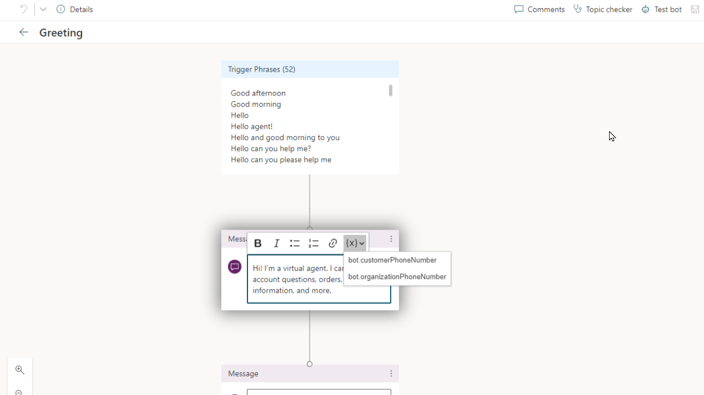

Basic behavior of a voice-enabled Power Virtual Agents bot isn't entirely different from a traditional bot. From a design standpoint, you don't need to do anything differently when you create the bot. Items such as topics, entities, and other elements are designed the same way. The primary difference is that, rather than interacting with a customer through a text-based form of communication, the bot will engage with them through a voice conversation. To ensure that this process happens as intended, you'll need to install multiple extensions into your environment to ensure that everything will be handled correctly.  

Depending on whether you're using Omnichannel for Customer Service for your contact center or not, you'll likely need to install the following three extensions to ensure that your bot can interact correctly with your environment:  

- [Power Virtual Agents telephony extension](https://appsource.microsoft.com/product/dynamics-365/mscrm.mspva_telephony_extension)
- [Omnichannel Power Virtual Agent Extension](https://appsource.microsoft.com/product/dynamics-365/mscrm.omnichannelpvaextension)
- [Omnichannel Voice Power Virtual Agent Extension](https://appsource.microsoft.com/product/dynamics-365/mscrm.omnichannelvoicepvaextension)

## Power Virtual Agents telephone extension

When customers engage through a voice channel, it's helpful if you have detailed information such as the customer's phone number or the support organization's phone number.  

To make this information available to a Power Virtual Agents bot, you can install the Power Virtual Agents telephony extension. The Power Virtual Agents telephone extension adds a number of extra actions and variables that Power Virtual Agents chatbots can use to understand, reply to, and transfer voice calls to the bot. 

Two variables that you can use in Power Virtual Agents conversations are:

- **bot.customerPhoneNumber** - Allows you to enter the phone number that the customer used to engage with your support center.  
- **bot.organizationPhoneNumber** - Allows you to enter the support number for your organization. This number is the one that the customer called to engage with you in a conversation.  

The following screenshot shows an example of using the extensions in a bot topic.  

> [!div class="mx-imgBorder"]
> 

To download and deploy the Power Virtual Agents telephony extension, go to [Power Virtual Agents telephony extension](https://appsource.microsoft.com/product/dynamics-365/mscrm.mspva_telephony_extension/?azure-portal=true).

## Omnichannel Power Virtual Agent extension

Regardless of the channel that a customer engages with a bot in, at some point, the bot will likely hand off the conversation to a live agent. You can integrate Power Virtual Agents bots with the Omnichannel for Customer Service solution or with a custom solution. When you integrate a bot with Omnichannel for Customer Service, incoming conversations are first routed to a queue and then distributed to agents, regardless of the channel. The bot is considered a virtual agent, and the items would be routed to the virtual agent first.  

An incoming conversation might be related to a specific case or existing customer. By having information that's related to the customer at your disposal, the bot can provide a more personalized experience for the customer as it's interacting with them. For example, when the Power Virtual Agents bot takes over and greets the customer, you might want it to greet the customer by name or include the name or case number that they're inquiring about.  

The Omnichannel Power Virtual Agent extension capabilities allow you to include context into handed off Power Virtual Agents conversations to live agents who are working in Microsoft Dynamics 365 Customer Service. 

A series of variables that will help provide context around the conversation are: 

- bot.msdyn_CaseId
- bot.msdyn_CaseNumber
- bot.msdyn_Case Title
- bot.msdyn_CustomerId
- bot.msdyn_CustomerName

 
When a conversation is handed off to a live individual, it's beneficial to have the context around the conversations. With Power Virtual Agents, you can seamlessly and contextually hand off escalated Power Virtual Agents conversations to live (human) agents by using the Chat Add-in for Dynamics 365 Customer Service.

To download and deploy the Omnichannel Power Virtual Agent extension, go to [Omnichannel Power Virtual Agent Extension](https://appsource.microsoft.com/product/dynamics-365/mscrm.omnichannelpvaextension/?azure-portal=true).

## Omnichannel Voice Power Virtual Agent extension

If you're using Omnichannel for Customer Service, the final extension that you'll need to install is the Omnichannel Voice Power Virtual Agent extension. This extension is important when you plan to use the voice channel in Omnichannel for Customer Service.  

> [!IMPORTANT]
> This extension requires that you've already deployed the Power Virtual Agents telephony extension.  

To download and install the Omnichannel Power Virtual Agent extension, go to [Omnichannel Voice Power Virtual Agent Extension](https://appsource.microsoft.com/product/dynamics-365/mscrm.omnichannelvoicepvaextension/?azure-portal=true).

Now that you've installed the necessary extensions, you can learn about the steps for setting up the Power Virtual Agents bot for voice.  
