In this exercise, you'll create a Power Automate cloud flow that's triggered on new incoming emails and then processes the messages with entity extraction.

Based on the results, if one of the recognized entities is a URL, you'll receive a Microsoft Teams notification to inform you that this email is a potential threat. The IT security team should confirm whether the link is legitimate and if an email can be considered safe or should be quarantined.

## Get started

As a prebuilt model, entity extraction is ready to be used and doesn't require training. You can create a Power Automate cloud flow and then add the AI Builder entity extraction action to it.

However, for this exercise, you'll take advantage of an existing Power Automate template to get started.

1.  In Power Automate studio, go to the **Templates** section and search for **entity extraction**. Select the tile for the **Extract entities of received emails using AI Builder** template.

	> [!div class="mx-imgBorder"]
	> [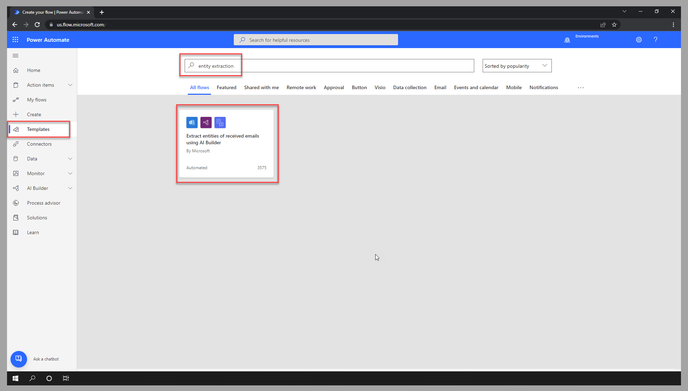](../media/search-entity-extraction.png#lightbox)

1.  Ensure that all required connections are linked to your email account. If needed, create the connection by selecting **Create**.

	> [!div class="mx-imgBorder"]
	> [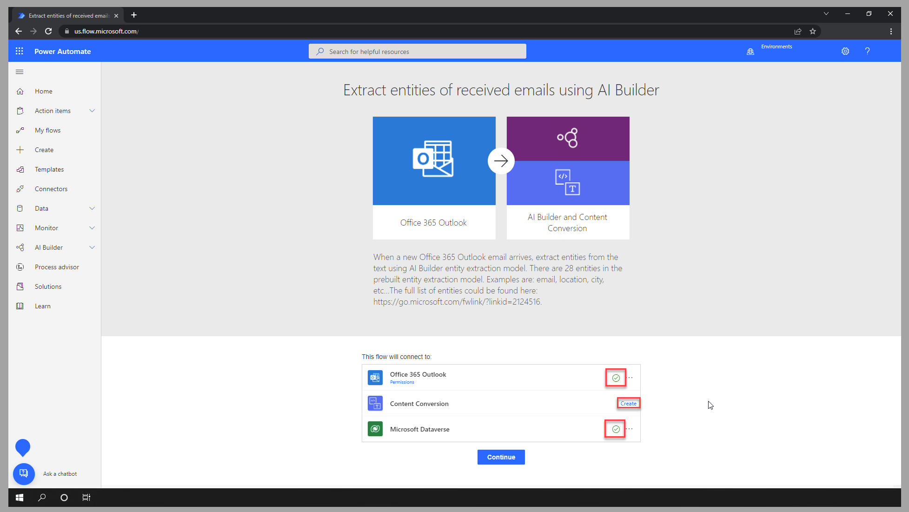](../media/create-content-conversion.png#lightbox)

1.  After the connection has been created, select **Continue**.

	> [!div class="mx-imgBorder"]
	> [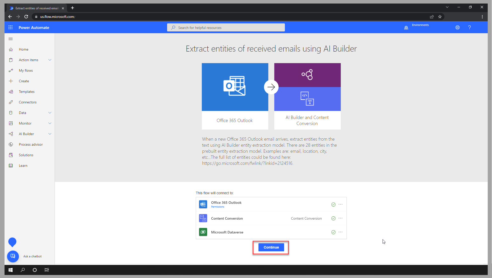](../media/continue.png#lightbox)

1.  **Save** your flow.

	> [!div class="mx-imgBorder"]
	> [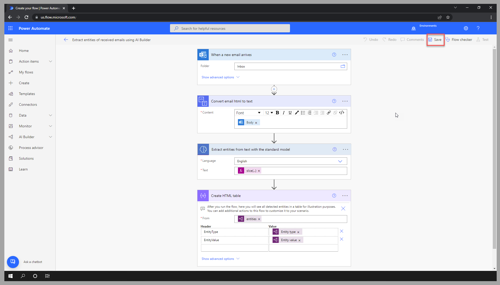](../media/save-flow.png#lightbox)

## Review the flow actions

The template has generated a cloud flow that's triggered on email arrival, and then it will process that email with entity extraction.

Make sure that you familiarize yourself with the different sequential actions that are contained in the new flow, as follows:

1.  The trigger will monitor the inbox for the account of the connection that you've selected.

	> [!div class="mx-imgBorder"]
	> [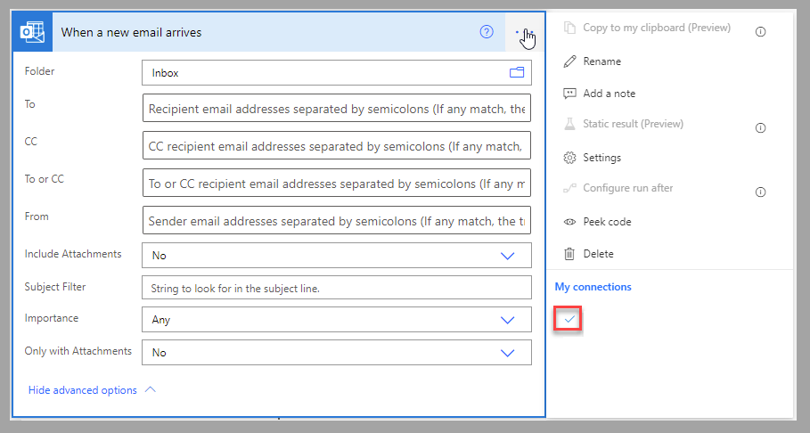](../media/connections-selected.png#lightbox)

1.  To ensure that no HTML tags interfere with the entity extraction process, the system will convert the content of the message (**Body**) from HTML to plain text.

	> [!div class="mx-imgBorder"]
	> [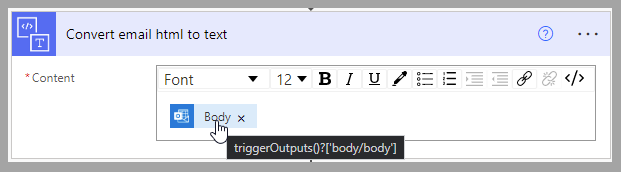](../media/body-value.png#lightbox)

1.  Assuming that the message is in English, the entity extraction model will process the first 5,000 characters (limitation of the model) of the converted text.

	> [!div class="mx-imgBorder"]
	> [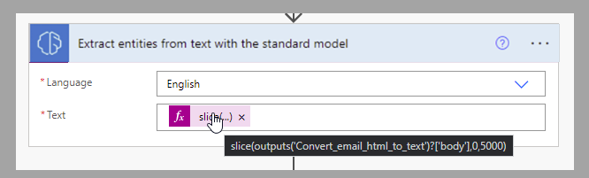](../media/slice-formula.png#lightbox)

1.  Results are converted in an HTML table so that you can review them when testing the flow.

	> [!div class="mx-imgBorder"]
	> [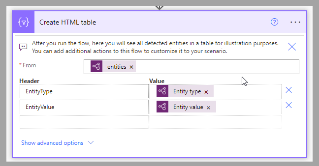](../media/create-table.png#lightbox)

## Process the results

The entity extraction action returns a series of results that consist of the list of detected entities with detailed information, such as:

-   **Type** - Which entity type was detected.

-   **startIndex and length** - Indication of the position and length of the text portion that this entity is for.

-   **Value** - The extracted portion of the text that represents the entity.

-   **Score** - Level of confidence for this detected entity.

This scenario focuses on one type of entity: **URL**. As a result, the following procedure will filter the results to only continue and send the notification when that entity is detected.

1.  Add a filter array action to keep only the **URL** entity type.

	> [!div class="mx-imgBorder"]
	> [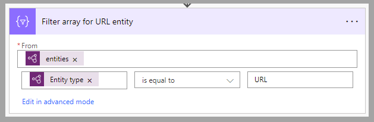](../media/entity.png#lightbox)

1.  Add a condition action to continue only if at least one item is left in the filtered array.

	> [!div class="mx-imgBorder"]
	> [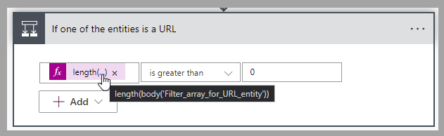](../media/length.png#lightbox)

1.  When condition is valid, post a Teams notification.

	> [!div class="mx-imgBorder"]
	> [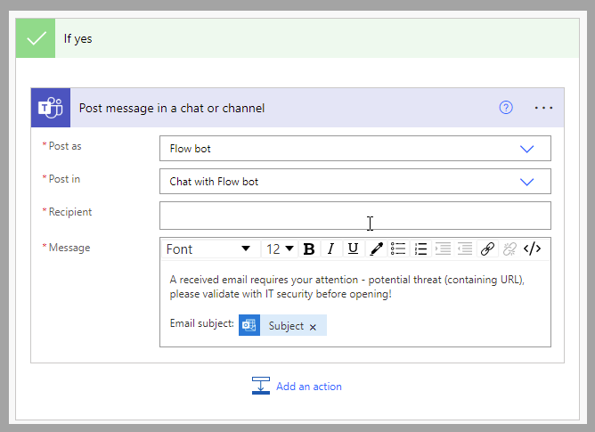](../media/post-message.png#lightbox)

## Test the flow

The last step is to confirm that the flow is processing the incoming emails as expected and is sending out a Teams notification if a URL is part of a received email message.

To test the flow, follow these steps:

1.  Save the flow.

	> [!div class="mx-imgBorder"]
	> [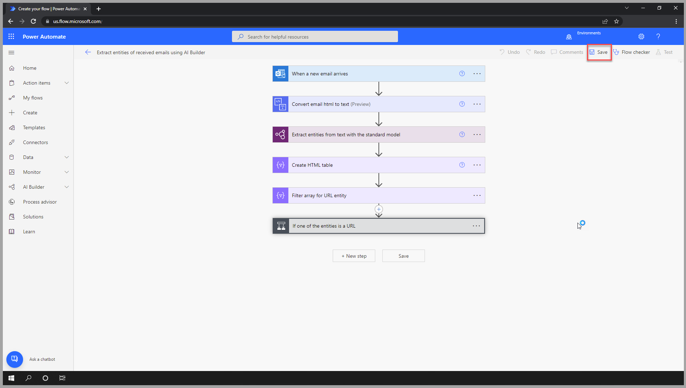](../media/save.png#lightbox)

1.  Confirm that the flow is active. Select **Turn on** if available.

	> [!div class="mx-imgBorder"]
	> [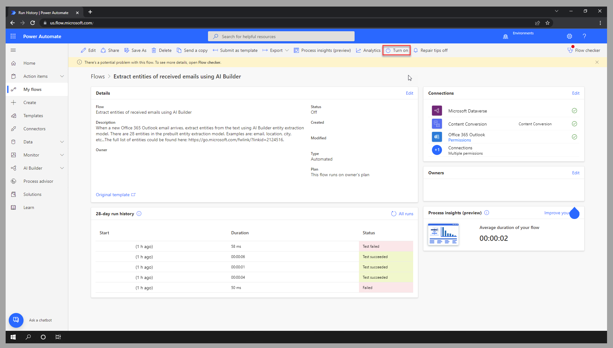](../media/turn-on-button.png#lightbox)

1.  In Outlook, send yourself (or the monitored email address) a message that contains different sentences and items. For the first test scenario, include a link to a website in the email message.

	> [!div class="mx-imgBorder"]
	> [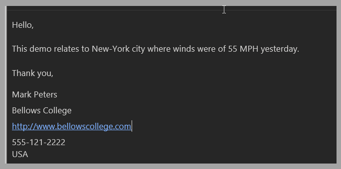](../media/signature.png#lightbox)

1.  In Teams, confirm that you've received a notification for this email.

	> [!div class="mx-imgBorder"]
	> [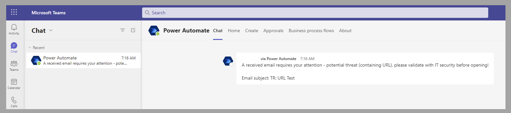](../media/notification.png#lightbox)

1.  For the second test scenario, create a new email message that doesn't contain a website link. A Teams notification isn't received.

	> [!div class="mx-imgBorder"]
	> [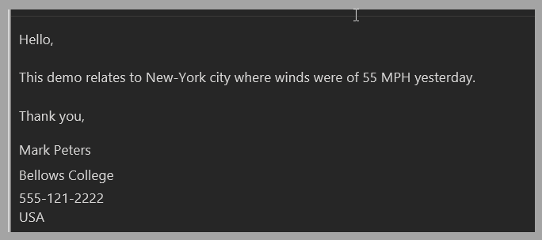](../media/email.png#lightbox)

1.  To stop processing incoming emails, turn off the flow.

	> [!div class="mx-imgBorder"]
	> [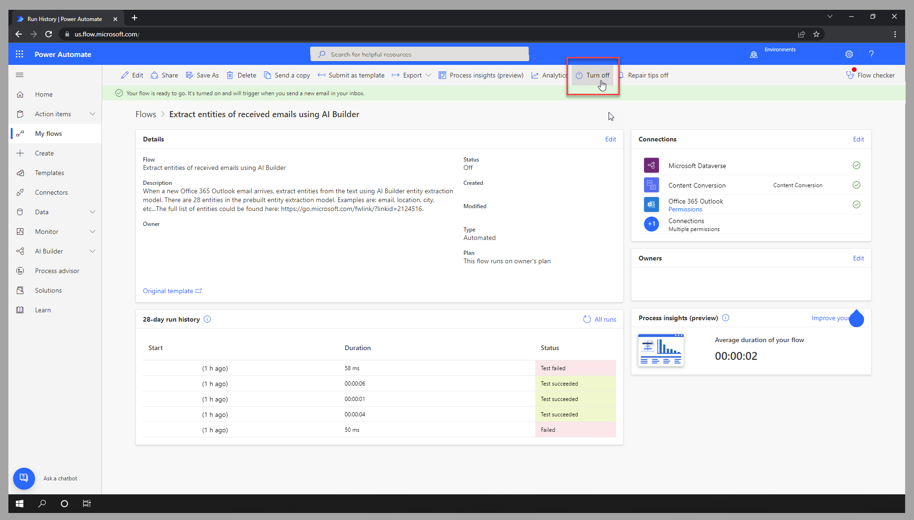](../media/turn-off-button.png#lightbox)

