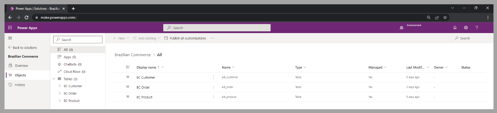
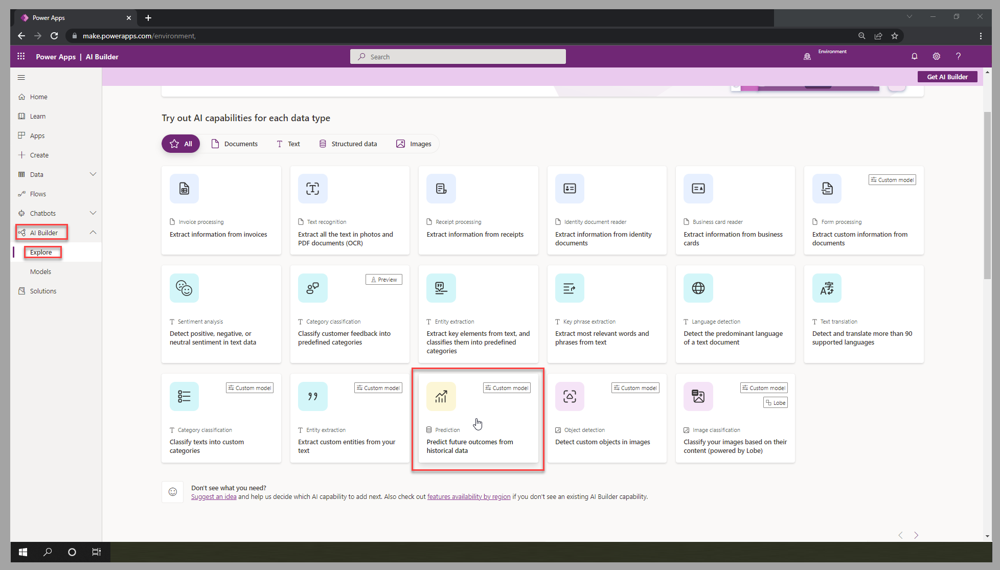
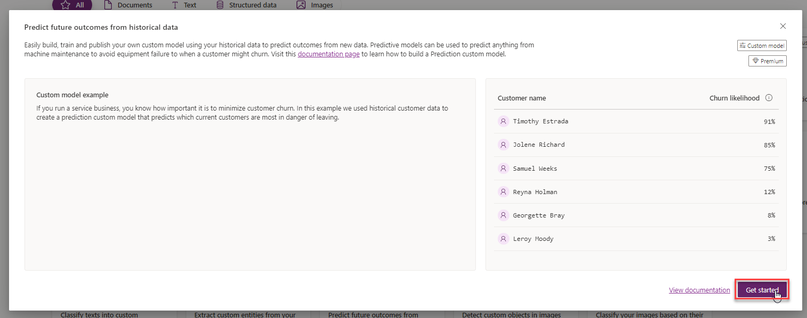
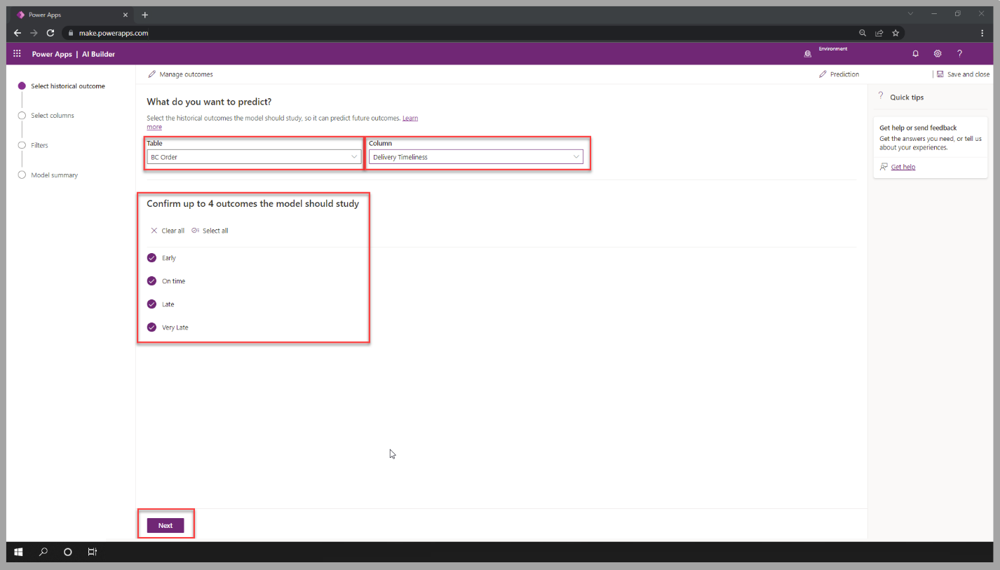
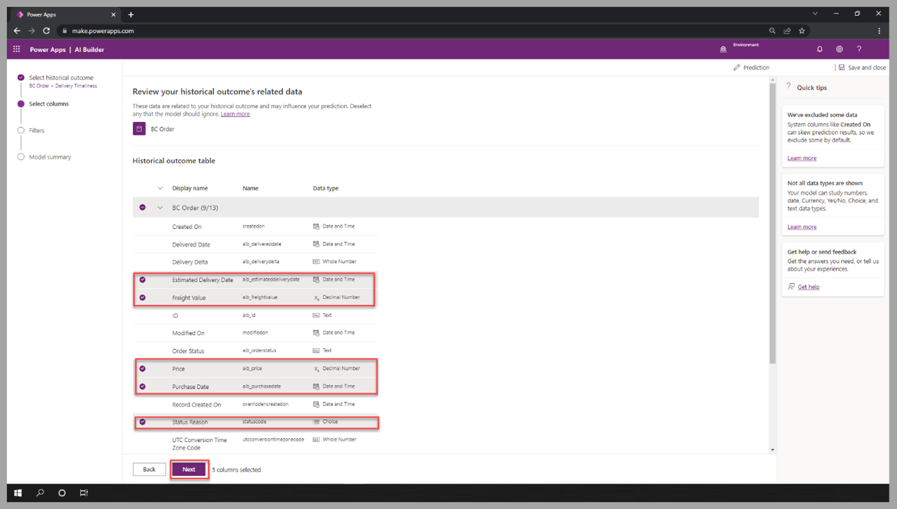
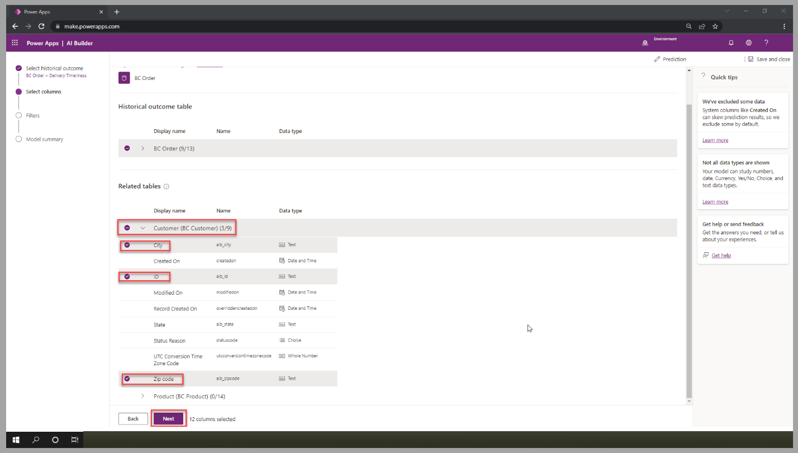
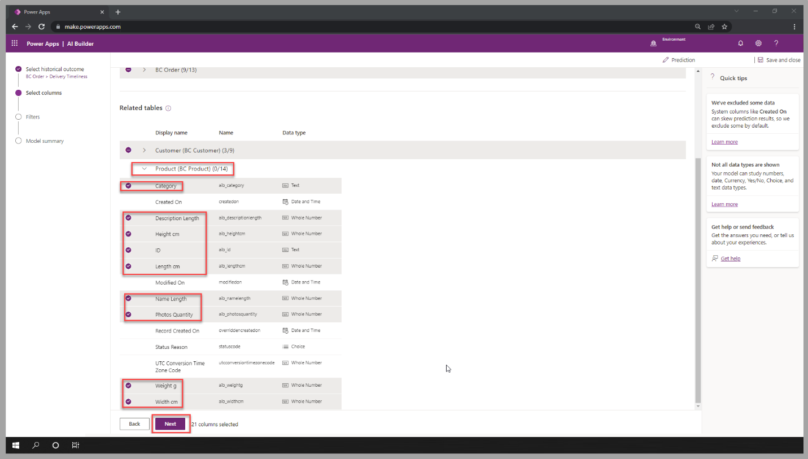
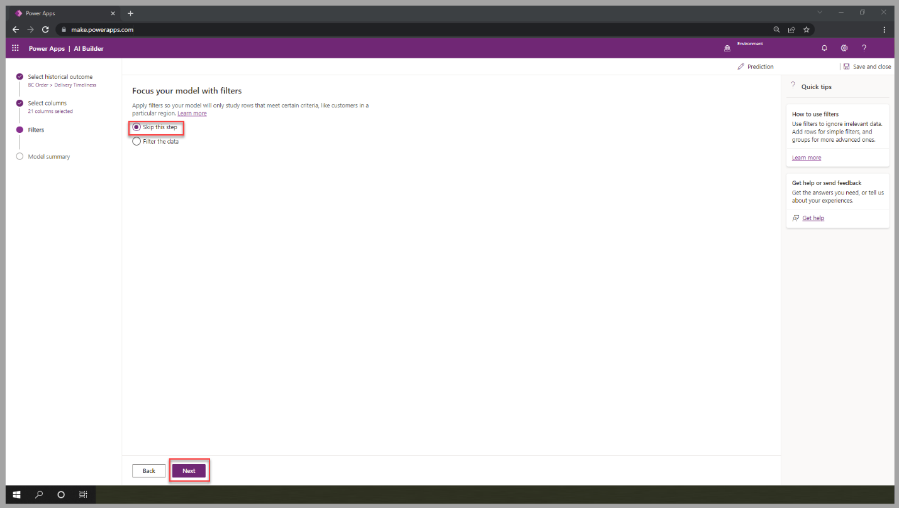
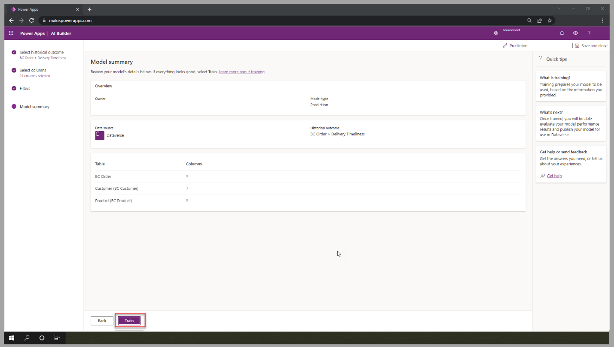

In this exercise, you'll build an AI Builder prediction model to help a Brazilian commerce predict the delivery timeliness of customer orders. The retailer has received complaints from customers about late shipments. This impacts the reviews and satisfaction surveys, which are high influence factors in competitive retail markets. By predicting the orders that have probability of late arrival, this retailer can implement rules to automatically upgrade shipping option to express service and have a higher probability of incurring no delay and receive positive feedback from its customers.

## Data preparation

As with all custom models, one of the initial important steps is to identify and prepare data that will be used to train the model. AI Builder prediction is no different and requires historical data to determine patterns that will help predict outcomes of new events.

To accelerate this exercise, follow the steps described at [Sample Dataset for prediction model](/ai-builder/prediction-data-prep?WT.mc_id=DX-MVP-5003600?azure-portal=true#sample-dataset-for-prediction-model).

For this exercise, you'll reference the three following tables that are part of the *Brazilian Commerce* (BC) Dataverse solution:

-   BC Customer: list of 5,000+ customers with the city and zip code their orders were delivered to

-   BC Order: list of 5,000+ orders processed for the customers with information about the product purchased, its price, estimated date of delivery, actual delivery date, and so on.

-   BC Product: list of 5,000+ products with category and shipment volume and weight information

> [!div class="mx-imgBorder"]
> 

In the following video, you're walked through those data preparation steps.

> [!VIDEO https://www.microsoft.com/videoplayer/embed/]

## Create a model 

The prediction model determines potential outcomes after analyzing historical data. Providing records that have multiple potential influencers and a clear outcome, will support a model with high confidence level.

The tables imported during the data preparation steps will be used to create the prediction model.

1.  In the Power Apps Studio, in the left navigation menu, under **AI Builder**, select **Explore**, and then select the prediction model.

	> [!div class="mx-imgBorder"]
	> 

1.  Select **Get started**.

	> [!div class="mx-imgBorder"]
	> 

1.  Select the **BC Order** table and **Delivery Timeliness** column. Confirm the four outcomes the model will study, and then select Next.

	> [!div class="mx-imgBorder"]
	> 

1.  Review and confirm the selected columns that may influence the outcome for the **BC Order** table.

	> [!div class="mx-imgBorder"]
	> 

1.  To allow the model to consider the customer information, select the **City**, **ID**, and **Zip code** columns for the **BC Customer** table.

	> [!div class="mx-imgBorder"]
	> 

1.  To allow the model to consider the product information, select the **Category**, **Description Length**, **Height cm**, **ID**, **Length cm**, **Name Length**, **Photos Quantity**, **Weight g**, and **Width cm** columns for the **BC Product** table; then select **Next**.

	> [!div class="mx-imgBorder"]
	> 

1.  For this exercise, no filter is required; select **Skip this step**, and then select **Next**.

	> [!div class="mx-imgBorder"]
	> 

1.  Review the model summary. Select **Train** to move to the next portion of this exercise.

	> [!div class="mx-imgBorder"]
	> 

