The purpose of this hands-on lab is to introduce the Power Apps portals invitation-based user registration process.

The exercises work best when you have sample data to work with. Depending on the environment that you're working with, you might want to install sample data to assist with the exercises. Dataverse does provide the ability to add sample data as needed. If the environment that you're working in doesn't have sample data installed, follow the steps in the [Add or remove sample data](/power-platform/admin/add-remove-sample-data/?azure-portal=true) documentation to install the sample data into your environment.

## Learning objectives

At the end of these exercises, you'll be able to:

- Create a Power Automate flow to email invitations to contacts.
- Create and send invitations to contacts to register.
- Redeem invitations.

**Estimated time to complete this exercise**: 10 to 15 minutes

### Prerequisites

The prerequisites for this exercise are as follows:

1. System Administrator access to a Dataverse or Dynamics 365 environment.
1. A provisioned portal in that environment.
1. Maker access to Power Automate.
1. An Office 365 email account or any other email account that can be accessed in Power Automate using a connector.

## Scenario

Your organization has been using Power Apps for some time and has been recording information about customers and suppliers. You've provisioned and configured a Power Apps portal. You want to invite one of your suppliers assisting you with the portal management to register as an administrative portal user so that they're able to sign in, access administrator-only content, and perform administrator-specific front-end functions like previewing draft content.

## High-level steps

To send invitations to your customers and for them to redeem the invitations, complete the following tasks:

- Create Power Automate flow to send a single invitation.
- Select a contact and create an invitation.
- Ensure that the invitation contains the required information.
- Send the invitation to the contact.

### Create a test contact

To create a test contact, follow these steps:

1. Sign in to [Power Apps](https://make.powerapps.com/?azure-portal=true).
1. Select a target environment by using the environment selector in the upper-right corner.
1. On the left menu, select **Apps**.
1. Select the **Portal Management** app. The **Portal Management** app will open in a new tab. Don't close the Power Apps maker environment window.
   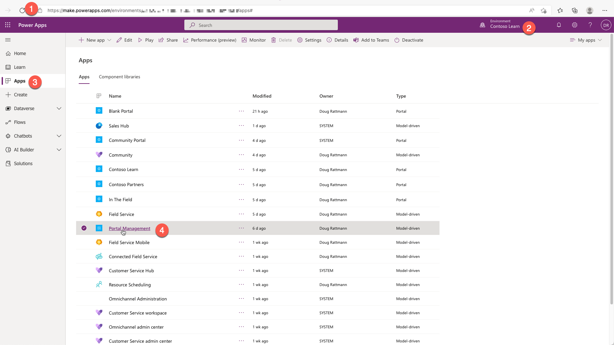
1. In the app, select **Contacts** in the **Security** section and then select **New**.
1. Create a new row for Nancy Davolio. Fill in the first name, last name, and email address information (*use an email address where you can receive the email*).
1. Select **Save**.
   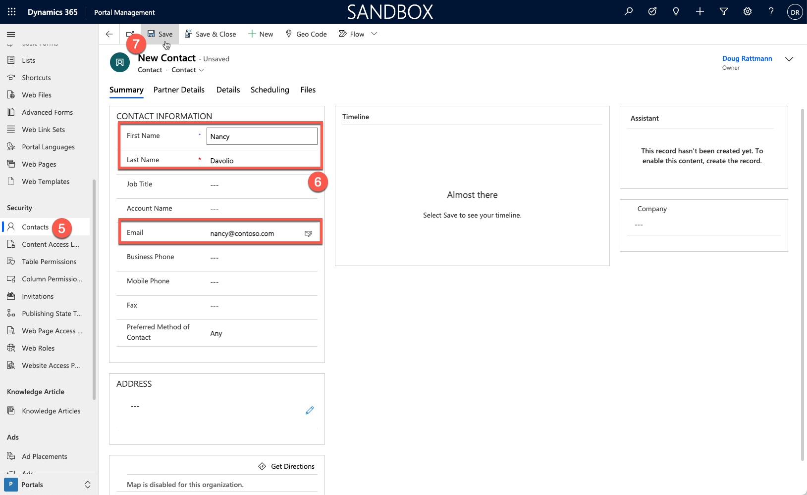
1. Don't close this window.

### Create invitation flow

Power Apps portals are provisioned with a classic workflow to send the invitation email. We'll use a modern approach instead and create a new Power Automate flow to accomplish the same task.

1. Switch to the Power Apps maker environment tab.

1. Select **Solutions**, then locate and select **Common Data Services Default Solution**.

   > [!TIP]
   > Use search to locate the solution.

   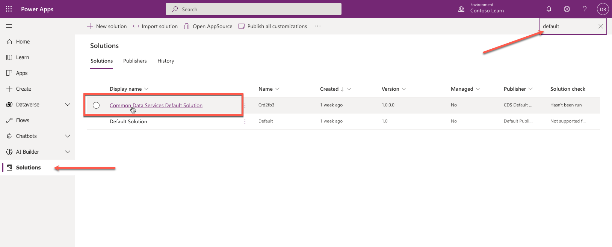

1. Select **New > Automation > Cloud flow > Instant**.

   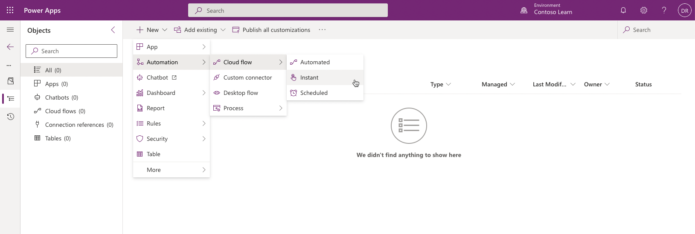

1. Enter **Send Invitation** as **Flow name**.

1. Select **When a row is selected** Dataverse trigger.

1. Select **Create**.

   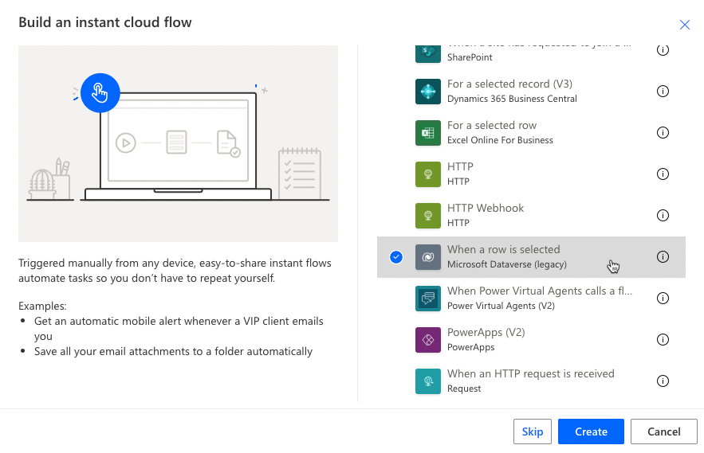 

1. Enter details for **When a row is selected** step.

   * Select **Default** environment
   * Select **Invitations** table

1. Add an action **Get a row by ID** from the **Microsoft Dataverse** connector.

   - Select ... on the step and select **Rename**. Change step name to **Get Contact**.
   - Select **Contacts** as the table
   - Insert **Invite Contact** dynamic content as the **Row ID**

1. Press **Save**. Your flow should look like the following:
   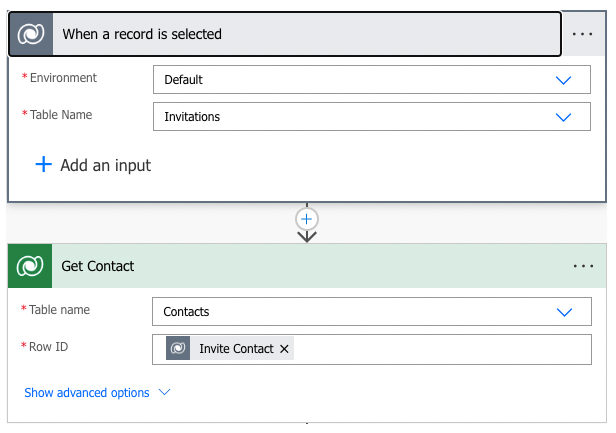 

1. Add a **Compose** action from the **Data Operation** connector.

   - Set **Inputs** to `<a href="https://portalurl/register/?invitation=CODE">this link</a>`
   - Replace **portalurl** with your portal address, for example, `contoso.powerappsportals.com`
   - Select **CODE** and replace it with **Invitation Code** dynamic content.
   - That will create an invitation link expression that we can now use inside an HTML email.

   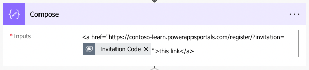

1. Add an action **Send an email (V2)** from **Office 365 Outlook** connector.

   > [!NOTE]
   > In this step, you can use any connector that supports sending HTML emails. For example, if you have a SendGrid subscription, you can use the SendGrid connector.

   * Insert **Email** dynamic content from the **Get Contact** step as **To**.

   * Enter **Join our community** as the **Subject**.

   * Insert the following text as the email body:
  
     ```text
     Dear FIRSTNAME,
     
     Please accept our invitation to join the Contoso community. To redeem your invitation, please follow LINK.
     
     Best regards,
     Contoso Team
     ```

   * Replace FIRSTNAME with **First Name** dynamic content from the **Get Contact** step.

   * Replace LINK with **Outputs** from the **Compose** step.

2. Select **Save**. Your flow should look like the following:
   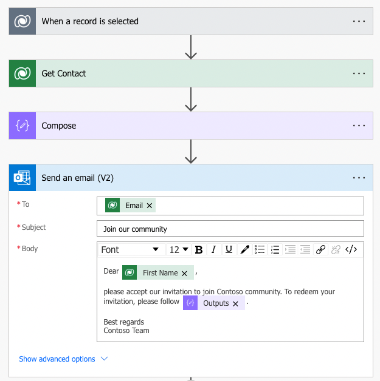

3. Add **Update a row** action from **Microsoft Dataverse** connector.

   - Press ... on the step and select **Rename**. Change step name to **Set status as sent**.
   - Select **Invitations** as the table.
   - Select **Invitation** dynamic content from the **When a record is selected** step as **Row ID**.
   - Expand **Show advanced options**.
   - Select **Sent** as the **Status Reason**.

   

4. Select **Save**, then select Go Back arrow in the top left corner.

    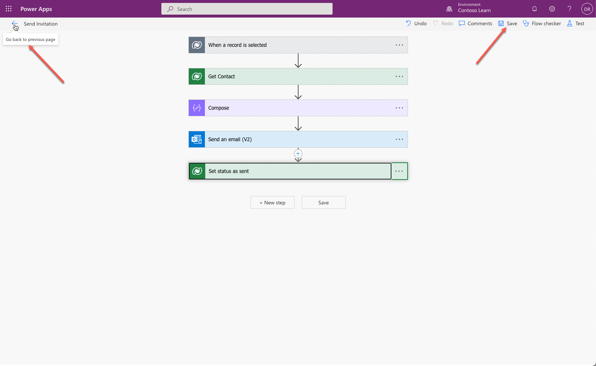

### Create and send the invitation

To create and send the invitation, follow these steps:

1. Switch to the Power Apps portals app. Open Nancy Davolio's contact row if it's not already opened.

1. Select **Create Invitation** on the command bar.

1. The invitation will be prepopulated. Select **Save**.

1. Under **Assign to Web Roles**, select **Add Existing Web Role**.

1. Search and add the **Administrators** role.

1. Select **Flow > Send Invitation**.

   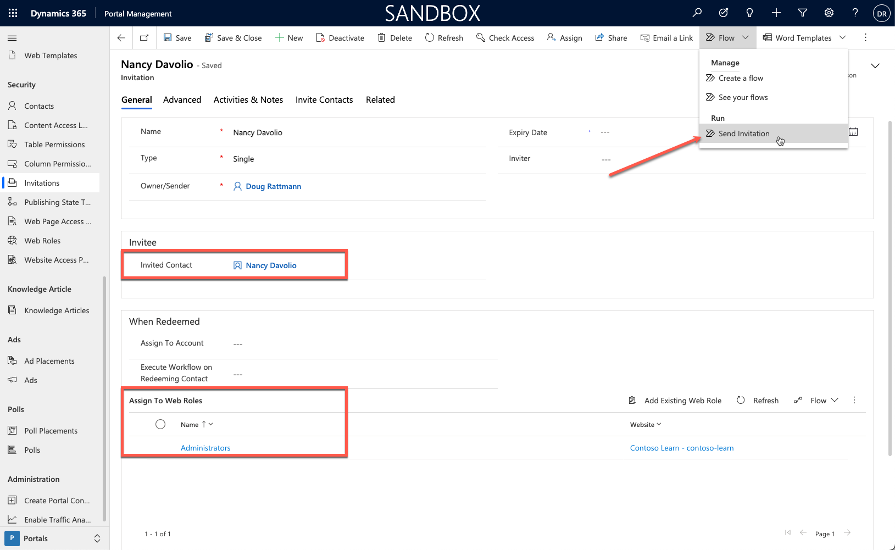

   > [!TIP]
   > If you don't see **Send Invitation** under the **Flow** menu, select **See your flows** first, refresh the window, then try accessing the **Flow** menu again.

### Redeem the invitation

To redeem the invitation, follow these steps:

1. Open the mailbox for the email that you used for Nancy Davolio.

1. Locate and open the invitation email.

1. Select the link in the email. The **Redeem Invitation** page will open.

1. Select **Register**.

1. Enter username **nancyd** and then a password of your choice.
   > [!TIP]
   > By default, Passwords must be at least 8 characters. Passwords must contain characters from at least three of the following four classes: uppercase, lowercase, digit, and non-  alphanumeric (special).

1. Select **Register**. Your account will be registered, and you'll be signed in automatically and redirected to the profile page.

1. Switch to the Power Apps portals app.

1. Select **Invitations** and then select the **Completed Invitations** view.

1. Confirm that the **Nancy Davolio** invitation is listed.

1. Open the invitation and confirm that **Status Reason** is now **Redeemed**.

   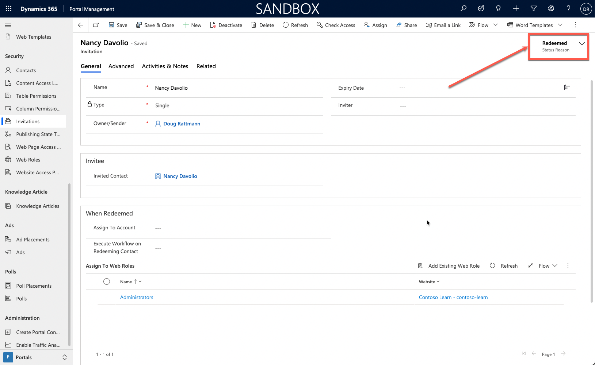