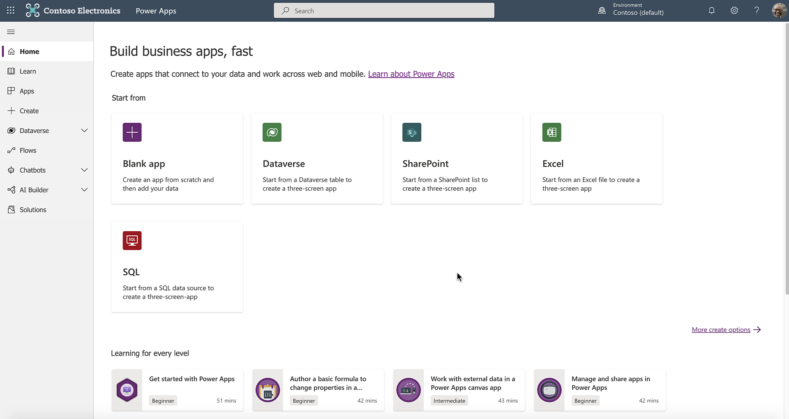
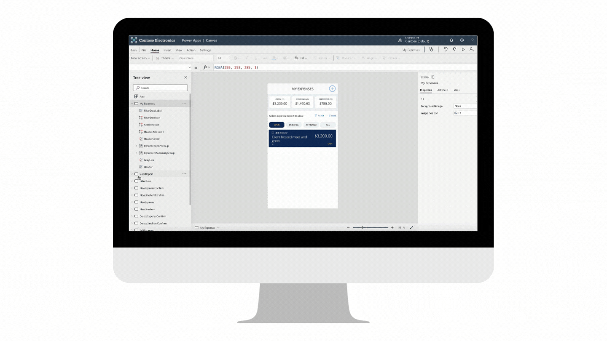
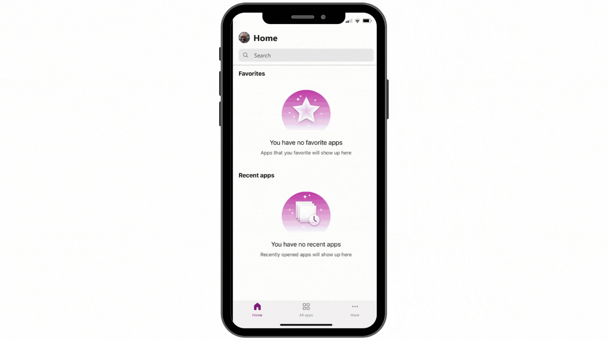
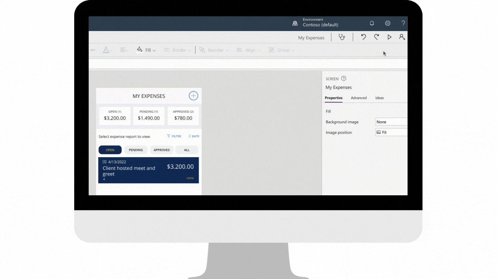

Power Apps is a collection of services, apps, and connectors that work together to let you do much more than only view your data. You can act on your data and update it anywhere and from any device.

This unit explores each part of the following Power Apps components:

-   [Power Apps home page](https://make.powerapps.com/?azure-portal=true) - Apps start at this page, whether you build them from data, a sample app, or a blank screen.

-   [Power Apps Studio](https://create.powerapps.com/studio/?azure-portal=true) - Develop your apps further by connecting to data, adding and arranging user interface (UI) elements (known as controls), and building formulas.

-   **Power Apps mobile** - Run your apps on Microsoft Windows, Apple iOS, and Google Android devices.

-   [Microsoft Power Platform admin center](https://admin.powerplatform.microsoft.com/?azure-portal=true) - Manage Power Apps environments and other components.

> [!NOTE]
> To use these sites, you'll need to sign in by using your organizational account.

## Power Apps home page

If you're building an app, you'll start with the [Power Apps home page](https://make.powerapps.com/?azure-portal=true). On this page, you can build apps from sample apps, templates, or a blank screen. All apps that you've built will appear on this page, along with apps that others have created and shared with you.

> [!div class="mx-imgBorder"]
> 

## Power Apps Studio

Power Apps Studio is where you can fully develop your apps to make them more effective as business tools and to make them more attractive. The following Power Apps Studio components help make the process of creating apps seem more like building a slide deck in Microsoft PowerPoint:

-   **Left pane** - Shows a hierarchical view of all controls on each screen or a thumbnail for each screen in your app.

-   **Upper-left dropdown menu** - This pane is the property dropdown list. It shows the different properties for the selected control.

-   **Middle pane** - Shows the canvas app that you're working on.

-   **Right pane** - Where you can set options, such as the layout, properties, and data sources for certain controls.

> [!div class="mx-imgBorder"]
> 

## Power Apps for mobile devices

Power Apps for Windows, iOS, and Android devices allows you to use all apps that you've created and that others have shared with you on your mobile device. You or your users can download the Microsoft Power Apps application from the appropriate app store. When you sign in with your credentials, all apps that have been shared with you will display. You'll only need to download Power Apps for mobile devices once.

When using Power Apps, you'll get the most out of your device's capabilities: camera controls, GPS location, and more.

> [!div class="mx-imgBorder"]
> 

## Microsoft Power Platform admin center

Microsoft Power Platform admin center is the centralized place for managing Power Apps for an organization. On this site, you can define and manage different environments to house the apps. For example, you might have separate environments for development and production apps. Additionally, you can define data connections and manage environment roles and data policies.

For more information, see [Use best practices to secure and govern Microsoft Power Platform environments](/learn/paths/best-practices-environments/?azure-portal=true).

> [!div class="mx-imgBorder"]
> 

