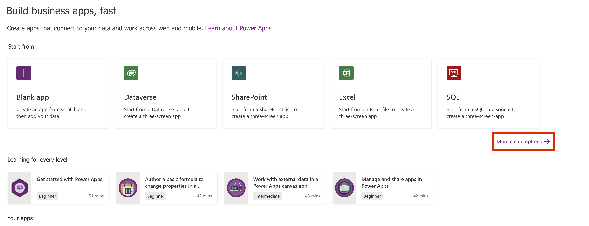
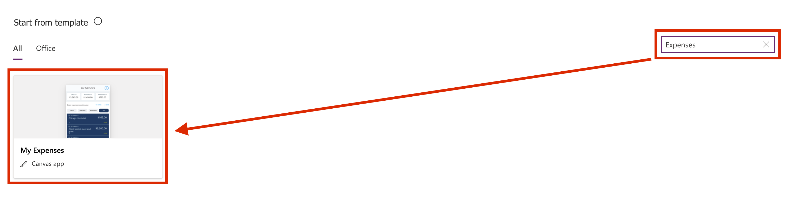
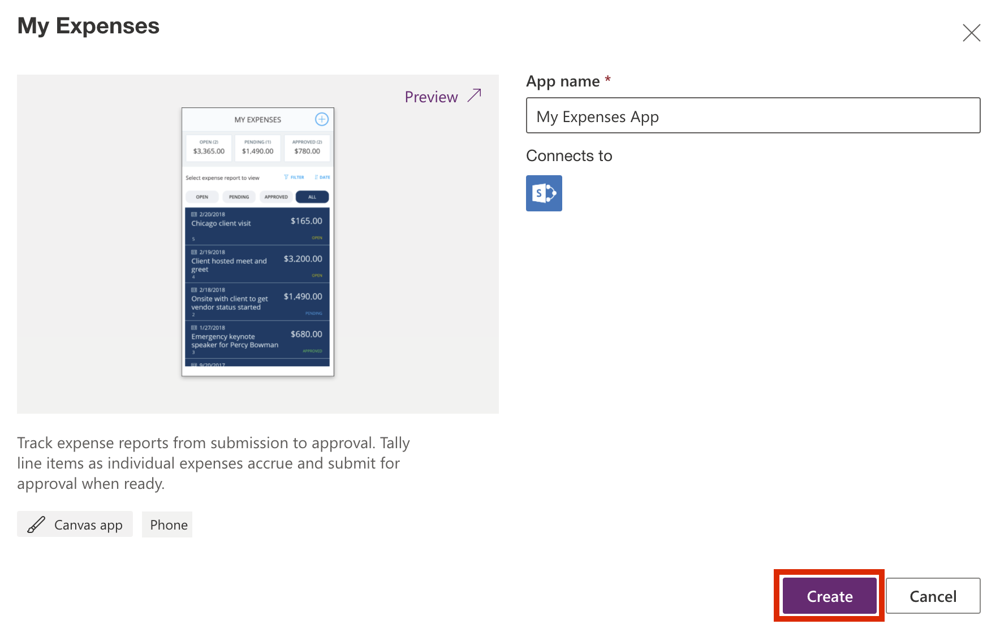

In this exercise, you'll create an expenses app for mobile devices. This app will start from the **My Expenses** template. Many templates are available for you to choose from, each preconfigured with different logic/functionality to support its use case. As a first-time app creator, make sure that you explore these templates further to help inspire you when you're creating custom apps.

Keep in mind that you can use data from many other sources, including Microsoft Dataverse, SharePoint, cloud services like Salesforce, and on-premises sources like Microsoft SQL Server.

> [!NOTE]
> Power Apps requires a Microsoft Office 365 license or a free trial. For more information, see [Licensing overview for Microsoft Power Platform](/power-apps/administrator/pricing-billing-skus/?azure-portal=true).

Before you begin, watch the video for a brief overview of what to expect when creating your first canvas app with Power Apps. The video demonstrates the app's capabilities and how to add new items and edit existing ones.

> [!VIDEO https://www.microsoft.com/videoplayer/embed/RE4XYrX]

## Create your first app
To create your first app, follow these steps:

1.  Open your browser and go to [https://make.powerapps.com](https://make.powerapps.com/?azure-portal=true). When prompted to sign in, enter your organizational account credentials.

1.  From the **Home** screen, on right side of the screen, select **More create options**.

	> [!div class="mx-imgBorder"]
	> 

1.  In the **Search all templates** field, enter **Expenses**.

1.  Under **Start from template**, select **My Expenses**.

	> [!div class="mx-imgBorder"]
	> 

	> [!NOTE]
	> After you've selected the template, select **Preview** to test it.

1.  In the **App name** field, enter **My Expenses App** and then select **Create**.

	> [!div class="mx-imgBorder"]
	> 

	After a few moments, an "Almost there" pop-up window might display. If so, select **Allow**.

1.  On the **Welcome to Power Apps Studio** pop-up window, select **Skip**.

	As a best practice, after you've created the app, immediately select **Save** to save your app. Power Apps has an AutoSave feature that will save your app every two minutes; however, that feature doesn't start until the app has been saved for the first time.

1.  In the upper-left corner of the screen, select **File**.

1.  On the **Save as** tab, name the app **My Expenses** and then select **Save** in the lower-right corner.

1.  When the app has saved successfully, in the upper-left, select the back arrow to return to the app.

## Explore and edit your new app

Your newly created **My Expenses** app will open in Power Apps Studio, which will allow you to review the various screens, controls, and functionality that make this app work.

If you want to play/preview the app, select the **Play** button in the upper-right corner. When you're ready to return to edit mode, select the **X** in the upper-right corner.

> [!NOTE]
> This sample app includes locally saved information by using [collections](/power-apps/maker/canvas-apps/create-update-collection/?azure-portal=true). If you want to use the app for business purposes, you'll need to create a data source to mimic the existing collections. Then, you'll need to add the connection to this app.

When you're finished, you can close the app by going to **File > Close**. To view the app on your phone, make sure that you install Power Apps for mobile first.

## Install Power Apps for mobile devices

When building or updating an app, you should test it in the same form factor as the users. This app was designed for phone factor, so make sure that you test it on a phone before putting the app into production.

1.  Download Power Apps for mobile from the app store for the platform that you want to use.

1.  Sign in by using your Office 365 username and password.

1.  On your phone or tablet, run the **My Expenses** app** in Power Apps for mobile. If you don't want to install the app, you can run it in a browser.

1.  If the **My Expenses** app doesn't show in Power Apps for mobile, select the user account menu and then turn on the **Show non-production apps** toggle. You might need to swipe to the left or tap your profile icon to get this option.

