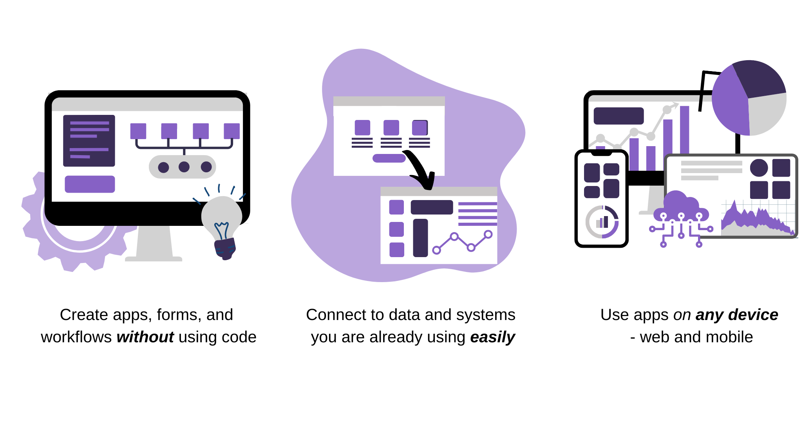
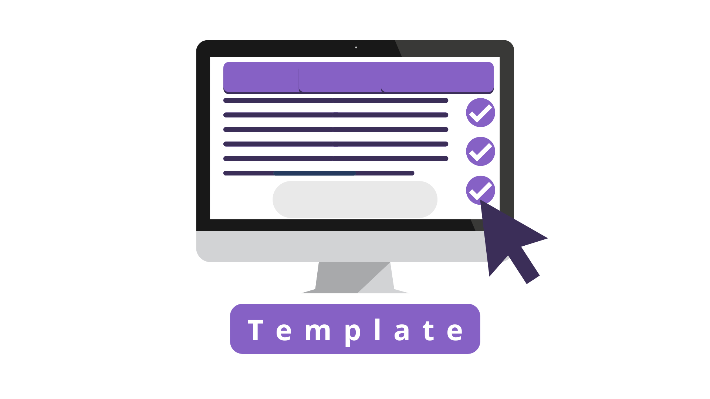
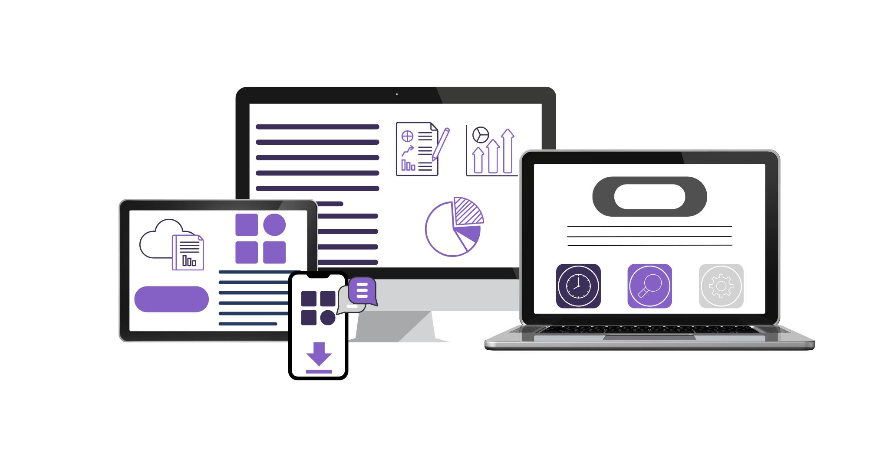
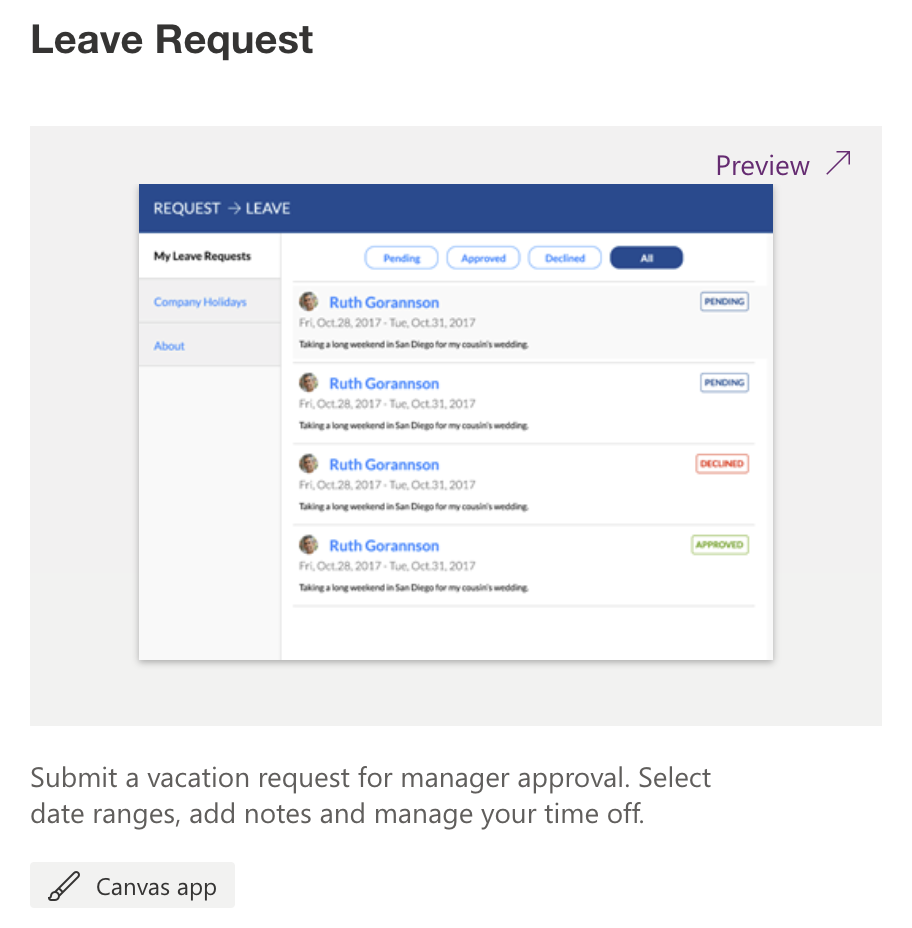

Power Apps is a low-code development platform with a suite of apps, services, and connectors you can utilize to build apps. In the past, to build custom applications you had to be highly technical, and proficient in the various coding languages, but you don't have to worry about that with Power Apps.

> [!VIDEO https://www.microsoft.com/videoplayer/embed/]

> [!div class="mx-imgBorder"]
> 

## Simple and easy to use interface

Power Apps simplifies the custom app building experience by enabling users to build feature-rich apps without writing thousands of lines of custom code. With Power Apps, drag and drop controls where you want in the app and you're off to a great start!

> [!div class="mx-imgBorder"]
> 

## Multiple ways to create an App

When creating apps, you have the flexibility and power of choice to decide what is best for your solution.

### Blank App

> Build an app from the ground up, you add all of the screens, controls, and functionality. You have complete control of everything, from start to finish by starting from blank.

> [!div class="mx-imgBorder"]
> 

### Data source

> Connect directly to your business data from multiple sources Microsoft Dataverse, SharePoint, Excel, SQL Server, and more. Once connected, Power Apps will automatically build you a three-screen app that lets you display, edit, delete, and create new records.

> [!div class="mx-imgBorder"]
> 

### Template

Templates use sample data to help you determine what's possible. By opening templates in Power Apps Studio, you can learn, hands-on, how an app is built.

> [!div class="mx-imgBorder"]
> 

## Share your app with others

Once your app is ready to be rolled out, make sure to publish the latest version and then you can share it with anyone (properly licensed) in your tenant. Users will be able to access the app via Desktop, Tablet, or on a Mobile device.

For more information about sharing Power Apps, see [Share a canvas app with your organization](/power-apps/maker/canvas-apps/share-app/?azure-portal=true).

> [!div class="mx-imgBorder"]
> 

## Can't forget about our professional developer friends

Power Apps also provides an expandable platform that lets pro developers programmatically interact with data and metadata, apply business logic, create custom connectors, and integrate with external data.

## Out with the old and in with the new

With all the possibilities of Power Apps, I'm sure there are several outdated business processes that you can think of where an app would be perfect. Another great thing about using a custom app, is the ability to keep everyone up to date and in the loop when data is added, modified, or removed.

The following examples can help you think about how to use an app, instead of traditional paper notes, to run your business:

### Restaurant employee management

Employees of a large restaurant might fill out work schedules and vacation requests on a piece of paper that's affixed to a wall. With Power Apps running on everyone's smartphone, employees can open the app to record the same information, anywhere, anytime. The app can even send reminders for the start of the next day's shift.

There's a Leave Request app Template available you might want to check out to see what other ideas it gives you.

> [!div class="mx-imgBorder"]
> 

### Home/Site Inspections

Often, company representatives who visit homes/sites/rental properties in the field carry clipboards as they walk the property. During this process, they're checking for damage and taking photos, as needed. By switching from a clipboard to a custom app, reps can now complete their inspections right there onsite, even take and upload pictures. All the information would be written back to the data source and accessible to anyone with the proper permissions.

There's a Site Inspection Template app you can check out if you're interested in this type of custom app solution.

> [!div class="mx-imgBorder"]
> 

If you would like to learn about some "real-world" Power Apps customer solutions, see [Microsoft Power Platform Stories](https://powerapps.microsoft.com/en-us/blog/power-platform-stories/?azure-portal=true).

