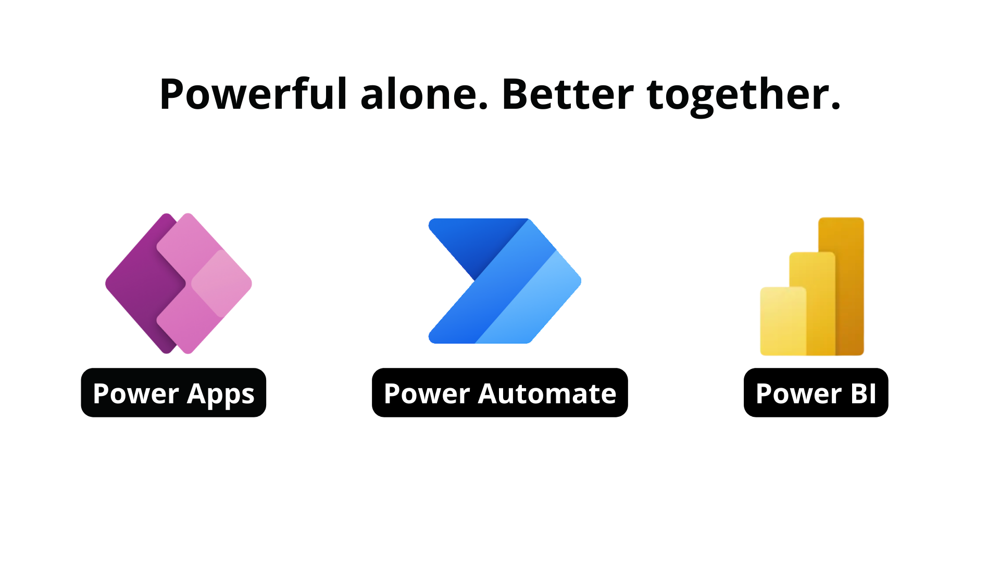

Microsoft Power Apps works with other technologies to help you build powerful apps for your organization, including:

-   **Microsoft Power Automate** - Allows you to build automated workflows to receive notifications, run processes, collect data, and more.

-   **Microsoft Power BI** - Allows you to connect data from multiple sources and transform the data into graphical visualizations to gain insights.

## Related Microsoft Power Platform technologies

As you continue developing your application, you should consider implementing other Power Apps related technologies such as Power Automate and/or Power BI. For example, you might have a simple **Expense Report** app that requires an approval before an item can be purchased. With Power Automate, you can create a flow to make this process happen. Alternatively, you might want to display your data with custom charts and graphs to give your users a more visual look into the data, which can often be useful. In this section, you'll learn more about other Microsoft Power Platform technologies and how you can apply them in your own Power Apps solution. Keep in mind that if you decide to implement these Power Apps related technologies, you should also review their licensing structure and associated costs.

> [!div class="mx-imgBorder"]
> 

### Power Automate

Power Automate brings automation to your business. This automation can be a traditional workflow through a flow, robotic process automation (RPA) for automating legacy systems through a desktop flow, or business process automation through business process flows. Each capability increases your ability to connect disjointed systems to build the business solution that you need and to help make your app more powerful.

You can use Power Automate to create logic that performs one or more tasks when an event occurs in a canvas app. For example, you can set up a button to implement a flow to create an item in a list in Microsoft Lists, send an email or meeting request, or add a file to OneDrive. You could set up the button to complete all of those actions in a single Power Automate flow. You can set up any control in the app to start the flow, which continues to run even if you close Power Apps. The following screenshot shows an example of using Power Automate to send a flow.

> [!div class="mx-imgBorder"]
> 

#### Identify flows in your solution

Now that you have a general overview of Power Automate, you'll need to determine if the solution that you're building requires a flow. Power Automate can help you with this decision. Power Apps can perform many simple functions, such as sending an email when a button is pressed in your application. This email that's generated from Power Apps can also contain dynamic/specific information and be sent to any email address that you want. Often, customers will use Power Automate to create this same functionality even though Power Apps can do this action out of the box. Consider using Power Automate for more complex solutions, such as approval workflows. With Power Automate, you can run an approval when a button is pressed, on a schedule, when an item is created or modified, and so on.

For many Power Apps solutions, you can use Power Automate to handle complex business logic, such as having a way to make sure that someone acted on the incident report that was generated by your app. Another example is when you might need a process to kick off whenever new data is created in another system so that Power Apps will have the data that it needs. You could also use Power Automate to check each morning to determine if an inspection is due that day and then send an email with a link to your Power Apps inspection form. These examples are great uses of Power Automate to transform your app from a simple solution to a full-featured business solution.

> [!div class="mx-imgBorder"]
> 

### Power BI

Power BI is an analytics tool within the Microsoft Power Platform suite. Power BI connects data from multiple sources and transforms the data into graphical visualizations that you can use to gain insights. It allows business users to use many different visualizations to build comprehensive reports and dashboards. When creating Power BI reports to view and analyze your app data, you have the ability to customize them for personal use that will only be accessible by you, providing you with a more unique and custom experience. If you need to share the report with others, you and each report consumer will need a Power BI Pro license. This license allows you to share the content and control what others are able to do with the shared report or dashboard.

While Power Apps has capabilities to include simple graphs or tables, many solutions would be better served with a visualization that's provided by Power BI. Power Apps and Power BI have two options for seamless integration: Embed a Power BI tile in an app in Power Apps or embed an app from Power Apps in a Power BI dashboard.

#### Embed a Power BI tile in an app from Power Apps

By embedding a Power BI tile in a Power Apps solution, you're able to bring valuable visualizations into the app to allow the user to consume data within the context of the app.

> [!div class="mx-imgBorder"]
> 

#### Embed an app from Power Apps in a Power BI dashboard

Another integration between these two applications is to embed an app from Power Apps in your Power BI report. This approach will allow the user to act on data while never leaving the dashboard, resulting in a better user experience. Consider an inventory management dashboard for a manufacturing facility. Without leaving the dashboard, the user can submit to purchase an order for other material. While the solution might have been using both platforms, the user will experience a complete end-to-end solution in one window on their desktop.

The following example analyzes the Sale Price and Profit by Country and Segment. After you've embedded your app from Power Apps in a Power BI dashboard, you can navigate between screens.

> [!div class="mx-imgBorder"]
> 

In the next screenshot, while still working with the same data as the previous example, you can use the native Power Apps features, such as **Search**, with Power BI data.

> [!div class="mx-imgBorder"]
> 

The following screenshot shows an example of the embedded app from Power Apps being filtered by the Power BI selection.

> [!div class="mx-imgBorder"]
> 

## Translate needs to the appropriate technology

To build the best solution, think through the use cases and determine how you want to collect, use, and analyze the data. After you've determined how the solution will be used in each case, you can begin to select the correct technology to implement each function.

Covering every use case and decision point is difficult; however, the number of steps in your solution/process will help you determine which technology best suits your needs. Power Apps is beneficial for performing simple solutions with minimal steps, but as your solutions become more complex and require multiple steps, Power Automate becomes a better solution.

Deciding whether to use the basic charts, graphs, and visuals that come with Power Apps or whether to use more powerful software like Power BI depends on your business solution and requirements. For example, if you want to add basic graphs and charts in your solution to improve the app's overall appearance and behavior while adding some visual flair for your users, Power Apps has you covered.

Alternatively, if your solution requires in-depth analysis of your data and robust visuals, Power BI will be the best product for your solution. Keep in mind that, with Power BI, each app user will need another license on top of the Power Apps license. This requirement is small if your solution relies on intuitive dashboards, charts, graphs, and several other features to help you get the most out of your solution.

By identifying the needs of related Power Apps technologies in your solution and strategically implementing them, you'll be able to provide your users with a better overall experience when using the solution.
