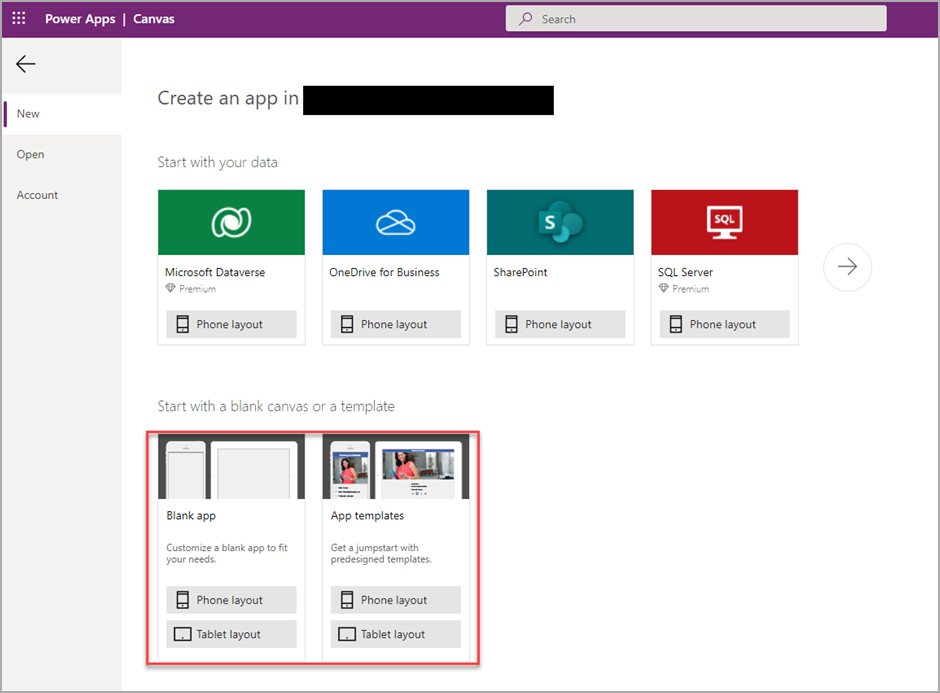
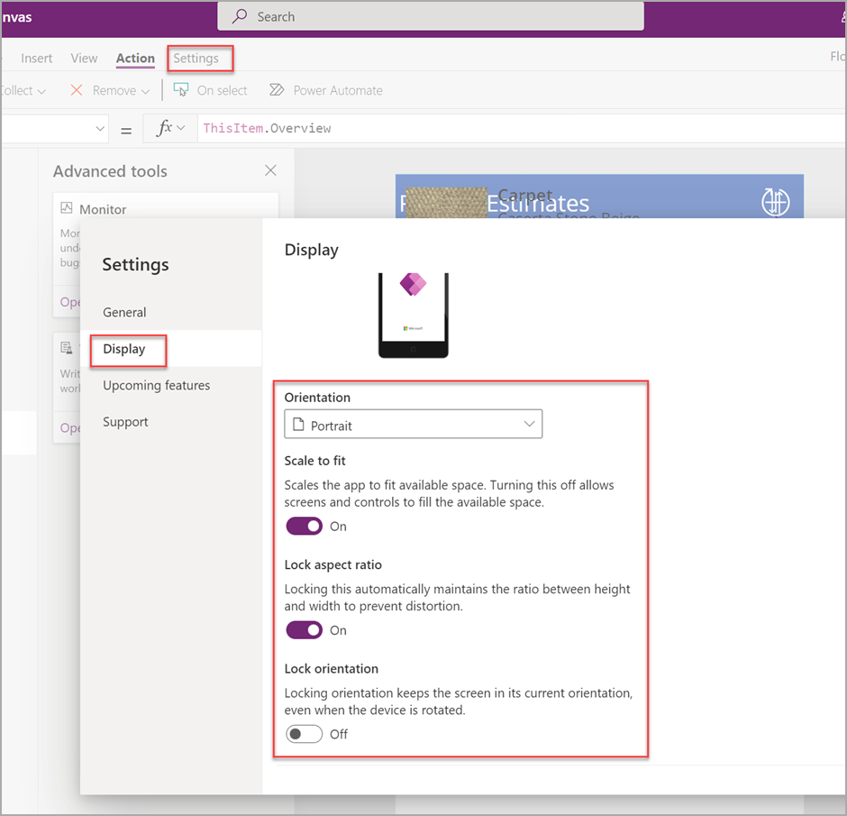
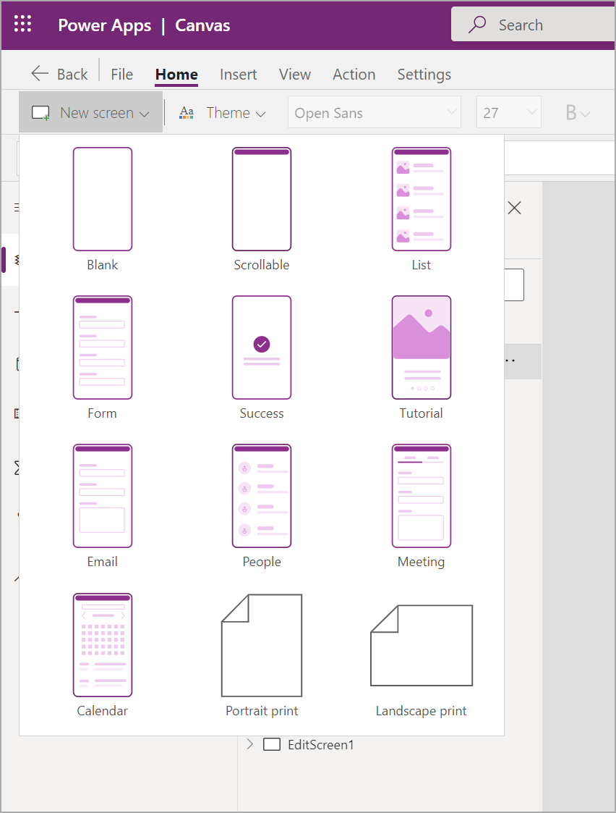
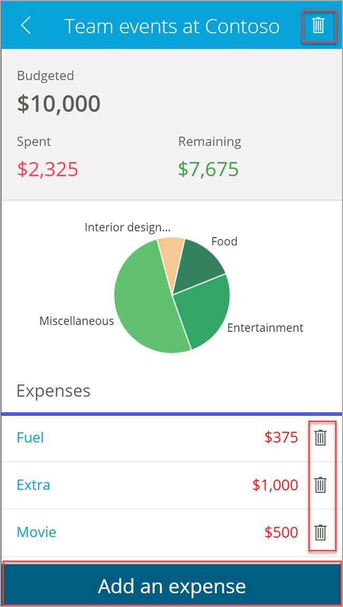
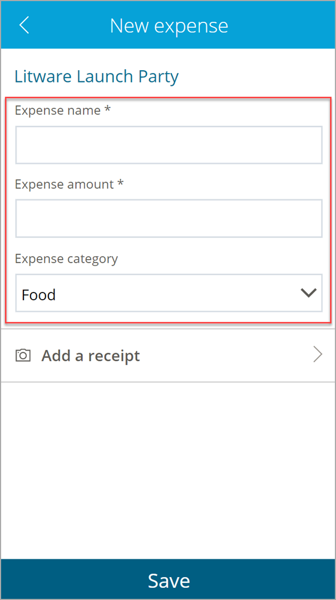

The following topics in this lesson examine the specific components within an app from Power Apps that you can use to make a responsive app: 

- Canvas app creation

- Application display settings

- New screen form additions

- Control and form additions

- Offline capabilities

- Notifications to an app when you have no connectivity

## Canvas app creation

When creating a canvas app, you can use the Power Apps designer, which contains the option to create a blank app or an app from a template in phone layout or tablet layout.

You can use both layouts on a mobile phone or tablet, but you'll have different experiences. For example, when you're creating a phone layout, the application will assume a vertical orientation and will include the ability for the user to scroll up and down in a narrow window. In tablet mode, the layout on that same phone will assume that the phone will operate in a landscape mode and be held horizontally by default. The best application will vary by use case.

> [!div class="mx-imgBorder"]
> 

## Application display settings

Within the canvas app, you can navigate to **Settings > Display** and view several important application display settings.

- Orientation - The orientation of the application will be the default presentation layout of your app. It can be in the longer portrait orientation or the wider landscape orientation.

- Scale to fit - For a responsive design, the recommendation is to set this option to **No**. It's set to **Yes** by default.

- Lock aspect ratio - This option is enabled only if the **Scale to fit** option is set to **Yes**.

  If this option is set to **No**, then the designer is no longer designing a canvas app for a specific screen dimension.

- Lock orientation

	- If this option is set to **Yes**, the setting in **Orientation** is locked. For example, if an application is in portrait mode, and **Lock orientation** is set to **Yes**, then the canvas app will never allow the user to enter a landscape orientation.

	- If this option is set to **No**, then the mobile app will allow the user to switch the application between landscape and portrait by moving the mobile device's orientation.

> [!div class="mx-imgBorder"]
> 

## Create new responsive forms

When you create a new screen or form within an app from Power Apps, several predefined responsive layouts will be available for a phone or tablet that adhere to a responsive design by default. The following image displays the responsive layouts for a phone.

> [!div class="mx-imgBorder"]
> 

If one of the responsive layouts won't meet the business requirements, you can create your own responsive layout by using formulas and conditions. For more information, see [Create responsive layouts in canvas apps](/power-apps/maker/canvas-apps/create-responsive-layout/?azure-portal=true).

## Control and form design considerations

Buttons should be easy for users to locate and select. Consider placing them at the top or bottom of a form that spans the application from edge to edge. If it's an action, such as a delete action, place the button to the side of the record where users are likely holding the device (right hand or left hand).

> [!div class="mx-imgBorder"]
> 

When you include fields on a form, add enough spacing between fields and the edge of the phone to provide a buffer for inaccurate screen touch selections. Likely, users will inconsistently touch in the middle of a field, so the experience shouldn't accidentally move the focus to another unintentional field. Buffers between the edge of a field and the edge of the form will help users avoid accidentally triggering phone swipe actions, such as navigating back to a previous form. If mandatory fields exist, try to prioritize them as the first fields.

> [!div class="mx-imgBorder"]
> 

Grids with data should span from edge to edge on a form and only scroll in one direction: vertically or horizontally. If other fields on a form are needed, include them below the primary field of the record, not in other columns to the right or left of the record. When you use multiple forms, scrolling should be a uniform experience across the application, unless it isn't possible.

> [!div class="mx-imgBorder"]
> 

## Containers

You should use containers for more complex layouts, such as a mobile tablet that has more than one component on a screen but needs a responsive design. How to use containers to optimize the experience of a canvas app on various mobile devices is discussed later in this module.

## Add offline capabilities

A user can add offline capabilities to an application for business cases where data needs to be used or stored offline until an application reconnects to the internet. Enabling these capabilities can be complex, with many design factors to consider. We recommend that you involve a developer to help you determine the best approach to implement offline capabilities. 

For more information, see [Develop offline-capable canvas apps](/power-apps/maker/canvas-apps/offline-apps/?azure-portal=true).

## Alert users about no connectivity

If you want to alert a user that the canvas app is offline, you can use the **Notify** function to alert the user that the function might not be available at the current time. By default, the notification  will appear for 10 seconds and then disappear, or it will remain on the screen until the user dismisses the alert manually.

For more information, see [Notify function in Power Apps](/power-apps/maker/canvas-apps/functions/function-showerror/?azure-portal=true).
