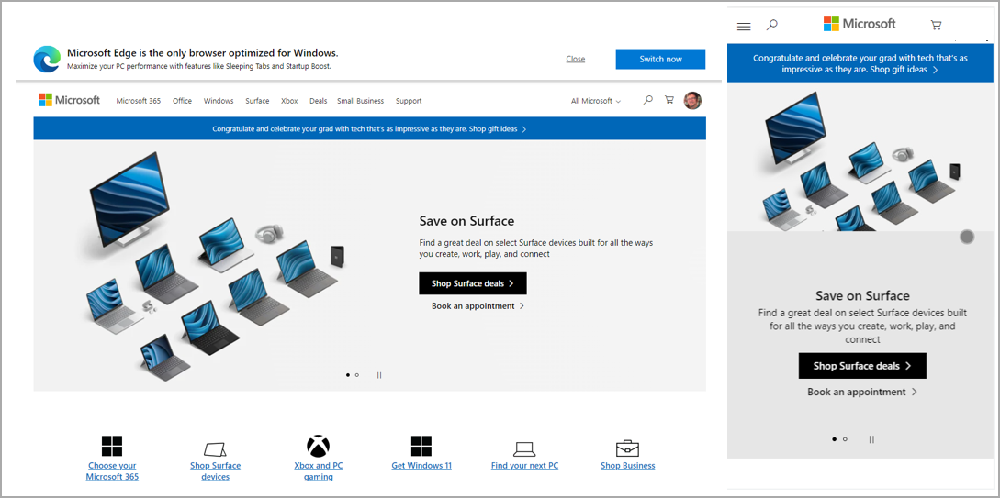

When a user designs and creates a mobile-optimized Power Apps canvas app, the user should keep in mind several design components.

A mobile-optimized canvas app should have the following design characteristics, which will be further examined in this lesson.

- Have a clearly defined purpose

- Have a responsive design [Bring your own device (BYOD)]

- Have a simplistic user interface

- Use intuitive navigation

- Not require external peripherals

- Include offline capabilities

- Include connectivity alerts

- Have a seamless setup

- Optimize for performance

## Have a clearly defined purpose

A mobile-optimized application should have a clearly defined purpose. When users are using apps in a mobile capacity, the fewest actions to accomplish the task directly correlate to a better user experience.

Determine if you want a single app with many different actions, such as a mobile warehouse application that will do all of the actions for maintaining inventory, or a single application for a specific purpose such as creating customers.

-   Is it easier to navigate back to a home page to do different actions or to exit the Power Apps app to do another action?

-   Is it a better experience for someone within an organization to navigate through multiple Power Apps apps?

-   If there's a single application, does it try to do too much and complicate the purpose?

When a user designs the forms for the app, each form should have a purpose that can be defined in a single, simple sentence.

-   Avoid the urge to have a single form that contains too many purposes, such as creating customers and customer contacts.

-   Instead, consider creating multiple forms, each with a specific purpose.

## Have a responsive design

Any mobile application or website that is considered mobile-optimized should adapt to the application in which it's viewed.

As an example, a website such as Microsoft.com can be viewed either in a desktop or mobile view. The application or website adjusts its layout for the design in which it's viewed. The following example shows Microsoft.com in a desktop and then a mobile-optmized view.

> [!div class="mx-imgBorder"]
> 

## Have a simplistic user interface

Resist the urge to include too many fields and input controls on a form.

-   It may seem like a good idea to include all the fields that users may want to use for a task, such as creating a customer, so that the canvas app is comprehensive.

-   However, many extra controls that users will likely not use often will create a cluttered interface and create more scrolling and "field hunting" to find the fields they use most often.

-   Instead, consider creating a succinct form and creating a new form for advanced field entry that users would use only on rare occasion.

If users must navigate to multiple screens, users may have a negative experience.

When buttons are needed, such as a Submit button, consider where to place the button in relation to where it's easiest for the users to select.

Design with simplicity.

-   If too many buttons and fields are in a screen, users may accidentally select a button or field by accident.

-   Consider adding buffer space around fields and Submit buttons to allow for user error variance.

## Use intuitive navigation

A mobile-optimized app shouldn't have to come with a complex user manual.

-   Organize the tasks and business actions in a way that guides the user through their day-to-day operations.

-   Note: There's no single, correct way to create a user interface. Determine the most logical way to organize the tasks for a user based on the defined purpose determined earlier. Consider the following two design scenarios:

    -   If the mobile app is used to create sales orders 90 percent of the time and create new customers 20 percent of the time, include navigation to the sales order creation form as the first button and the customer creation after.

    -   If the mobile app is used for the business use case to find new customers by creating their first order, include the navigation to the customer form as the first button and the sales order creation after.

A user will always want an easy way to "return home" or go back to the main screen.

-   Each form should include an easy way to get back to the main screen to conduct another action.

-   It's a poor user experience to require a customer to navigate back to a central point through multiple actions.

-   If a user finishes a specific task and there are no new tasks to complete, automatically return users to the home location where they can conduct their next actions.

## Exclude external peripherals

Users on a phone or tablet will more than likely not have a mouse and keyboard.

-   When designing the application's user interface, imagine holding a specific device in your hand and interacting with the application with your hands or eyes and determine if it's a good experience.

-   When entering field information, a keyboard will likely appear on the device. Will this impact the user experience?

## Include offline capabilities

A mobile application will traverse multiple locations.

-   Is there a chance this application will be used in a location where the user will need to conduct an action without internet connectivity?

-   There are complexities to including offline capabilities in a canvas app. Are the efforts to make the actions offline capable worth the effort?

-   Are the actions that need to be conducted offline reading/writing data that is only available at a location not on the device?

## Include connectivity alerts

In a cloud-first solution, connectivity to the cloud is imperative. Most users will assume they have connectivity to the internet when they access the canvas app.

-   Different forms and actions that have internet connectivity requirements should include a form verification to alert the user that the mobile application is in offline mode and the action isn't available before the user attempts to enter data.

    -   For example, if creating a customer requires connectivity, the application shouldn't allow a user to access the customer creation form and enter data when the mobile application is offline.

-   Try to alert the user as soon as possible to reduce any potential data entry rework.

-   Consider including an alert indicator, such as a banner on the top of the screen that indicates the mobile application doesn't have connectivity.

## Have a seamless setup

A seamless setup is vital to users adopting the Power Apps app. Microsoft's deployment of Power Apps makes the deployment seamless. But connecting those apps to necessary data sources or user access may be where configuration is required.

-   When prompting the user to enter data required to run the application, such as a URL to an application or API, include tips for users to find that data. Assume this is the first time they've used the application and that they need guidance.

-   Include a comprehensive and direct description of the mobile application that tells users what the app is used.

## Optimize for performance

Performance is more important for mobile applications than desktop applications. The limitations of multi-tasking multiple tasks on a mobile phone make performance a significant factor. Desktop users can navigate to another application while the canvas app does specific tasks with little effort.

-   Consider the datasources being used and the complexity of the data being retrieved.

-   Evaluate the data connectors being used for the application.

-   Try to eliminate complex or unnecessary datasources.

-   Try to only retrieve the specific number of records required for a given action.

