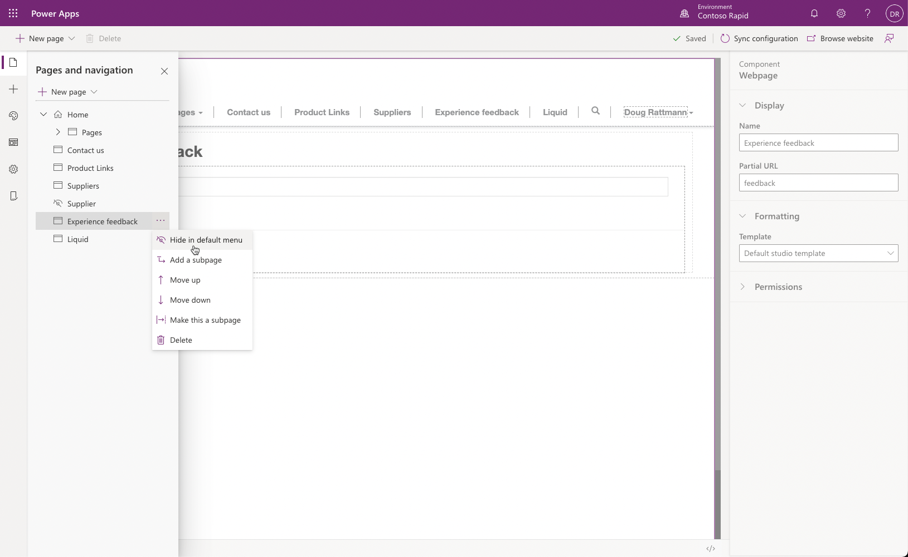
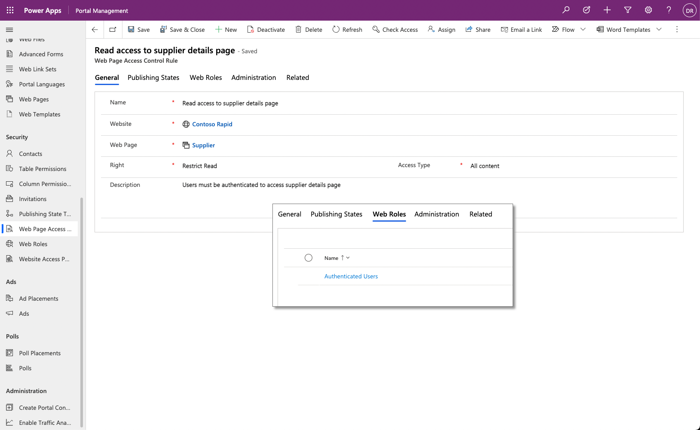
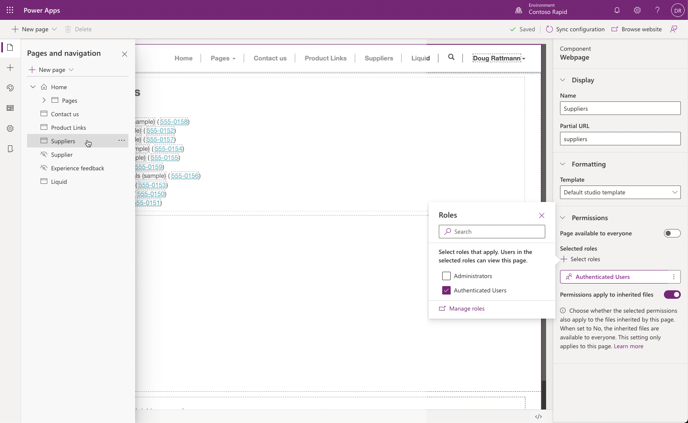
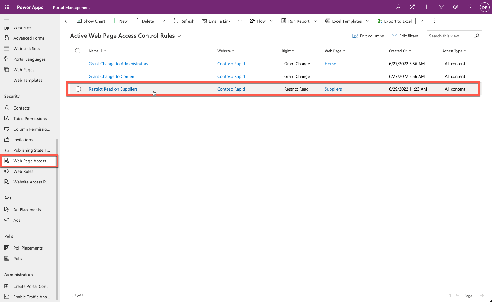

## Webpage content

A website is a common way for an organization to provide content to a public-facing audience. You can create webpages to display overall organization information, offerings of products and services, or educational content.

Occasionally, certain situations will occur when content should only be made available to specific authenticated portal users, such as when a company webpage is providing members-only content or specific instructions or offers.

By default, when a maker creates a new webpage by using Power Apps portals Studio or the Portal Management app, the page is publicly available and added to the default menu.  The page can be hidden from the default menu; however, it will still be accessible using the direct URL.

<!--image hide page in default menu-->

> [!div class="mx-imgBorder"]
> 

## Webpage access control rule

The **Web Page Access Control Rule** table is a portal metadata row that can be linked to a specific webpage that can determine the visibility of that page.

> [!div class="mx-imgBorder"]
> 

The following table describes the **Web Page Access Control Rule** row properties.

| Property | Details |
| --- | --- |
| Name | This property can be any name to describe the rule. Ideally, it should note the webpage that is being referenced. |
| Website | This property references the website in which the rule will reside. |
| Web Page | This lookup references the webpage to which you should apply the rule. |
| Right | This property determines the level of access rights that a portal user will have to the specific webpage. The **Restrict Read** right means that the portal visitor is allowed to view the page but cannot directly edit the page. The **Grant Change** right means that the user can view the page, and if they have access to the content editing tools, they will be able to change the content. |
| Description | This column allows a maker to add a description of the purpose and scope of the rule. |

After you have defined an access control for a webpage, the page will not be accessible on the portal and, by default, will not appear on any menu navigation.

> [!VIDEO https://www.microsoft.com/videoplayer/embed/RE4AjtR]

> [!NOTE]
> The menu link (**WebLink**) to a restricted page can be made visible to all portal visitors by selecting the **Disable Page Validation** option on the **WebLink** row in the Portal Management app. That way, anonymous visitors can see links to protected pages and automatically redirected to a login page when they try to access them.

The **Web Page Access Control Rule** row can be linked to one or more web roles. A user with any of these web roles assigned will be able to access the particular webpage.

## Access management in portals Studio

Power Apps portals Studio simplifies the configuration of webpage access permissions compared to using the Portal Management app and is the recommended method. Portals Studio can be used for managing **Restrict Read** rights only. To restrict page access to a specific user role in Portal Studio:

1. Select the page under **Pages and navigation** toolbelt command.

1. Expand the **Permissions** section in the page properties panel.

1. Set **Page available to everyone** option to **Off**.

1. Use **Select roles** to choose which roles will be allowed to access the page.

When a rule is added in portals Studio, the corresponding **Web Page Access Control Rule** row is created automatically.

For more information about managing page permissions in Portals Studio including inherited permissions in the page hierarchy, see [Manage page permissions](/power-apps/maker/portals/configure/webpage-access-control/?azure-portal=true)
