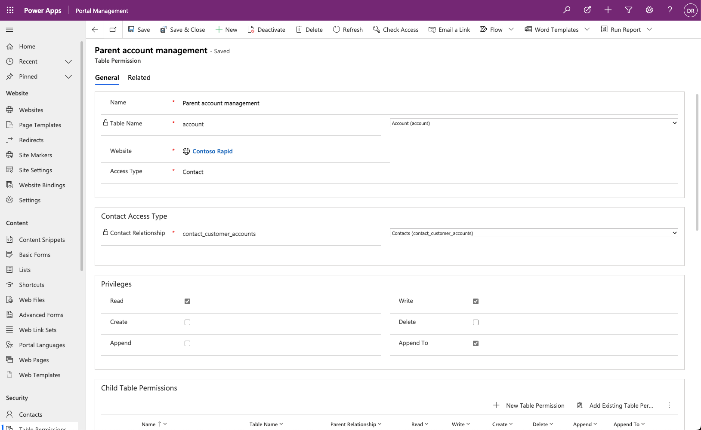
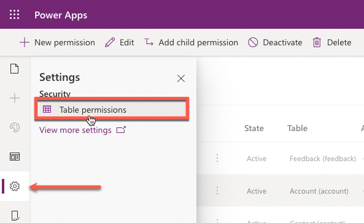
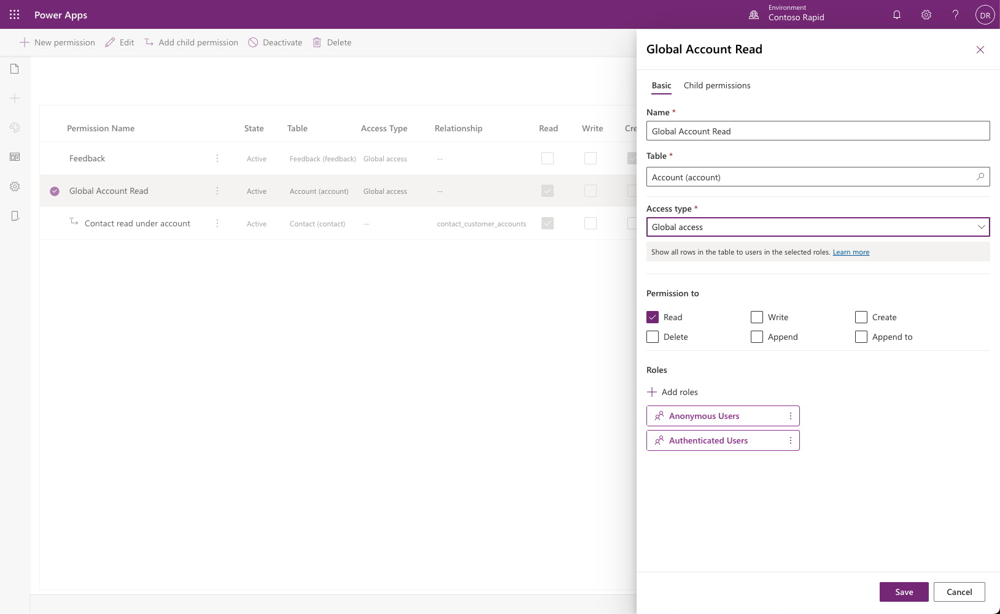
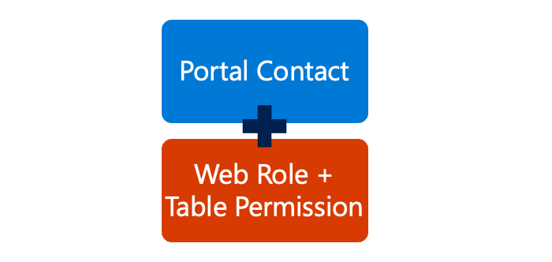
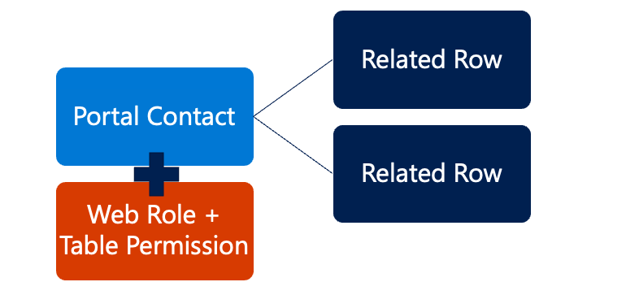
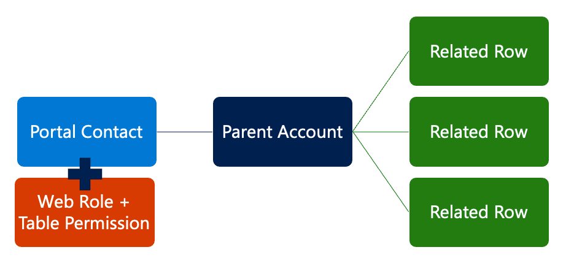
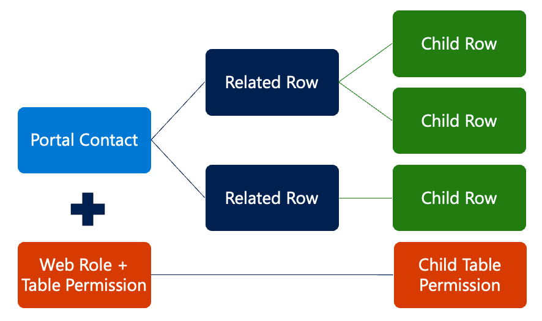

Table permissions define the access and scope that a portal user has to a particular Microsoft Dataverse table on the portal. Dataverse rows can be accessed on a Power Apps portal by using a list, basic form, or advanced form, or they can be shown by using Liquid tags in webpage content or web templates.

> [!div class="mx-imgBorder"]
> 

You can create a table permission in either the Portal Management app or the Power Apps portals Studio and associate it with one or more web roles to allow a portal user access to the specific table rows.

> [!IMPORTANT]
> **Table permissions** are automatically enforced for all forms and lists and applied to data retrieved using Liquid tags.

## Create a table permission

Follow these steps to create a new **Table Permission** row:

1. Identify the table that will be secured.

1. Define scope.

1. For any scope other than Global, select the relationships that define that scope.

1. Determine the privileges that are being granted to the role through this permission.

> [!IMPORTANT]
> Rights are cumulative. If a user is in one role that grants Read rights and another role that grants Read and Write rights, the user will have Read and Write rights for any rows that overlap between the two roles. No mechanism exists to reduce the permission scope or remove a privilege by assigning another role.

## Use Power Apps portals Studio

Power Apps portals Studio provides a user experience for creating and editing table permissions:

1. Select the **Settings** icon on the toolbar, then select **Table permissions**.
   

1. Select an existing table permission row or use the **New permission** command to access the permission settings panel.
   

For more information about managing table permissions in Power Apps portals Studio and a step-by-step walk through, see [Configure table permissions using portals Studio](/power-apps/maker/portals/configure/entity-permissions-studio/?azure-portal=true).

The **Table Permission** row includes the following common columns.

| Column                       | Description                                                  |
| ------------------------------------ | ------------------------------------------------------------ |
| Table Name                           | Name of the table that you are securing on the portal.       |
| Scope                                 | Defines which rows can be accessed.                        |
| Account/Contact/Parental Relationship | Defines the relationship from a portal user, parent account, or related row to the row that is being secured. |
| Parent Table Details                 | The Table Name and Table Permission that defines permission to the parent table. |
| Privileges                            | Defines what privileges are being granted by this permission set: Read, Write, Create, Delete, Append, Append To. |

The following sections closely examine how these columns are used to define the scope and identify the rows that the portal user has access to.

## Global scope

If a **Table Permission** row that has Global scope is associated with a web role, any contact in that role will have specified access to all rows of the defined table in Dataverse.

For example, if a lead table is granted the Read privilege with Global scope, all users in assigned web roles will be able to see all leads. This permission will be automatically respected by any lists, essentially showing all rows, according to the model-driven views, that have been defined for that list.

> [!div class="mx-imgBorder"]
> 

Global scope is most frequently used with Read privilege to provide access to the reference data, for example, a list of countries or currencies.

## Contact scope

With Contact scope, a signed-in user in the role for which the table permission row is defined will have the rights granted by that permission only for rows that are related to that user's contact row through a selected Dataverse relationship.

On a table list, a filter will be added to whatever model-driven views are shown by that list, which only retrieves rows that are directly linked to the current user. Depending on the scenario, this relationship can be thought of as ownership or management rights.

> [!div class="mx-imgBorder"]
> 

For example, a set of privileges can be granted to a web role that allows Contact scope access to the orders by using the customer type of relationship. In other words, any portal user with that web role will have access to a subset that can be considered as *My Orders*.

## Account scope

With Account scope, a signed-in user in the role for which the permission row is defined will have the rights granted by that permission only for rows that are related to that user's parent account row through a selected Dataverse relationship.

> [!div class="mx-imgBorder"]
> 

For example, a set of privileges is granted to a web role that allows Account scope access to the cases by using a customer type relationship between an account and case tables. In other words, any portal user with that web role will have access to a subset that can be thought of as *My Account's Cases*.

## Parent scope

Parent scope is designed to cover most complex scenarios where a portal user will require full access to the rows, but the access must be limited to a specific scope. For example, for users who have access to Cases (for example, *My Cases*), you would grant permissions to those users to access Notes that are related to the cases, but you would restrict access to the Notes for only the cases that the user already has access to.

The **Parent Permission** row defines permission and scope for a table (Cases, in this example). With that permission in place, a child permission is created that defines a relationship from another table (Notes, in this example) to the table that is defined in the parent relationship (Cases).

> [!div class="mx-imgBorder"]
> 

Users in a web role with access to rows that are defined by parent table permissions will also have rights, as defined by the child permission row, to the rows that are related to the parent row.

## Self scope

The Self scope allows you to define the rights that a user has to their own contact row. This scope allows people to use basic or advanced forms to make changes to the contact row that is linked with their profile.

The default profile page has a special built-in form that allows any user to change their basic contact info and to opt-in or out of marketing lists. If this form is used in your portal, users won't require the Self scope permission to use it. However, they'll require the Self scope permission to use any other custom basic or advanced forms that target their contact row.

<!--VIDEO tablePermissions.mp4-->

> [!VIDEO https://www.microsoft.com/videoplayer/embed/RE4AjtN]

For more information, see [Add row-based security by using table permissions for portals](/power-apps/maker/portals/configure/assign-entity-permissions/?azure-portal=true).

## Column permissions

Table permissions are used to apply security to individual Dataverse table rows. You can now add column permissions to secure individual table columns.

> [!NOTE]
> Column permissions are currently only applicable for [portal Web API](/power-apps/maker/portals/web-api-overview/?azure-portal=true) used to perform operations across all Microsoft Dataverse tables from your portals pages.

Web roles can have any number of table permissions and column permissions. If a web role has multiple column permissions, all column permissions are applied to the selected web role.

When permissions are evaluated, table permissions are evaluated first. If a user has access to a table, the table's column permissions will be applied. If the user doesn't have access to the table, any configured column permissions will be ignored.

When no column permissions are defined, the corresponding table permissions will apply to all columns.

For more information about managing column permissions, see [Configure column permissions for portals](/power-apps/maker/portals/configure/column-permissions/?azure-portal=true)
