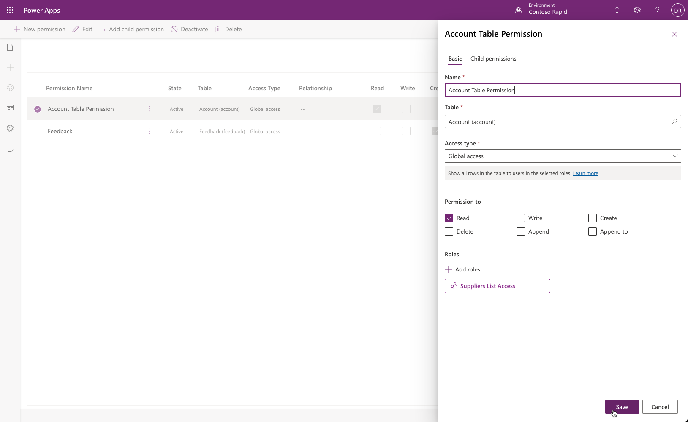
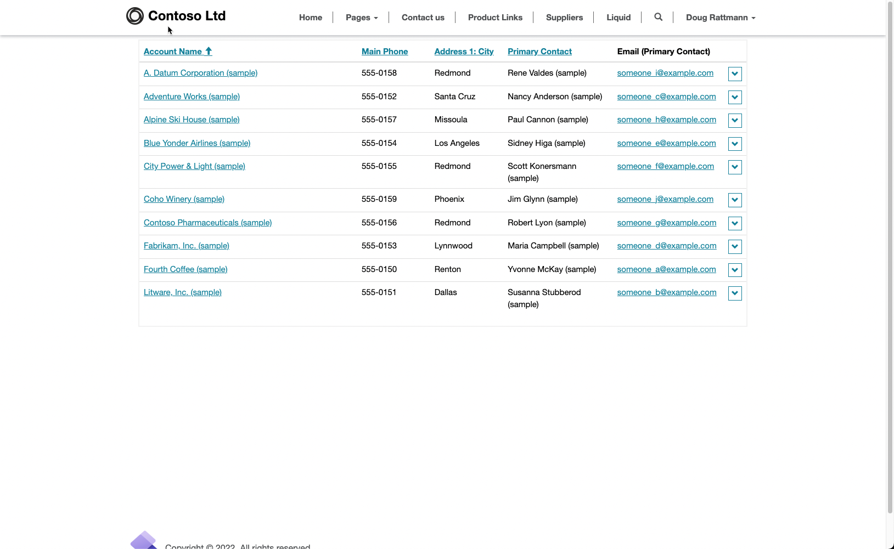

The purpose of this hands-on lab is to configure table permissions to secure access to Microsoft Dataverse table rows.

The exercises work best when you have sample data to work with. Depending on the environment that you are working with, you might want to install some sample data to assist with the exercises. Microsoft Power Platform does provide the ability to add sample data as needed. If the environment that you are working in does not have sample data installed, follow the steps in the [Add or remove sample data](/power-platform/admin/add-remove-sample-data/?azure-portal=true) documentation to install the sample data into your environment.

## Learning objectives

At the end of these exercises, you will be able to:

- Use the Power Apps portals Studio to configure table permissions.

- Create and assign a web role.

- Create a table permission row.

- Link the table permission to the web role and associate the web role to a Dataverse contact.

## Prerequisites

For this exercise, you will need to have the following parameters set up in your environment:

- A Power Apps portal that is provisioned. If you do not have a Power Apps portal available, follow the [Create Portal](/power-apps/maker/portals/create-portal/?azure-portal=true) instructions to create one.

- Access to the Power Apps maker portal.

## Scenario

Your organization has provisioned a Power Apps portal and wants to create a directory of supplier organizations. After initial provisioning of the portal pages and of the list to manage the supplier directory, administrators have discovered that no users have access to the data regardless of their security role.

Your organization wants to provide access to the data to the specific authenticated users but not to anonymous visitors.

### High-level steps

To finish the exercise, complete the following tasks:

- Add a webpage with a list component that shows the account table.

- Register a new user on the portal by using local authentication.

- Create a new **Web Role** row for the supplier list access.

- Create a **Table Permission** row, providing global read access to the accounts table to the users with the supplier list access role.

- Link the portal user to the web role and link the web role to the table permission.

- Confirm that the user with the supplier list access role has access to the list of accounts.

## Detailed steps

### Launch portals Studio

1. Sign in to [Power Apps](https://make.powerapps.com/?azure-portal=true).

1. Select a target environment by using the environment selector in the upper-right corner.

1. On the left menu, select **Apps**.

1. Select your portal app (Type = Portal).

1. Select **Edit**, which will launch the portals Studio.

### Create a webpage

To create the **Suppliers** webpage, follow these steps:

1. Select **+ New page > Blank**.

1. Enter the following webpage properties:

   - **Name** - Suppliers

   - **Partial URL** - suppliers

### Add a list

1. On the canvas, select the page content and, from the toolbelt, select the **Components** icon and then add the **List** component.

1. Add the following values:

    - **Name** - Suppliers

    - **Table** - Account

    - **Views** - Active Accounts

1. Select **Save**.

### Browse the website

Select the **Browse website** to view the page. You will receive a message indicating that you do not have permission to view the rows.

### Add a portal user

1. Select the **Sign in** menu item.

1. Select the **Register** tab.

1. Fill in the **email**, **username**, and **password** information.

1. Select **Register**. The portal profile page will appear.

1. Fill in the **First Name** and **Last Name** columns and then scroll down and select **Update**.

1. Close the portal.

### Add a web role and assign a contact

1. Sign in to [Power Apps](https://make.powerapps.com/?azure-portal=true).

1. Select a target environment by using the environment selector in the upper-right corner.

1. On the left menu, select **Apps**.

1. From the **Apps** list, locate and open the Portal Management app (Type = Model-driven).

1. In the **Security** area, select **Web Roles**.

1. Add a new web role row, and then enter the following values:

    - **Name** - Supplier List Access

    - **Website** - your portal row

1. Save the row.

1. Select the **Related** tab, then select **Contacts**.

1. Select **Add Existing Contact**.

1. From the list on the right side, select the contact that you registered on the portal, then select **Add**.

1. Keep the Portal Management app open.

### Create table permission

1. Switch to Power Apps portal Studio.

1. Select the **Settings** gear icon on the toolbelt, then select **Table permissions**.

1. Select **+ New permission**, then enter the following values:

   - **Name** - Account Table Permission

   - **Table Name** - Account

   - **Access type** - Global access

   - **Permission to** - Read

1. Select **Save**.

### Link web role and table permissions

1. Switch to the Portal Management app.

1. On the **Web Role** form, select the **Related** tab, then select **Table Permissions**.

1. Select **Add Existing Table Permission**.

1. From the list on the right side, select the **Account Table Permission**.

1. Select **Add**.

   

1. Switch to portal Studio and open the **Account Table Permission** row. The Properties panel should now show the associated **Supplier List Access** role.
   

1. Press **Cancel**.

### Verify access

1. Select **Browse website**.

    > [!NOTE]
    > Browsing the website within portals Studio will refresh the portal cache.

1. Select **Sign in** and then enter the username and password for the portal user that you previously created.

1. Go to the **Suppliers** page, where you should be able to view the list of account rows.

    > [!div class="mx-imgBorder"]
    > 

1. Select the *username* and then select **Sign-out**. The page should display a message about not having permission to view the rows.
