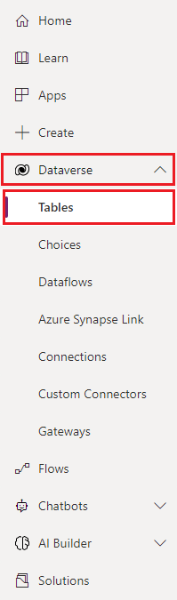
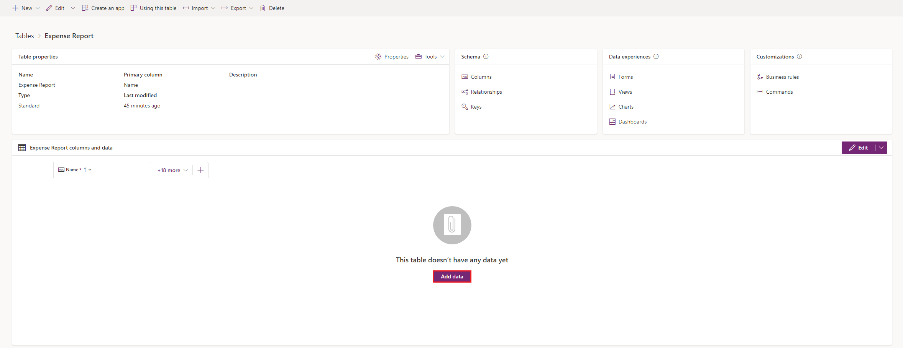

To add Dataverse data to your app, follow these steps:

1. In a new browser tab, go to [make.powerapps.com](https://make.powerapps.com/?azure-portal=true).

1. Select **Data > Tables**.

   > [!div class="mx-imgBorder"]
   > 

1. Select your **Expense Report** table.
   
   > [!TIP]
   > You might need to change the view to custom tables.

   > [!div class="mx-imgBorder"]
   > 

1. In the **Expense Report** table, select the **Add data** button.

   > [!div class="mx-imgBorder"]
   > 

1. Here you can add, edit and remove rows and columns of your table.
