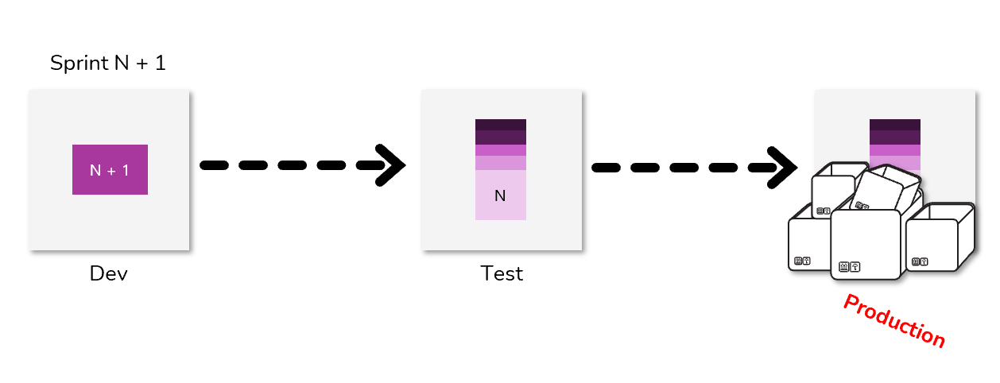
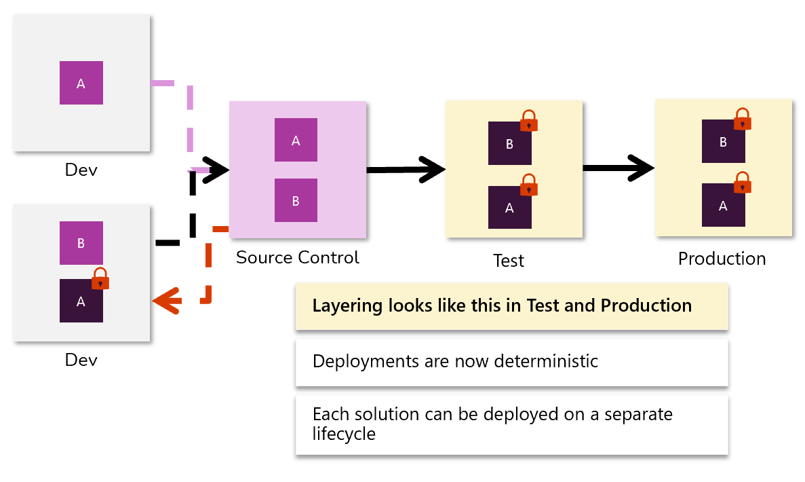

Previously in this learning path, you learned about the challenges with common patterns when you’re deploying a new unmanaged solution with each sprint. Eventually, production will begin to fail because of hundreds of solutions in the pipeline.

> [!div class="mx-imgBorder"]
> 

A modern approach to solution development will include layering and support deployments that are deterministic. The phrase *deployments are deterministic* means that, after an import order has been established, the impact on runtime behavior should be more clearly understood.

> [!div class="mx-imgBorder"]
> 

## Continuous delivery workflow example

Watch the following video for a demonstration of the continuous integration flow being condensed to the left to focus on the release stage (continuous delivery).

> [!VIDEO https://www.microsoft.com/videoplayer/embed/]
