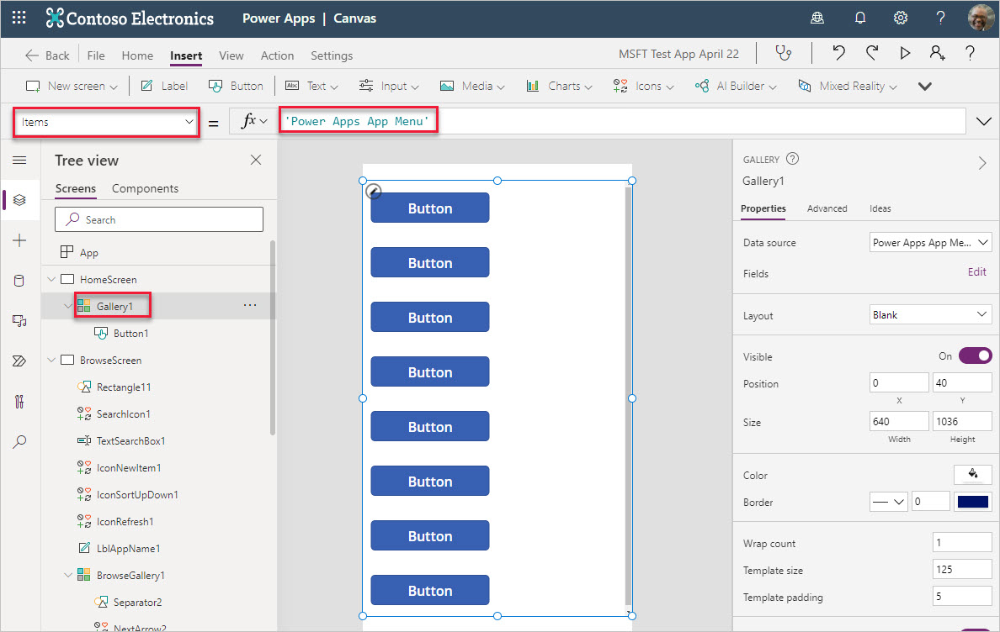
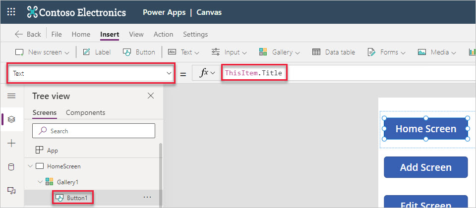
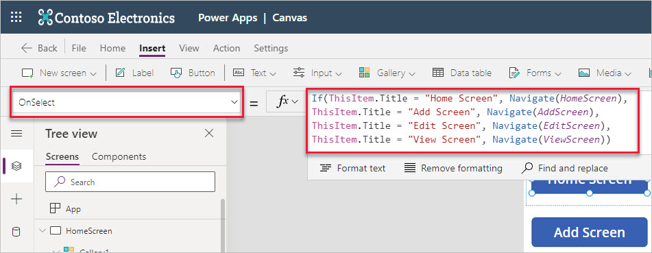
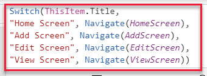
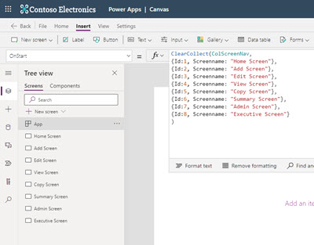
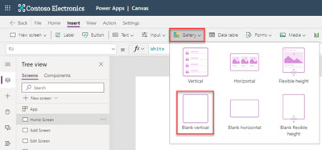
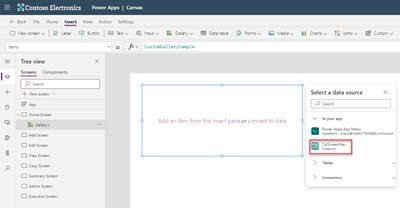
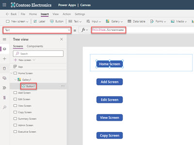
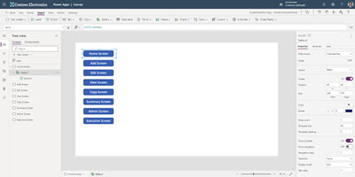

For a user, a navigation menu gives an overall perspective of the services an app has to offer. So, it's also important to have such a menu available throughout the app. From the maker standpoint, the menu needs to be easy to make and easy to update.

## Overview of a navigation menu

A navigation menu can be built using individual buttons or using a collection in a gallery. Adding individual buttons takes more time and effort to align their X and Y positions and to match their height and width. However, button navigation is still required for scenarios where only one or two buttons are needed. Below is an example of a home screen for a Device Request app that has two buttons.

> [!div class="mx-imgBorder"]
> 

When a navigation menu contains multiple options, then using a combination of a collection (or data source) and a gallery is a better option. This way formatting the X and Y location and the height and width is automatically taken care of.

> [!div class="mx-imgBorder"]
> 

## Use a data source

Having the menu content connected to the data source gives the flexibility to modify the menu without having to modify the app design in the canvas studio. Take, for example, a SharePoint list like the one below. The menu can be added as items in a single-column list.

> [!div class="mx-imgBorder"]
> 

This list is then connected to Power Apps as a SharePoint data source. You can then insert a blank gallery into whatever screen you wish to have your menu in and assign it the 'Power Apps App Menu' as the data source (the **Items** property for the gallery). You then can insert a button into the gallery that would become the clickable link.

> [!div class="mx-imgBorder"]
> 

Complete the menu by renaming the **Text** property of the button to make it **ThisItem.Title**.

> [!div class="mx-imgBorder"]
> 

Finally, to make the navigation work, modify the **OnSelect** property of the button by adding conditional logic around **ThisItem.Title** to navigate to the chosen screen.  You could do this with an **If** or **Switch** statement.  Either statement serves the same purpose. However, you must enter screen names that are actually in the app and in your list for this to work.

> [!div class="mx-imgBorder"]
> 

> [!div class="mx-imgBorder"]
> 

## Use a collection

You also have the flexibility to create a collection inside the canvas app using the **App OnStart** property. Then you can populate that collection in a gallery as a menu like a list in Microsoft Lists.

Keep in mind that you must have the screens in your app. Here's an example of a collection to provide navigation from a collection gallery. Once you enter the code, you can select the ellipsis next to **App** and select **Run on start** to get the collection into memory for the app.

> [!div class="mx-imgBorder"]
> 

Next, you can add a **Blank vertical** gallery.

> [!div class="mx-imgBorder"]
> 

With the gallery selected, you can choose a data source for your gallery.

> [!div class="mx-imgBorder"]
> 

Then you can add a button inside the gallery and change its **Text** property to **ThisItem.ScreenName**.

> [!div class="mx-imgBorder"]
> 

You can now resize the **Template size** and button width to tidy things up.

> [!div class="mx-imgBorder"]
> 

A similar process can be followed to create a horizontal menu using the Horizontal gallery.

Like the Data Source technique, you would modify the **OnSelect** property of your button to navigate to the screen of your choice.