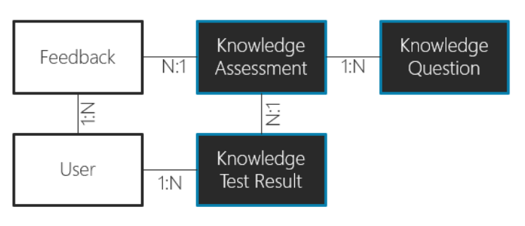

In this exercise, you'll be creating a data model for Fabrikam to track visitors. Review the information presented about Fabrikam Robotics and complete the tasks.  This could be completed as small groups as well.  

> [!VIDEO https://www.microsoft.com/videoplayer/embed/RE4U3Ej]

If you're completing this exercise independently: 

- Take notes. 
- Put yourself in the mindset of both customer and Solution Architect. 
- Draw your data model, put pen to paper (actual pen to paper, or virtual pen to paper) and evaluate options. 
- Consider bigger picture items, if you build this data model, you'll have to design security and relationship behavior too.  Will your ideas still work? 
- If given the opportunity, share this assignment with colleagues who are also architects and seek their feedback to your data model. 

## Requirements
You're building a solution for Fabrikam to track visitors to a showroom and manufacturing site.  Some of the visitors are potential purchasers and some are there to see the magic of the robots working.  

- **Requirement 1** - Visitors must have a reserved spot to gain access. 
- **Requirement 2** - Visitors invited by sales staff must be tracked to a sales process, visitors just touring for fun aren't tracked to a sales process.
- **Requirement 3** - Visitors can bring guests. 
- **Requirement 4** - Each visitor must have a photo taken upon arrival and associated with their visit.
- **Requirement 5** - Each visitor must sign a waiver of liability each time they visit, and you must store their signature and date time of acceptance
- **Requirement 6** - Each primary visitor is assigned an engagement tracking device that tracks their location in the manufacturing area and showroom. This is for safety and for improving the tours.  The device stores the data in its own cloud service that offers both bulk export and API access. 
- **Requirement 7** - You must allow for the tracking data to be viewed in the sales process user interface used by the sales staff. 
- **Requirement 8** - Marketing has asked to be able to view visitors by day/month/quarter along with statistics on closing of sales after a visit. 

## Tasks
Create a data model for the above requirements.  You can sketch your data model on a whiteboard or paper, you can use a tool such as Visio.  

Example of a data model, your data model should be for the above requirements. 

> [!div class="mx-imgBorder"]
> 

- How would you handle reservations?  Would each member of a group need a reservation? 
- How would you handle storing of visitor photos?  How would you handle repeat visitors?
- How would you handle storing of visitor waiver acceptance and signature?
- How would you accommodate for viewing of tracking data in the sales process?
- Did you use anything from the Common Data Model schema? 
- How would you handle marketing’s statistics needs? 

## Other considerations
- What connectors, if any, would be needed? 
- How could you model the data differently than your initial proposed solution? 
- What compromises did you make with the stated requirements versus your planned data model?
- What concerns do you have for the implementation of the proposed solution? 
- What are the performance considerations? 
- Does your data model lend itself to a good user experience in an app?
- Did you include the following influencers in your data model planning? 
    - Security requirements 
    - Data localization 
    - Data retention policy 
    - Reporting
    - Customer roadmap 
    - Product roadmap 
    - Existing systems 
