Congratulations! You made your first app, and it's tested and ready to go!

As soon as your app is ready to use, you need to publish and share it.

## Option 1: Publish a model-driven app

Model-driven apps can't be published if they don't include all the required components. Some components rely on others and this relationship between components is known as a dependency.

For example, you can't display a table on the Sitemap if the table isn't included within the app.

The process of checking for dependencies within a model-driven app is known as **validation**.

When the app is validated, the app designer canvas shows details about the assets that are missing.

### How to validate an app and add in dependencies

1. Sign in to [Power Apps](https://make.powerapps.com/?azure-portal=true).

1. On the left pane, select **Solutions**, then open the **Dive Center App** Solution.

    > [!div class="mx-imgBorder"]
    > [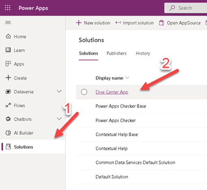

1. Select the model-driven app, and then on the command bar select **Edit**.

    > [!div class="mx-imgBorder"]
    > [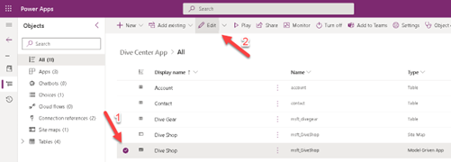](../media/edit.png#lightbox)

1. Select **Switch to Classic** on the header.

    > [!div class="mx-imgBorder"]
    > 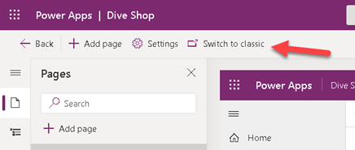

1. In the app designer, select **Validate**.

    > [!div class="mx-imgBorder"]
    > [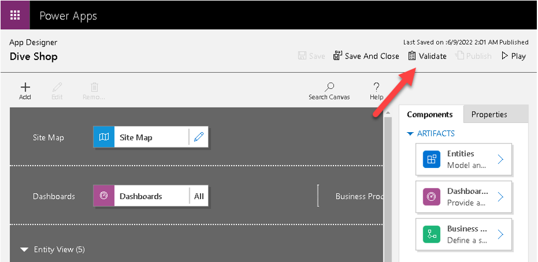](../media/validate.png#lightbox)

    A notification bar appears and shows whether the app has any errors or warnings. The notification bar shows warnings in cases where, for example, a table has no forms or views, or the app doesn't contain any components. An error might appear if a site map isn't configured for the app. You can save and publish the app without addressing warnings, but errors must be fixed before you can publish.

    > [!div class="mx-imgBorder"]
    > [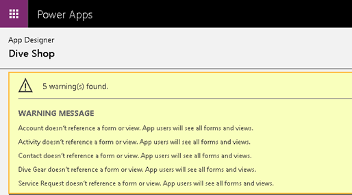](../media/warning.png#lightbox)

1. Add the assets that are missing. With every required asset added, the error count decreases.

### Publish an app inside a solution

1. Sign in to [Power Apps](https://make.powerapps.com/?azure-portal=true).

1. On the left pane, select **Solutions**, then open the **Dive Center App** Solution

    > [!div class="mx-imgBorder"]
    > 

1. Select the model-driven app, and then on the command bar select **Publish**.

    > [!div class="mx-imgBorder"]
    > [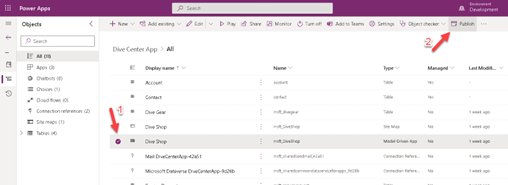](../media/publish.png#lightbox)

## Option 2: Publish a canvas app

Whenever you save changes to a canvas app, you automatically publish them only for yourself and anyone else who has permissions to edit the app. When you finish making changes, you must explicitly publish them to make them available to everyone with whom the app is shared.

1. In Power Apps Studio, select **Save** on the **File** menu (on the left edge), and then select **Publish**.

    > [!div class="mx-imgBorder"]
    > 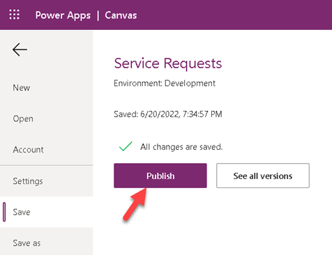

1. In the **Publish** dialog box, select **Publish this version** to publish the app to all users with whom the app is shared.

    > [!div class="mx-imgBorder"]
    > 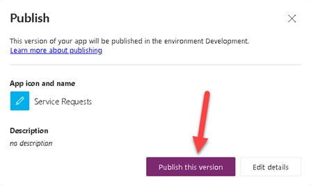

### Identify the live version

1. To see all versions of an app, go to [Power Apps](https://make.powerapps.com/?azure-portal=true) > **Apps** > select your app > **More Commands** > **Details**.

    > [!div class="mx-imgBorder"]
    > [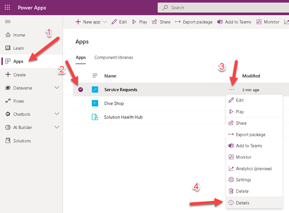](../media/details.png#lightbox)

1. Select the **Versions** tab.

    > [!div class="mx-imgBorder"]
    > [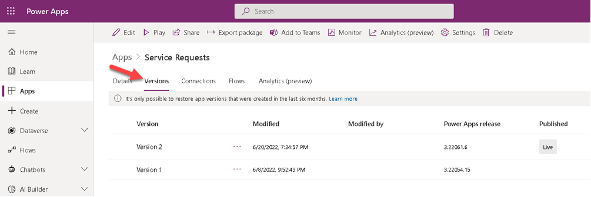](../media/versions.png#lightbox)

The **Live** version is published for everyone with whom the app is shared. The most recent version of any app is available only to those users who have edit permissions for it.

> [!div class="mx-imgBorder"]
> 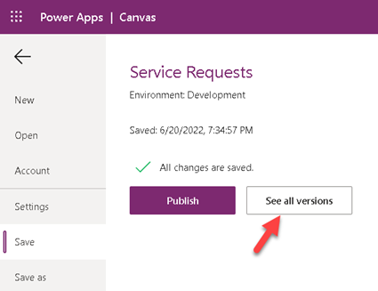
