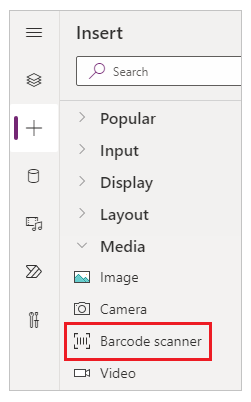

One of the enhancements we can introduce to our Dive Shop's Canvas App is the ability to scan barcodes and QR Codes.

> [!div class="mx-imgBorder"]
> 

The barcode scanner control in Power Apps lets you use your phone or mobile device to scan barcode from [various formats](/power-apps/maker/canvas-apps/controls/control-new-barcode-scanner#barcode-availability-by-device/?azure-portal=true).

## Prerequisites

- [Power Apps license](/power-platform/admin/pricing-billing-skus/?azure-portal=true)

- Before you create an app from scratch, familiarize yourself with Power Apps basics by [generating an app](/power-apps/maker/canvas-apps/get-started-test-drive/?azure-portal=true) and then customizing that app's [controls](/power-apps/maker/canvas-apps/add-configure-controls/?azure-portal=true), [gallery](/power-apps/maker/canvas-apps/add-gallery/?azure-portal=true), [forms](/power-apps/maker/canvas-apps/working-with-forms/?azure-portal=true), and [cards](/power-apps/maker/canvas-apps/working-with-cards/?azure-portal=true).

- To create an app, you must be assigned to the [Environment Maker](/power-platform/admin/database-security/?azure-portal=true) security role.

To learn how to add a bar code scanner control to your canvas app, see [Create a canvas app with the barcode scanner control](/power-apps/maker/canvas-apps/how-to/create-app-barcode-scanner/?azure-portal=true).
