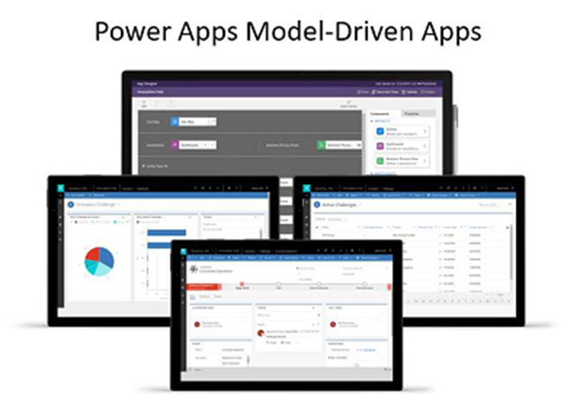
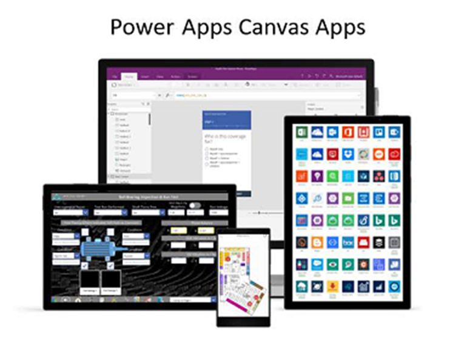

> [!VIDEO https://www.microsoft.com/videoplayer/embed/]

> [!div class="mx-imgBorder"]
> 

Model-driven apps require a Microsoft Dataverse database. They're built on top of the data modeled in that database environment. Views and detail screens for model-driven apps are based on the data structure. Because of this, they offer users a more consistent look and feel from one screen to the next without requiring much effort from the app creator.

Model-driven apps are good for scenarios where the [business logic](/power-apps/guidance/planning/logic/?azure-portal=true) is complex, such as:

-   Sophisticated data models

-   Business process management

-   Tracking activities associated with data

> [!div class="mx-imgBorder"]
> 

Canvas apps, on the other hand, can be built with or without a Dataverse database. They use connectors to access data and services. Canvas apps start with a blank screen, like an artist's canvas, and the creator manually lays out each screen. This gives the creator complete control over the placement of each element on the canvas.

Use canvas apps if the user is expecting a customized user experience. They offer:

-   A graphical, intuitive interface

-   The ability to create a tailor-made UI based on user requirements

-   Integration spanning multiple systems by using connectors

Consider creating a model-driven app unless your users have a specific need for a canvas app. Model-driven apps enable you to make your app quickly because they don't require you to build out the UI yourself.

It's important to note that your final end-to-end solution can include multiple apps. The type of add sometimes is driven by the personas using the app, so your end-to-end solution can apply Model Driven Apps for some users, Canvas Apps for others, and even a [Power App Portal](/power-apps/maker/portals/overview/?azure-portal=true) for your customers to access via the web.

Regardless of the app(s) we end up with as part of our solution another significant step during our designing phase is to determine where to place logic such as data validation, calculations, process automation, etc. To learn more about the placement of logic inside your app(s), see [Where to place logic](/power-apps/guidance/planning/logic/?azure-portal=true).