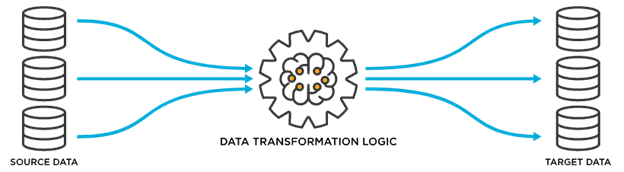

> [!VIDEO https://www.microsoft.com/videoplayer/embed/RE50qXc]

Rarely would you start an application with no existing data. When designing your data structure, you first need to understand where the data is located that the app will use.

Existing data will be imported into your application or you'll integrate it into your application with an existing system or data source.

## Find and organize the required information

Typically, existing data is imported when your application will be replacing an existing solution, whether it's an older application or static data from a spreadsheet. One recommended approach is to review which data is available and decide how much of it will be required by the application.

> [!div class="mx-imgBorder"]
> 

Perhaps the data that you're working with is 10+ years old, but your users only need access to the last three years' worth of data. At that point, it would be beneficial to do some data cleaning before you import it into your environment. It's also a good time to remove duplicate records, inaccurate records, and other data that will be irrelevant to the tasks that users will be completing in the application. Additionally, you should analyze the contents of legacy fields and identify any that are rarely used. If these fields aren't needed in the new system, it might not make sense to migrate data from them.

Cleaning up data won't only display relevant data to users, it will also help you identify data storage capacity. Exceeding storage capacity is one of the greatest setbacks that an enterprise can encounter during the deployment of Microsoft Power Apps.

Analyzing the existing data also allows you to identify columns or fields that you need to add to your app. You can create a plan that describes which origin fields will match which destination fields and how these fields will appear after migration.

## Integrate with existing systems and apps that people already use

Apps that are created with Power Apps have two ways to integrate with existing data.

> [!div class="mx-imgBorder"]
> 

One way is by using a connector, which allows you to connect directly to a data source. The other method is to use a dataflow, which copies a snapshot of the data.

-   **Connector** - A connector is a feature in Power Apps where you can connect to various systems and sources, such as SharePoint, SQL Server, or Office 365, and directly retrieve data from them or save data to them. For more information, see [Overview of canvas-app connectors for Power Apps](/power-apps/maker/canvas-apps/connections-list/?azure-portal=true).

-   **Dataflow** - Dataflow is a feature in Power Apps where you can extract, transform, and load data from another system to Microsoft Dataverse or Microsoft Azure Data Lake Storage. Unlike a connector, a dataflow will fetch data in a scheduled batch. Instead of retrieving the data as it is from the data source, you can use Power Query Online to manipulate, cleanse, and transform data before you store it to the target storage. For more information, see [Self-service data prep with dataflows](/power-apps/maker/data-platform/self-service-data-prep-with-dataflows/?azure-portal=true).

The method that you choose depends on your use cases and how data needs to be handled. The following table lists some items that you can use for comparison.

|      Item to compare         |      Connectors                                     |      Dataflow                                        |
|------------------------------|-----------------------------------------------------|------------------------------------------------------|
|     Freshness of data        |     Real-time                                       |     Static or snapshot                               |
|     Direction                |     Bidirectional                                   |     One direction (from origin to Microsoft Dataverse)         |
|     Modify existing data?    |     Yes                                             |     No                                               |
|     Example use cases        |     Production order, timesheet, sales quotation    |     Customer master, past invoices, employee list    |

Depending on the data that you need to access, you might need more technical assistance. When you need to work and integrate with existing enterprise systems, such as SAP and Oracle, you should seek cooperation and support from your IT administration team or the team that's in charge of the system.

For more information, see [Working with enterprise systems](/power-apps/guidance/planning/enterprise-systems/?azure-portal=true).
