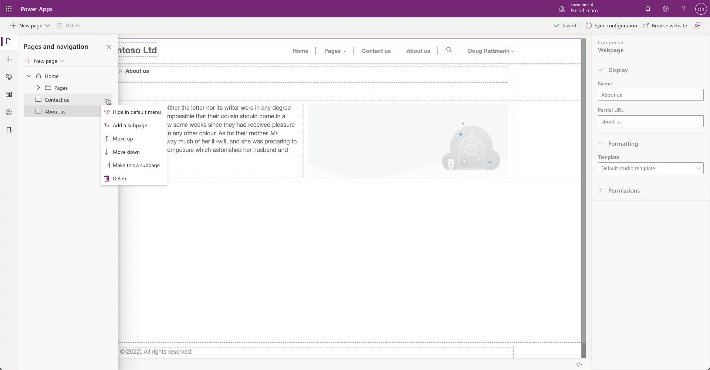

A portal maker can quickly add and organize new pages in Power Apps portals Studio.

From the portals Studio command bar, select **New page**. You'll be presented with many page layout choices. The choices that are available will depend on the portal starter template and any page templates that you might have added to the portal by using the Portal Management app.

> [!div class="mx-imgBorder"]
> 

After you've selected a layout, the page will appear on the canvas and the webpage properties will be available to edit in the Properties pane. The maker can define the webpage name, partial URL, and template.

Then, the maker can begin to add and edit components to the webpage.

After saving the webpage, a maker has the following options that they can use to organize where and how the page is organized in the portal site map. By selecting pages from the toolbelt, the maker can select the particular page and then perform the actions that are described in the following table.

> [!div class="mx-imgBorder"]
> 

| Item | Details |
| -------------------- | ---- |
| Hide in default menu | A weblink record (menu option) won't be displayed on the default navigation menu.    |
| Add a subpage   | A new webpage is added as a child page of the currently selected page. |
| Move up                     | Moves up the webpage in the sitemap.      |
| Move down            | Moves down the webpage in the sitemap.                       |
| Make this a subpage  | Makes the currently selected page a child page of the page that is directly above it in the site map. |
| Promote subpage      | Moves up the webpage in the hierarchy and makes a sibling of its former parent page. |
| Delete               | Deletes the webpage. |