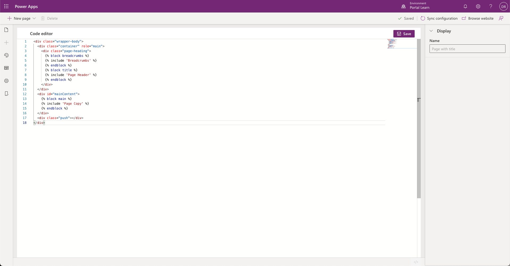

A web template can be composed of HTML, CSS, and JavaScript code. A template can also include Liquid template language expressions that can be used to add dynamic content to pages. Power Apps portals Studio provides a built-in code editor to allow makers to directly modify an existing web template.

On the toolbelt, select **Templates** and then choose the web template that you want to edit. 

> [!NOTE]
> Some of the default web templates, or web templates without a corresponding page template, may not be accessible or editable.  

> [!div class="mx-imgBorder"]
> 

> [!WARNING]
> Directly editing the web templates with incorrect syntax can lead to undesirable results.

For more information about the Liquid language, see [Work with Liquid templates](/power-apps/maker/portals/liquid/liquid-overview/?azure-portal=true).
