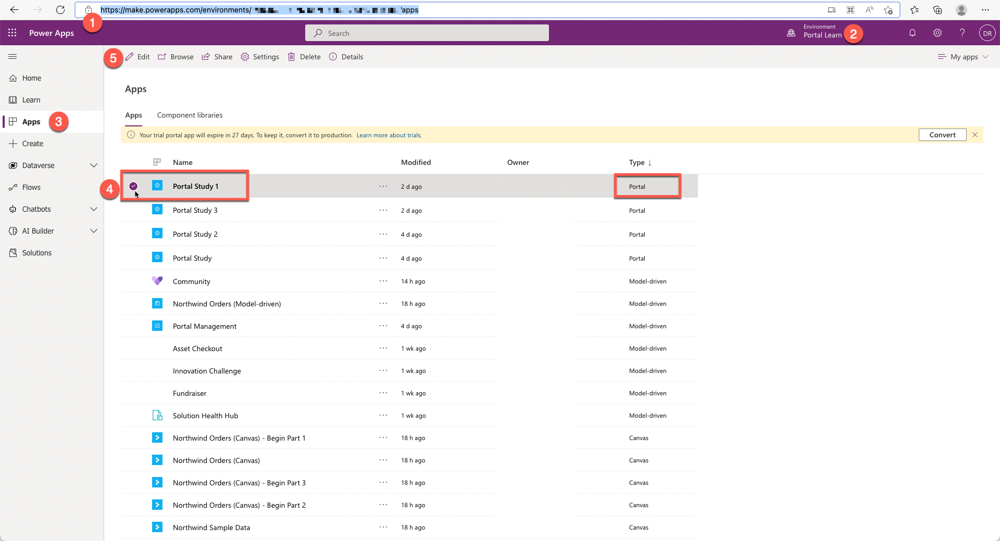
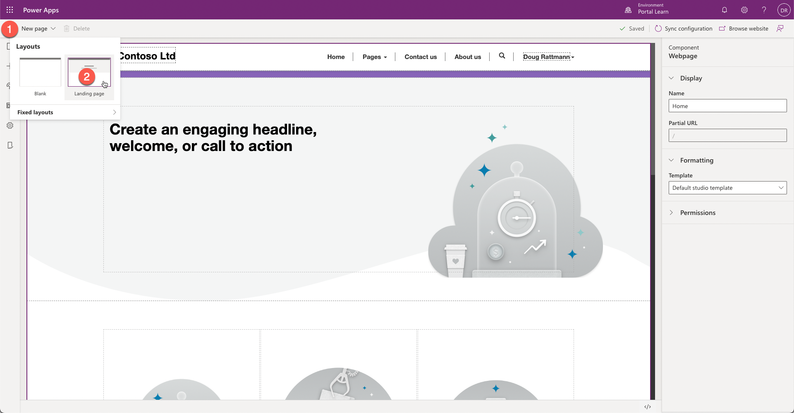
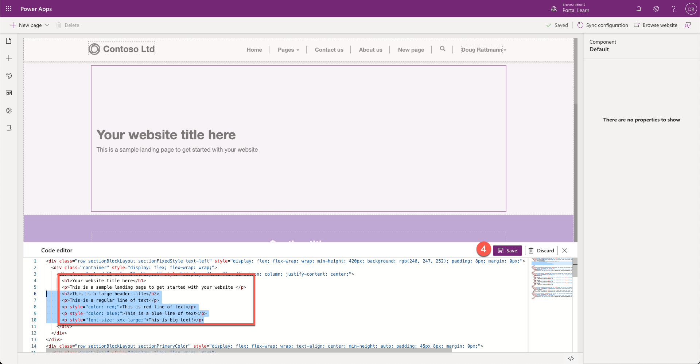

The purpose of this hands-on-lab is to edit webpage source code by using Power Apps portals Studio.

At the end of these exercises, you will be able to:

- Open portals Studio to edit your portal.
- View the source code of a webpage section.
- Add your own HTML code directly to a portal page or section.

For this exercise, you will need to have the following parameters in your environment:

1. A Power Apps portal that is provisioned. If you do not have a Power Apps portal available, follow the [Create Portal](/power-apps/maker/portals/create-portal/?azure-portal=true) instructions to create one.
1. Access to the Power Apps maker portal.

## Scenario

To ensure a consistent website appearance and define the *accessible* content that can be located and indexed, it is important to be able to edit HTML content of a page. In this exercise, you will add HTML code to the webpage copy section by using the Power Apps portals Studio Code Editor, and then you will follow these processes:

1. Open your portal in Power Apps portals Studio.
2. Create a new landing webpage.
3. Add HTML code that contains various elements such as headings, paragraphs, and so on.
4. Save the page and browse the website to view the results.

### Launch portals Studio

To launch the Power Apps portals Studio, follow these steps:

1. Sign in to [Power Apps](https://make.powerapps.com/?azure-portal=true).
1. Select a target environment by using the environment selector in the upper-right corner.
1. On the left menu, select **Apps**.
1. Select your portal app (Type = Portal).
1. Select **Edit**, which will launch the portals Studio.



### Locate the webpage

To locate the webpage, follow these steps:

1. Select **New page**.
1. Select **Landing page** layout.



### Edit source code

To edit the source code, follow these steps:

1. Select column in the first section on the webpage canvas.

1. Select the **Source code editor** (**</>**) icon.


1. Insert the following HTML code into the content of the first column: 

    ```html
    <h2>This is a large header title</h2>
    <p>This is a regular line of text</p>
    <p style="color: red;">This is red line of text</p>
    <p style="color: blue;">This is a blue line of text</p>
    <p style="font-size: xxx-large;">This is big text!</p>
    ```


1. Select **Save**.



You should see the formatted text on the canvas.


### View the webpage

To view the webpage, on the Command bar, select **Browse website**. You should now see your page with the formatted text.