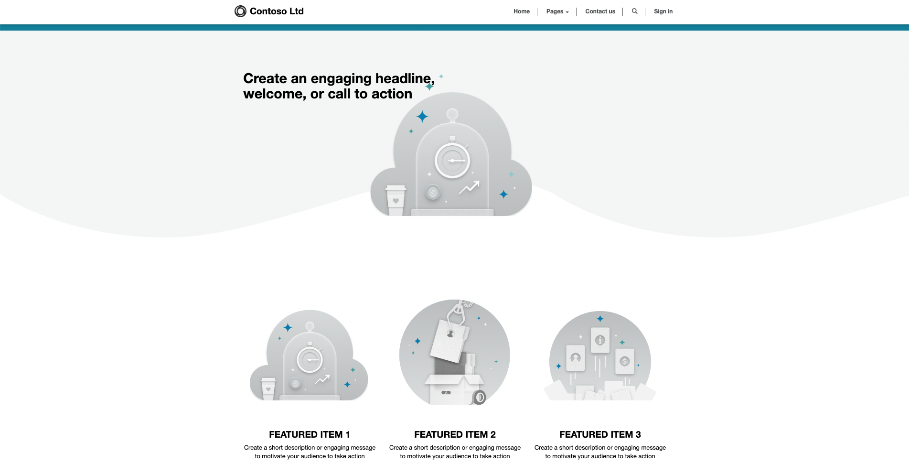

The **Blank website** template provides organizations with a basic portal that does not fit the requirements of the specific portal audience or workload features.

This portal is an ideal starting point for unique line-of-business applications with portal requirements. Examples of custom portals could be event and registration management, grant management, or government citizen service solutions. Any custom business app that is built on Microsoft Dataverse can be extended to an external-facing audience.

The **Blank website** portal contains core features such as content management, security, ability to transact with Dataverse, and extensibility.

 |

A maker can configure the **Blank website** portal to address business requirements by adding web links and custom pages and by surfacing Dataverse records. A **Blank website** portal can be further extended by using lists, basic forms, advanced forms, or custom templates.

Features from other portals can be applied to a **Blank website** portal in a Dataverse environment with Dynamics 365 apps enabled.

> [!VIDEO https://www.microsoft.com/videoplayer/embed/RE4ynsK]
