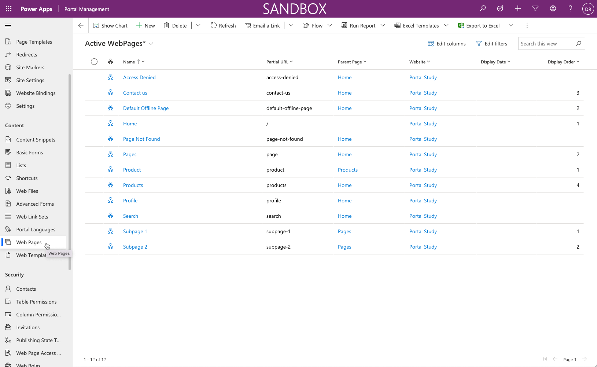
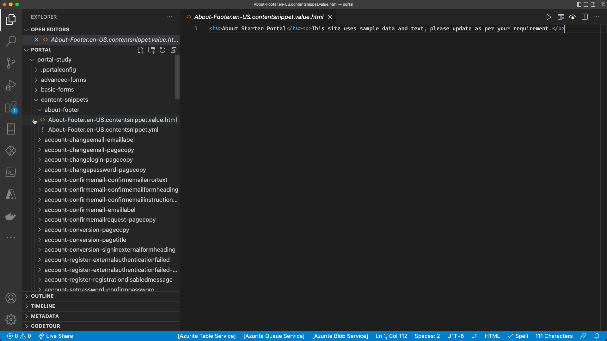
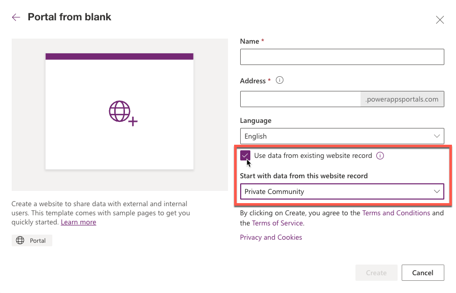

## Development life cycle

Application lifecycle management (ALM) is important as the applications that your organization builds become more complex and as more of your company depends on their stability.

If you create a model-driven Power App, a Power Automate flow, or any other object to build a business solution on a Microsoft Dataverse environment, you would typically contain these assets in a *solution* and export the single solution file from one environment to another. The solution file can also be *unpacked* into discreet file components and uploaded to a source control system (such as Microsoft Azure DevOps) that will maintain a repository of the solution and track the various changes. Many tools are provided by Microsoft and the community to automate the ALM process. 

For more information, see [Application lifecycle management (ALM) with Microsoft Power Platform](/power-platform/alm/?azure-portal=true).

## Portal metadata

Power Apps portals configuration is stored directly within Dataverse as rows known as *portal metadata*. When you provision a Power Apps portal, the portal template that you choose will populate many portal-specific Dataverse tables with data that describe the website structure, webpages, content, list configuration, basic form configuration, table permissions, and so on. As you configure the portal by using Power Apps portals Studio or other tools, you're changing or adding to the portal metadata.

> [!div class="mx-imgBorder"]
> 

Portal metadata can't be added to a Dataverse solution file. The challenge is how to move the portal metadata rows from one environment to another. While model-driven Power Apps have built-in features to export and import data, these features work for a single table and must be sequenced based on data relationships.  

Portal metadata is stored in over 50 interconnected, unique tables. In addition, functionality is built into the portal solutions that will be triggered as rows are created. For example, as a webpage row is added to the portal, a corresponding webpage row will be created for each provisioned language. Using an import tool might inadvertently duplicate webpage rows.

You can move portal metadata from one environment to another by using tools that are available from the community and Microsoft.

### Microsoft Power Platform CLI

Microsoft Power Platform CLI (Command Line Interface) is a simple, one-stop developer CLI that empowers developers and ISVs to perform various operations in Microsoft Power Platform related to environment lifecycle, authentication, and work with Microsoft Dataverse environments, solution packages, portals, code components, and so on. 

With this feature, Microsoft Power Apps portals supports Microsoft Power Platform CLI to enable CI/CD (Continuous Integration/Continuous Deployment) of portal configuration. You can now check in the portal configuration to source control and move portal configuration to any environment using Microsoft Power Platform CLI.

Here's a list of features and capabilities that portals benefits from with the support for Microsoft Power Platform CLI:

- Download/upload portal data to/from the local file system.

- Track changes to portal configuration using a source control system.

- Move portal configurations across organizations or tenants.

- Easily set up CI/CD pipelines

To quickly test Microsoft Power Platform CLI capabilities, follow these steps:

1. Open **Visual Studio Code**. If you don't have VS Code installed follow [Setting up Visual Studio Code](https://code.visualstudio.com/docs/setup/setup-overview) instructions applicable to your platform.

1. Select **View > Extensions**.

1. Search for "power platform". Locate and select **Power Platform Tools**.

1. Select **Install**.

1. Select **Terminal > New Terminal**.

1. Enter `pac auth create --url https://yourorg.crm.dynamics.com`. This command will open a browser window to authenticate and create an authentication profile for you to use.

1. Enter `pac paportal list` to list all portals in your Dataverse environment. Select and copy WebSiteId value of the portal you want to download.

1. Enter `pac paportal download -p portal -id paste-websiteid-here` to start downloading the portal data into a folder **portal**.

1. Type `code portal` to open the folder with the downloaded data in an editor window.

   

1. Browse portal source in the editor window. 

   

1. Close the editor when done. If you need to remove the folder created during the download, enter `rm -r portal` in the terminal window.

This tooling is a step toward a comprehensive application life-cycle management (ALM) story where the enterprise developers and ISVs can create, build, debug, and publish their extensions and customizations quickly and efficiently. For more information, see [What is Microsoft Power Platform CLI?](/power-apps/developer/data-platform/powerapps-cli/?azure-portal=true) and [Portals support for Power Platform CLI](/power-apps/maker/portals/power-apps-cli/?azure-portal=true).

### Configuration Migration tool

The **Configuration Migration** tool is an application that can be run as a Windows desktop application or invoked as a PowerShell cmdlet. The tool can export and import a set of Dataverse rows and maintain the table relationships.  

> [!div class="mx-imgBorder"]
> 

> [!NOTE]
> The **Configuration Migration** tool is designed for smaller datasets (specifically configuration data, such as portal metadata) and is not suited for high-volume data migrations or integrations.

The **Configuration Migration** tool will use a schema file to determine which Dataverse tables to export to a data file. Microsoft has a predefined schema file for each of the portal templates to identify the specific portal metadata Dataverse tables.

After you have set up your Power Apps portal configuration, you can run the **Configuration Migration** tool to export your portal metadata to an XML file by using the schema that corresponds to your portal template.

Ideally, the portal metadata file should be uploaded to a source control repository, where the changes can be tracked and used to deploy to other environments.

You'll also need to deploy any configurations that are made to Dataverse, such as new tables and model-driven forms and views that are used by portal lists and basic forms. You would move this configuration by using *solutions*. For more information, see [Solutions Overview](/power-apps/maker/common-data-service/solutions-overview/?azure-portal=true).

On your destination environment, you can then run the **Configuration Migration** tool to import the portal metadata file to update the portal configuration.

> [!CAUTION]
> Using the **Configuration Migration** tool will move over all and overwrite existing portal metadata. Situations might occur where content is specific to the environment (for example, hyperlinks to specific URLs). After the data has been migrated, you might need to update some content directly in the destination portal.

For more information, see [Migrate portal configuration](/power-apps/maker/portals/admin/migrate-portal-configuration/?azure-portal=true).

### Create new portal using migrated data

If the migration process is updating an existing portal, the updates should now be visible in the target environment. If the migration is for a new portal, you can now create the new portal for the imported website record by using the option **Use data from existing website record**. 

