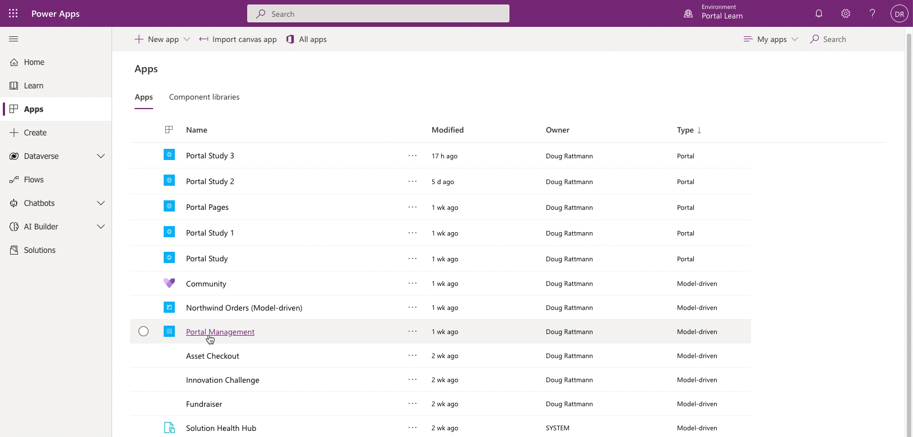
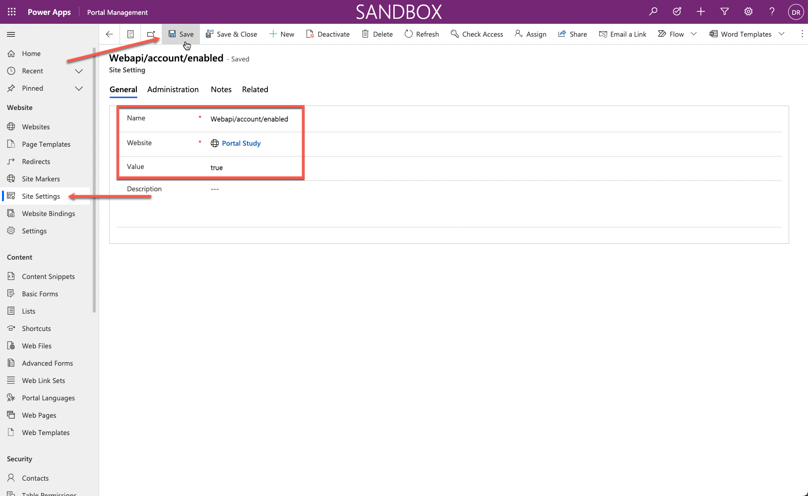
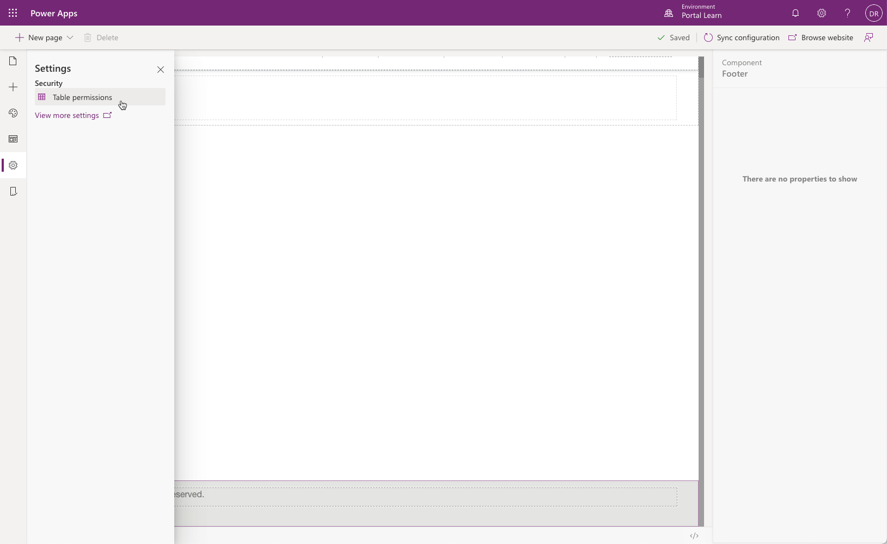
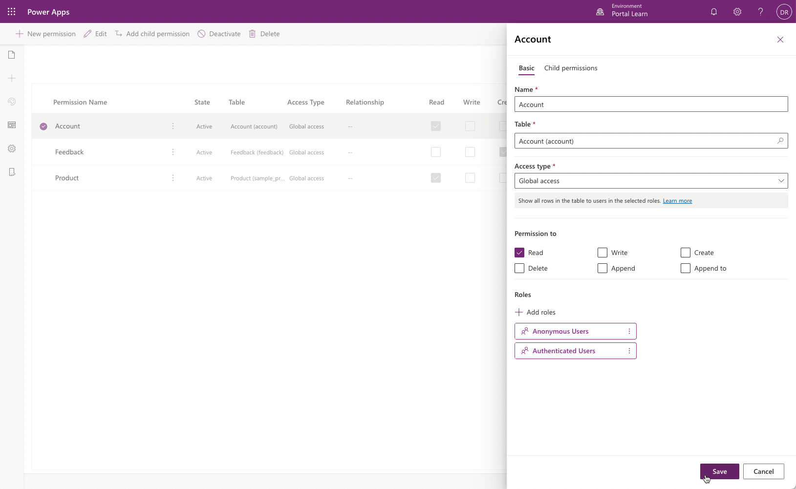
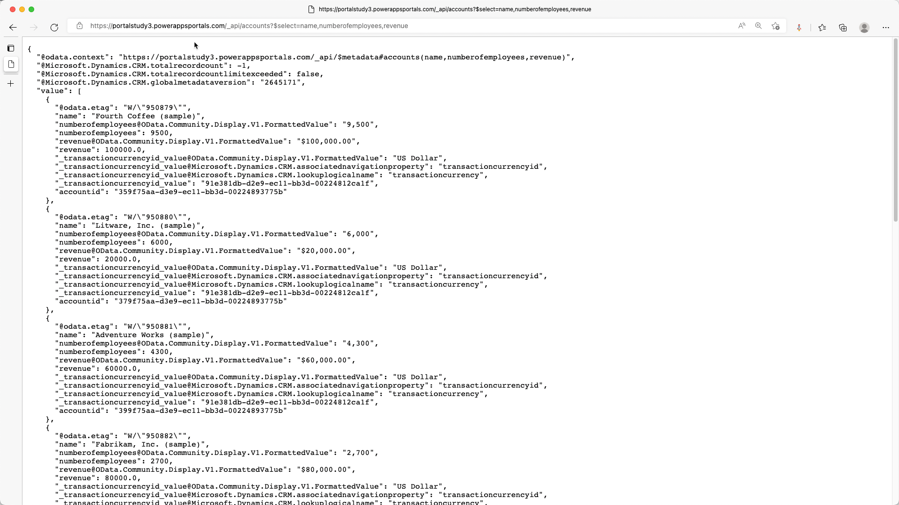
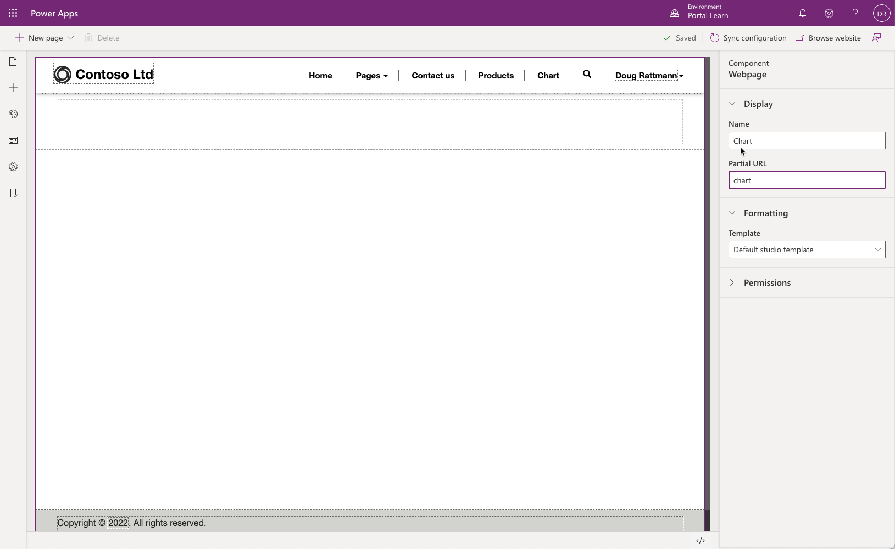
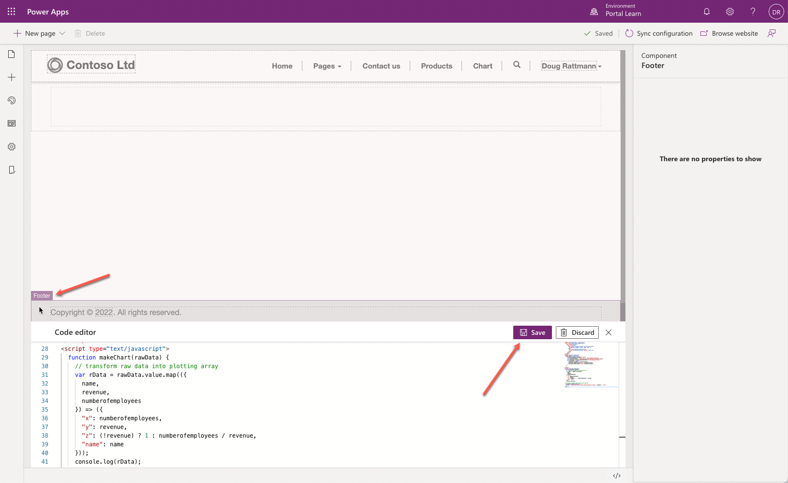
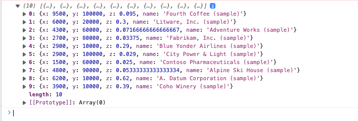
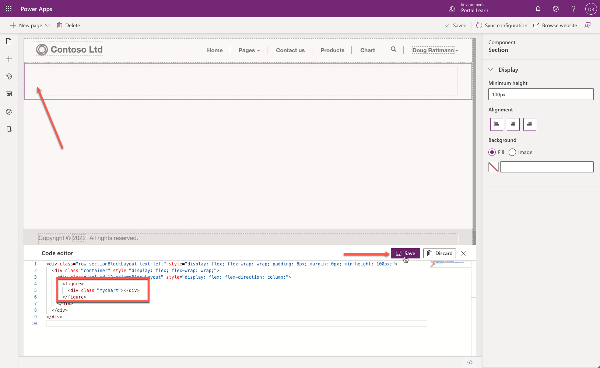
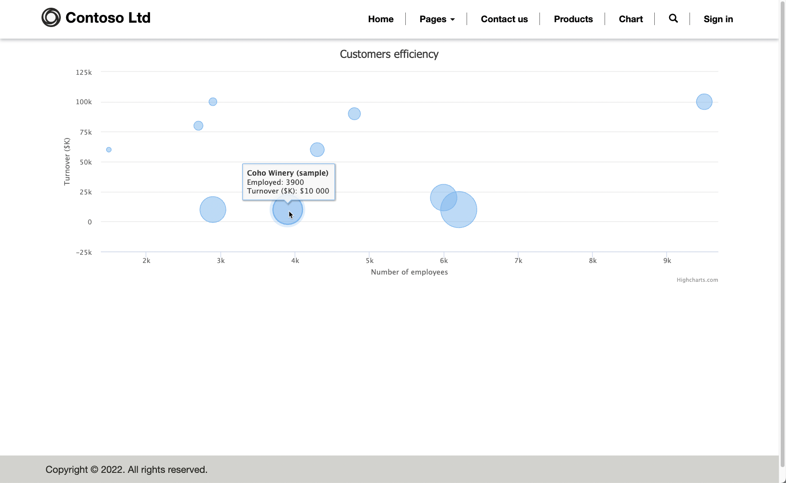

The purpose of this hands-on lab is to demonstrate how to add JavaScript code to a page to render data from Microsoft Dataverse as a chart by using an external charting library with the data retrieved from Dataverse using Portals Web API.

The exercises work best when you have sample data to work with. Depending on the environment that you're working with, you might want to install some sample data to assist with the exercises. Microsoft Power Platform does provide the ability to add sample data as needed. If the environment that you're working in doesn't have sample data installed, follow the steps in the [Add or remove sample data](/power-platform/admin/add-remove-sample-data/?azure-portal=true) documentation to install the sample data into your environment.

## Learning objectives

At the end of these exercises, you'll be able to:

- Configure site settings and table permissions to enable Portals Web API requests.
- Add inline code to a content webpage to retrieve and transform the data using the Portals Web API.
- Use an external JavaScript library to plot the transformed data.
  
**Estimated time to complete this exercise**: 15 to 20 minutes

## Prerequisites

For this exercise, make sure that the following parameters are set up in your environment:

- A Power Apps portal that is provisioned. If you don't have a Power Apps portal available, follow the [Create Portal](/power-apps/maker/portals/create-portal/?azure-portal=true) instructions to create one.
- Access to the Power Apps maker portal.

## High-level steps

To finish the exercise, complete the following tasks:

1. Create site settings and table permissions allowing Portals Web API read requests to accounts table.
1. Create a content page and add JavaScript code that retrieves and transform the data.
1. Add a charting library to the page and JavaScript code by using the library to build a graph with the retrieved data.

## Detailed steps

### Enable Portals Web API requests

To enable Portals Web API requests to **accounts** table, follow these steps:
#### Create site settings

1. Sign in to [Power Apps maker portal](https://make.powerapps.com/?azure-portal=true) and confirm you've selected the correct environment in the upper right corner.

1. Select **Apps**.

1. Select the **Portals Management** app.

    > [](../media/portal-management-app.png#lightbox)

1. Select **Site Settings**.

1. Select **+ New** and enter the following information:

    - **Name** - Webapi/account/enabled.
    - **Website** - select your portal.
    - **Value** - true.
    - Select **Save**.

    

1. Select **+ New** and enter the following information:

    - **Name** - Webapi/account/fields.
    - **Website** - select your portal.
    - **Value** - name,numberofemployees,revenue.
    - Select **Save & Close**.

#### Create table permissions

1. Switch to Power Apps maker portal window. 

1. Select portal app and select **Edit** to open portals Studio.

1. Select **Settings** icon then select **Table permissions**.

   

1. Select **+ New permission** and fill in the following information:

    - **Name** - Account
    - **Table** - Account (account)
    - **Access type** - Global
    - **Permission to** - Read

1. Select **Add roles** and add Anonymous Users and Authenticated Users. 

1. Select **Save**.

    

#### Test the Web API

1. Open the following URL `https://yourportal.powerappsportals.com/_api/accounts?$select=name,numberofemployees,revenue`.

1. Your output should look like the following:

   

### Create a content page and retrieve data

To create a content page and add JavaScript code that retrieves and transform the data, follow these steps:

1. In portals Studio, select **Pages & navigation** icon then select **+ New page**.

1. Select **Blank** layout.

1. Enter **Chart** as **Page name** and **chart** as **Partial URL**.

   

1. Select footer area and then select **Source edit </>** icon.

1. Append the following script:

   ```html
   <script type="text/javascript">
     function makeChart(rawData) {
       // transform raw data into plotting array
       var rData = rawData.value.map(({
         name,
         revenue,
         numberofemployees
       }) => ({
         "x": numberofemployees,
         "y": revenue,
         "z": (!revenue) ? 1 : numberofemployees / revenue,
         "name": name
       }));
       console.log(rData);
     }
     // retrieve accounts data using portals Web API
     $(document).ready(function() {
       $.get('/_api/accounts?$select=name,numberofemployees,revenue', makeChart, 'json');
     });
   </script>
   ```

1. Press **Save**.

   

1. Press **Browse website**.

1. When the page is displayed, press the **F12** key to display browser developer tools.

1. Verify that the console output contains the same data as previously retrieved but now transformed.

   

1. The data structure is now prepared for plotting by assigning appropriate labels to data points:

    - **name** - Company name
    - **x** - Number of employees
    - **y** - Company revenue in thousands
    - **z** - Revenue for each employee (calculated)

### Add external library functionality

This exercise uses Highcharts.js library (free for personal or non-profit use) to create a bubble chart based on the data.

1. Switch to portals Studio.

1. Select the footer and locate the code that you previously added.

1. Insert the following code either above or below the previous code:

    ```html
      <script src="https://code.highcharts.com/highcharts.js"></script>
      <script src="https://code.highcharts.com/highcharts-more.js"></script>
    ```

1. Modify the **makeChart** function as follows:

    ```javascript
    function makeChart(data) {
      console.log(data);
      var rData = data.value.map(({
        name,
        revenue,
        numberofemployees
      }) => ({
        "x": numberofemployees,
        "y": revenue,
        "z": (!revenue) ? 1 : numberofemployees / revenue,
        "name": name
      }));
      console.log(rData);
    
      // new code to plot the data
      Highcharts.chart($('.mychart')[0], {
        title: {
          text: "Customers efficiency"
        },
        legend: {
          enabled: false
        },
        xAxis: {
          title: {
            text: "Number of employees"
          }
        },
        yAxis: {
          title: {
            text: "Turnover ($K)"
          }
        },
        tooltip: {
          pointFormat: '<strong>{point.name}</strong><br/>Employed: {point.x}<br>Turnover ($K): ${point.y}',
          headerFormat: ''
        },
        series: [{
          type: 'bubble',
          data: rData
        }]
      });
    }
    ```

1. Your JavaScript should look like the following:

    ```html
    <script src="https://code.highcharts.com/highcharts.js"></script>
    <script src="https://code.highcharts.com/highcharts-more.js"></script>
    
    <script type="text/javascript">
      function makeChart(data) {
        console.log(data);
        var rData = data.value.map(({
          name,
          revenue,
          numberofemployees
        }) => ({
          "x": numberofemployees,
          "y": revenue,
          "z": (!revenue) ? 1 : numberofemployees / revenue,
          "name": name
        }));
        console.log(rData);
        
        Highcharts.chart($('.mychart')[0], {
          title: {
            text: "Customers efficiency"
          },
          legend: {
            enabled: false
          },
          xAxis: {
            title: {
              text: "Number of employees"
            }
          },
          yAxis: {
            title: {
              text: "Turnover ($K)"
            }
          },
          tooltip: {
            pointFormat: '<strong>{point.name}</strong><br/>Employed: {point.x}<br>Turnover ($K): ${point.y}',
            headerFormat: ''
          },
          series: [{
            type: 'bubble',
            data: rData
          }]
        });
      }
      $(document).ready(function() {
        $.get('/_api/accounts?$select=name,numberofemployees,revenue', makeChart, 'json');
      });
    </script>
    ```

1. Select **Save**.

1. Select the content area of the page.

1. Insert the following code into inner `<div>` element:
    ```html
      <figure>
        <div class="mychart"></div>
      </figure>
    ```

1. Press **Save**.

   

1. Select **Browse website**.

1. The output should now include the bubble chart. Hover over the bubbles to verify the data.

> [!div class="mx-imgBorder"]
> [](../media/chart.png#lightbox)
