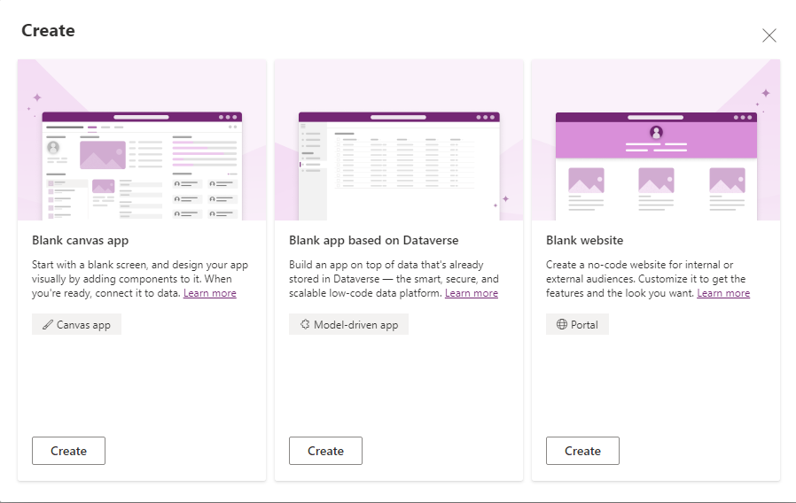
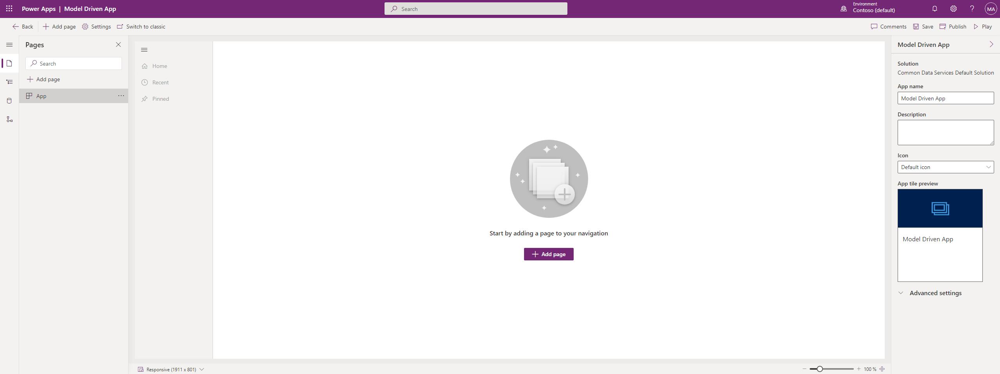
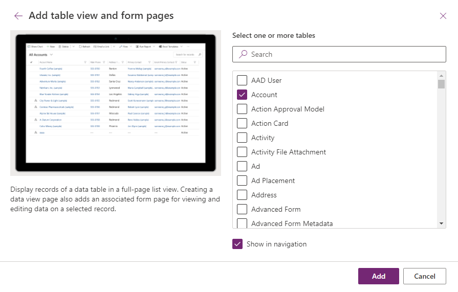
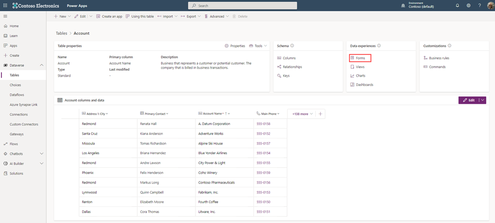
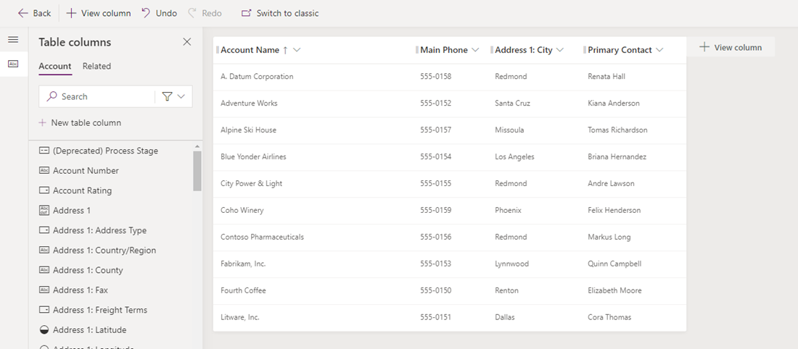
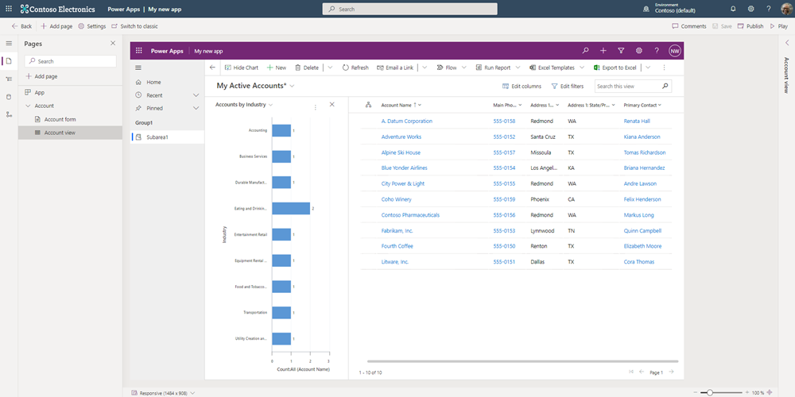

In this unit, you'll create a model-driven app by using one of the standard tables available in your Microsoft Power Apps environment.

## Create a model-driven app

1. On the **Home** page, select the **Blank app**.

1. Find **Blank app based on Dataverse** and then select **Create**.

    > [!div class="mx-imgBorder"]
    > 

1. On the **Create a New App** page, enter a name and description for the app.

1. Select **Create**. Your new app appears in the App Designer, and you can now add components to it.

## Add a page to your app

You add pages to your app within the App Designer.

1. Select **Add Page**.

    > [!div class="mx-imgBorder"]
    > 

1. Select **Table based view and form**, and then select **Next**. Afterwards, select **Account** and then **Add**.

    > [!NOTE]
    > If *Account* is not an option as a table, you may not have any sample data in your environment. Refer to this exercise on [how to create sample apps and data](/training/modules/intro-model-driven-apps-common-data-service/4-template-apps/?azure-portal=true).

    > [!div class="mx-imgBorder"]
    > 

Here you can explore your **My Active Accounts** view and the **Account** form that is automatically created when your Dataverse instance is initialized.

## Edit your form

You've successfully added a form to your app, now we'll edit them.

1. Navigate to [https://make.powerapps.com](https://make.powerapps.com).

1. Select **Dataverse**, then **Tables**.

1. Select the **Account** table.

1. Under **Data experiences**, select **Forms**.

    > [!div class="mx-imgBorder"]
    > 

1. In this page you can adjust Form Settings, Add components, fields, business rules, event handlers, custom form libraries, edit table columns and more.

## Edit views

1. Navigate to [https://make.powerapps.com](https://make.powerapps.com).

1. Select **Dataverse**, then **Tables**.

1. Select the **Account** table.

1. Under **Data experiences**, select **Views**.

1. You'll see a list of all the views that you can edit. The default view that is added when you added the **Account** page to your app is **My Active Accounts**.

1. Select **My Active Accounts** to edit the view.

1. On this page, you can edit:

   - Which fields will show up on this view
   - What filters will be applied
   - Default sort order
   - The order of your columns
   - The width of your columns.

    > [!div class="mx-imgBorder"]
    > 

## Publish your app

On the App Designer toolbar, select **Publish** in the top right corner. After you publish the app, it's ready
for you to run or share with others.

Above My Active Accounts, select **Show Chart**.

If the sample data for your accounts doesn't have an Industry populated, go into a few accounts and add an Industry. Once you've updated a few accounts with an industry, the chart will update as well. Once populated, your chart will look similar to the chart below.

> [!div class="mx-imgBorder"]
> 
