In this unit, you'll create a table and then customize key components, like columns, relationships, views, and forms. You'll learn how to:

- Create a custom table.
- Add custom columns to your table.
- Add a table relationship.
- Customize a view.
- Customize a form.

The tutorial follows the Contoso company, which is a pet grooming business that grooms dogs and cats. Contoso needs an app for client and pet tracking that can be used by employees on various devices.

## Create a custom table

Sign in to [Power Apps](https://make.powerapps.com) and follow these steps to create a new custom table.

1. In the left navigation pane, expand **Dataverse**, select **Tables**, and then select **+ New table**.

1. Under New table, enter the following:

    - **Display name**: *Pet*

1. In the Primary Column section, enter the following:

    - **Display name**: *Pet Name*

1. At the bottom, select **Save**.

## Add and customize columns

1. Once the table is finished creating, your display will show the table properties and your blank table in the section called **Pet columns and data**. Note here that **Pet Name** is the only column on display and next to that is **+18 more** and next to that is  **+** to add a new column.  There's also an **Edit** button on the upper right corner of this section that will also allow you to edit, but in this case we'll do the editing within this window.
1. Within the **Pet columns and data**, select the **+** button to create a new column, and observe a popup **New column** pane on the right side of the screen.

1. In the **New column** pane, enter the following values:

    - **Display name**: *Species*
    - **Data type**: *Choice*
    - **Searchable**: *ensure this box is selected*

    > [!div class="mx-imgBorder"]
    > 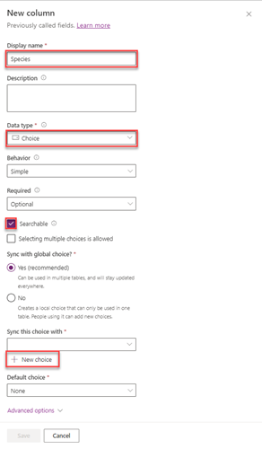

1. Create the choice set:

    1. Select **+ New choice** and you'll see the **New choice** pane appear.
    1. In the Display name box, enter *Species*.
    1. Under **Choices** you see two entry fields titled **Label** and **Value**. Enter *Dog* and *1* respectively.
    1. Select **+ New choice** under the *Dog* entry and make *Cat* the new entry for *Label*. The *Value* automatically updates as *2*.
    1. Select **Save**.

    > [!div class="mx-imgBorder"]
    > 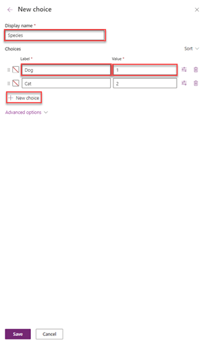

1. To make the *Species* choices that you just created the designated choices for this column, select the dropdown under **Sync this choice with** and locate and select *Species* selected, and then select **Save**.

    > [!div class="mx-imgBorder"]
    > 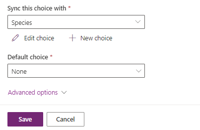

1. Let's add another column in the columns and data pane; again select the **+** to add a new column.

    > [!div class="mx-imgBorder"]
    > 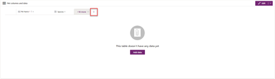

1. In the **New column** pane, enter the following values, and then select **Save**:

    - **Display name**: *Breed*
    - **Data type**: *Single line of text* (this is the default)
    - **Searchable**: ensure the checkbox is selected (default)

1. Add one more column by selecting the **+** *New column* button again.
1. In the **New column** pane, enter the following values, and then select **Save**:

    - **Display name**: *Appointment date*
    - **Data type**: *Date and Time*
    - **Searchable**: ensure the checkbox is selected (default)

## Add a relationship

1. On the **Schema** pane, select **Relationships** and the screen will display the existing relationships.

    > [!div class="mx-imgBorder"]
    > 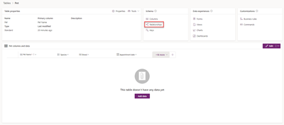

1. At the top left of the screen select the **+ New relationship**, and then select **Many-to-one** in the dropdown.
1. In the **Many-to-one** pane on the right, in the **Related** list, select **Account**.
1. Select **Done**.

    Notice that when you add a many-to-one relationship, an **Account** column of the **Lookup** data type is automatically added to your list of relationships.

    > [!div class="mx-imgBorder"]
    > 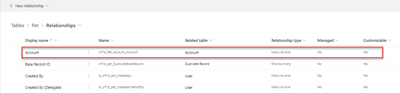

## Customize a view

1. Go back to your **Tables** screen by selecting *Pet* just to the left of *Relationships*. In the **Data experiences** pane select **Views**, then select **Active Pets**.
1. In the view designer, select **+ View Column**, select the following columns. (As you add each one, your view will reset. Continue selecting **+ View Column** to add all of the columns):

    - Account
    - Appointment date
    - Breed
    - Species (you'll need to scroll down or search for this column)

    > [!div class="mx-imgBorder"]
    > 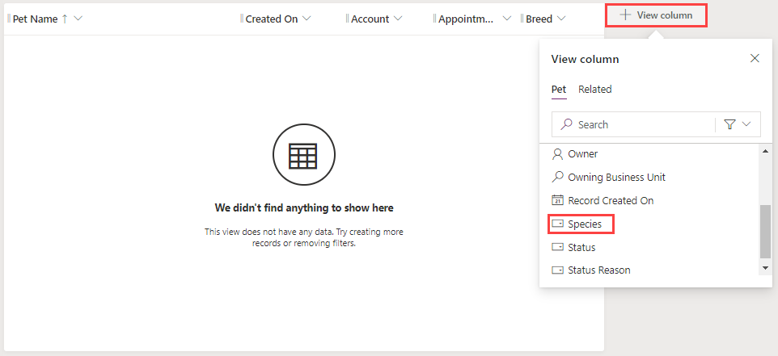

1. Select the **Created On** column, select **Remove**.
1. To arrange the columns, drag and drop them in the order you want them (or you can select the column to move, and then select **Move Left** or **Move Right**) until your view looks like this. 

    > [!div class="mx-imgBorder"]
    > 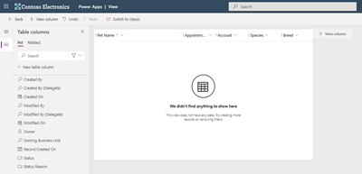

1. On the view designer toolbar, select **Save**.
1. Select **Publish** and then Navigate back to Tables by pressing the **Back** button at the top left of the screen.

## Customize the main form

1. In the left navigation pane, ensure **Dataverse** is selected, select **Tables**, and then select **Pet**.
1. In the **Data experiences** pane, select **Forms**.
1. Select **Information** next to the **Main** form type to open the form editor.

    > [!div class="mx-imgBorder"]
    > 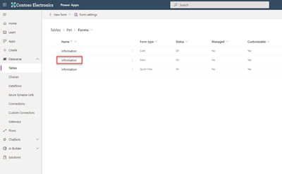

1. In the form editor, select **Table columns** from the menu on the far left side of the window, and drag the **Species**, **Breed**, **Appointment date**, and **Account** columns from under the **Table columns** pane to the **General** section of the form canvas, so that the form looks like this.

    > [!div class="mx-imgBorder"]
    > 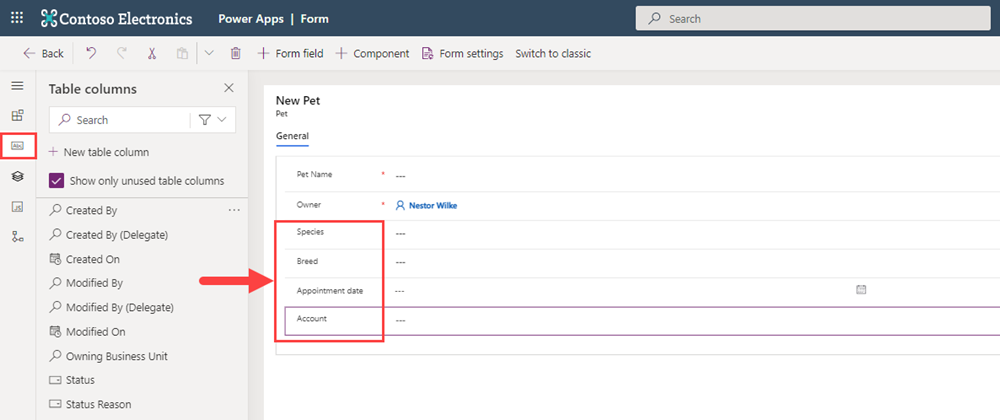

1. Select **Save**.
1. Select **Publish**.
1. Select the back arrow in your browser to close the form designer.
1. At this point it's possible to add data directly to your table. Select **Add data** and the screen below will appear. You can begin entering as many rows as you like.

    > [!div class="mx-imgBorder"]
    > 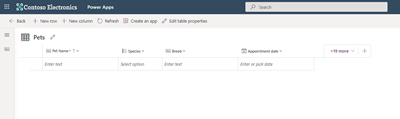

It's also possible to import data into your table. We'll show you how to do that in the next exercise.

