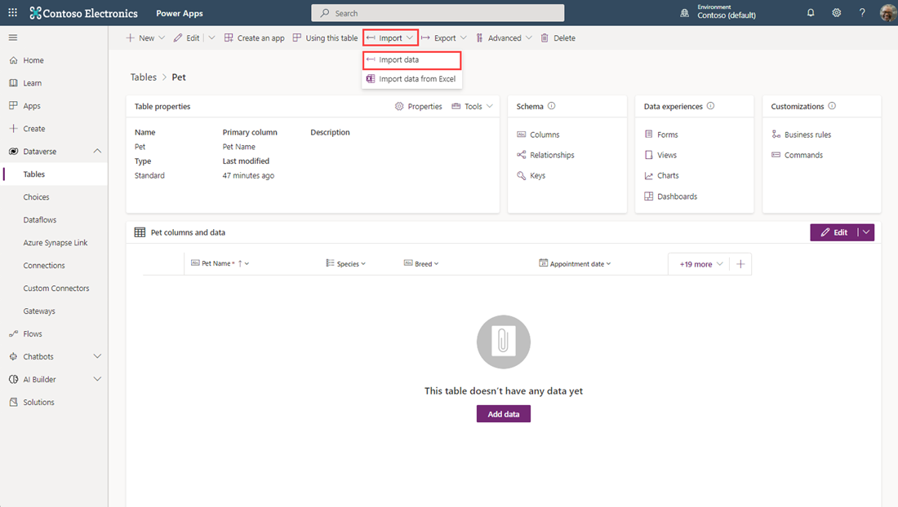
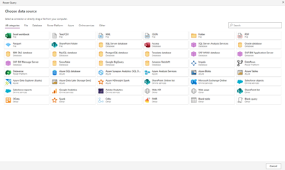
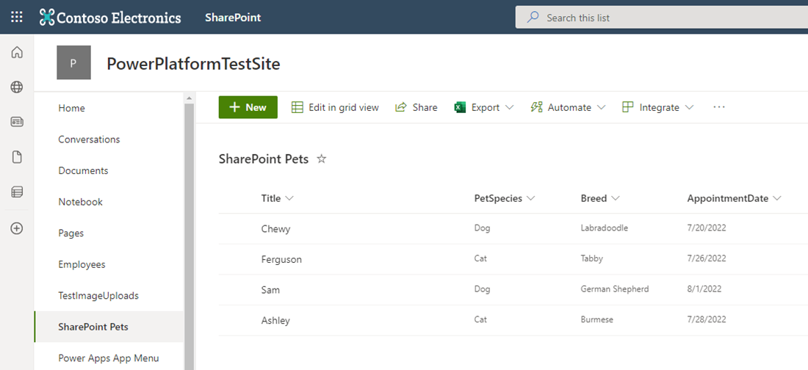
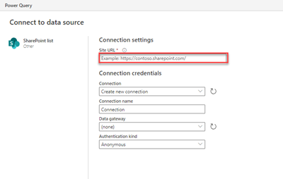
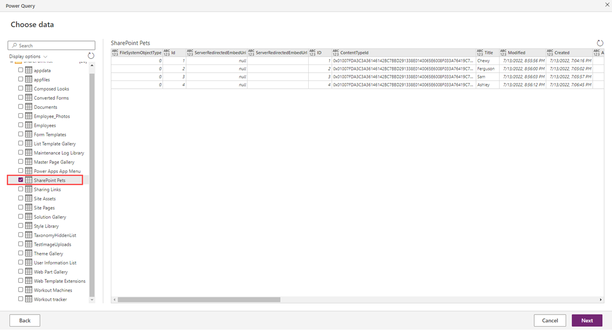
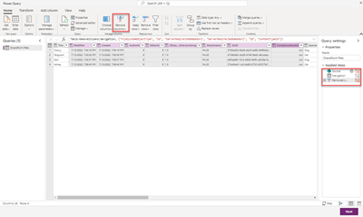
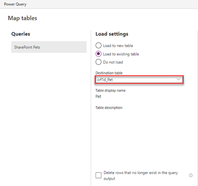
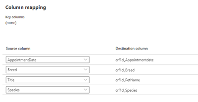
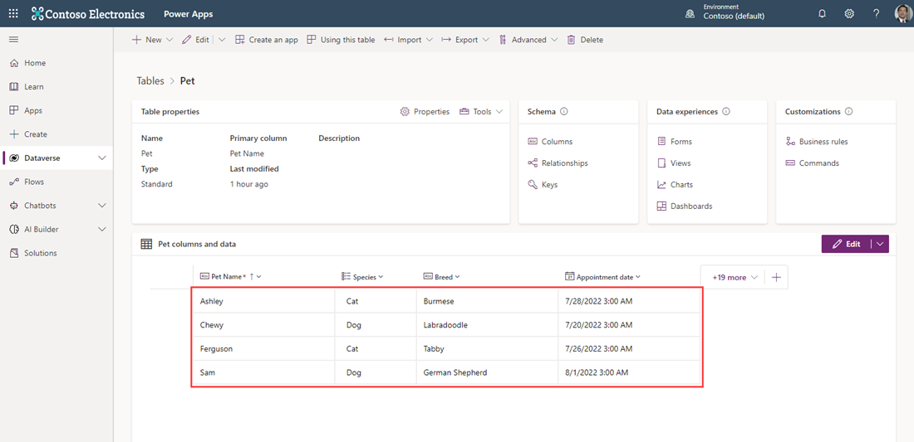

You can import data into your Microsoft Dataverse database in bulk from various sources including Excel, Access, SharePoint, SQL and many others.

> [!NOTE]
> The Pet table referred to here was created in the previous exercise.

1. On [powerapps.com](https://make.powerapps.com/?azure-portal=true), in the left navigation pane, expand **Dataverse** and select **Tables**.
1. Select the **Pet** table, and then select **Import** and **Import data** from the menu at the top of the screen.

    

1. On the **Choose data source** window note that there are more than 40 options to choose from. In this example, we're going to select SharePoint list where we have data to import into our *Pet* table.

    

## Import Data
In this example we have a simple SharePoint list with columns aligned with our Dataverse *Pets* table. It's important to know the web URL for your site Home Page so you can set up the data import.

1. Here's an example SharePoint list showing Pet data. This is an example of importable data. At the site *Home* screen, we can copy the URL.

    

1. From the Power Apps window showing **Choose data source** we can select **SharePoint list**.

1. As the window changes to **Connect to data source** we'll enter the SharePoint page URL copied previously in the **Site URL** entry field. After entering the URL, it may be necessary to put in your connection credentials. Then we select **Next** at the bottom right of the window.

    

1. On the **Choose data** window that appears, we can now select one or more lists or document libraries that we want to import. Selecting from the list on the left shows all available columns of data available in the data source.  Selecting **Next** takes you to the **Queries** screen where you can shape the data before importing.

    

1. Using the query edit window, you can remove any of the columns that you don't wish to import, by using the **Remove columns** button at the top of the window. It's possible to select multiple columns at once by selecting columns while holding the *Shift*  or *Ctrl* key and then selecting **Remove columns**. If you make a mistake, the **Applied steps** on the right side of the window keeps track of the changes, and you can cancel that step to undo the last action.

    

1. With the remaining columns of *Id*, *Title*, *Species*, *Breed* and *AppointmentDate* we'll select the **Next** button to move to the next step.

1. At the **Map tables** window now appearing, we want to select **Load to existing table**
1. We can select the **Destination table** from the dropdown. Keep in mind then the *Pet* table we created will have a prefix in front of it with an underscore, in this case it's *crf1d_Pet*. Notice how the **Column mapping** has the destination columns from our *Pet* table.

    

1. Next we select the source columns that we want to import into our destination columns. It's helpful to have similar names to make mapping easier. Each dropdown has a list of all available columns, so it's fairly easy to match if your names are close. Once all of your source columns are matched with the destination columns, select **Next** in the bottom right of the window.
 
    

1. The **Refresh settings** provides you the ability to set up a refresh schedule if you want your data to regularly update. In this case we'll, leave it set to **Refresh manually** and select **Publish** at the bottom right of the window.

    

    If you receive any warnings, pay attention to the messages, and go back to your query edit screen to shape your data.

1. If you published and received no warnings, and the table screen refreshes, you should be able to see that the data was imported into your list.

    

Though this example used SharePoint as a source for importing data, the steps are similar with any data source you wish to import into your list. Ready to try building a custom Dataverse table? Let's continue to the next unit!
