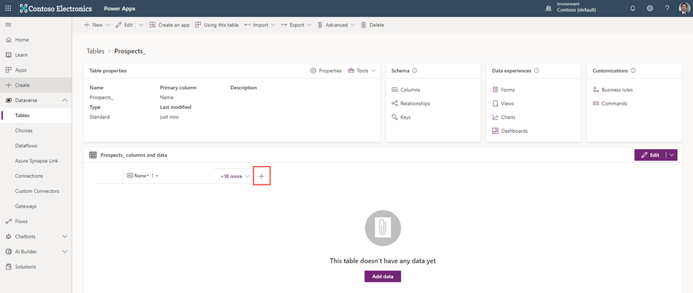
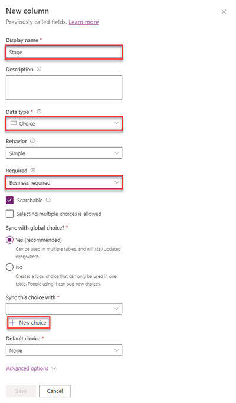
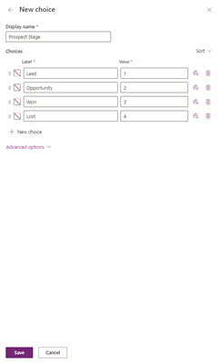
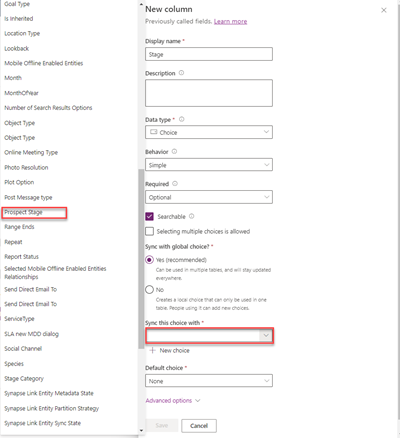
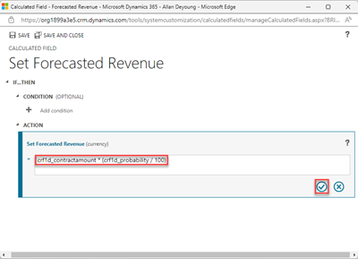
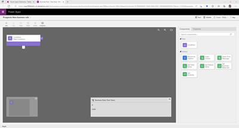
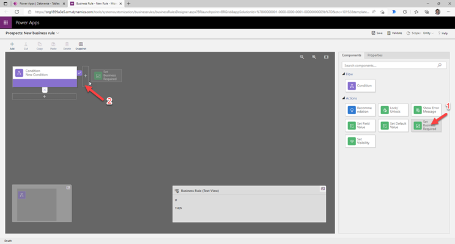
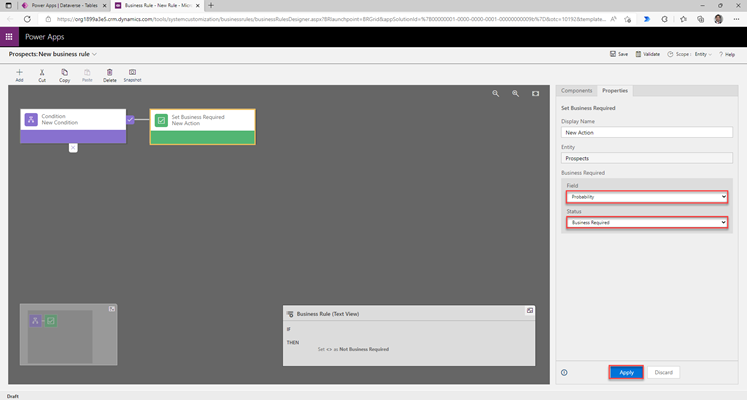

## Scenario

The current sales process for your company is manual and updates are only provided
each Friday. To simplify this process, minimize the opportunity for mistakes, and 
improve visibility, you have decided you want to create a new app to track sales 
leads and automatically calculate the forecasted revenue. You want Dataverse to store the list of potential customers. 

## Use Microsoft Dataverse to store data

In this exercise, you'll use Dataverse to store the list of potential 
customers for your app. 

### Creating a custom table

1. Go to the [Power Apps maker portal](https://make.powerapps.com/) and sign in (if required).
1. On the menu, expand **Dataverse** and select **tables**.
1. Select **New table**.
1. Under **Properties** enter the **Display name**: *Prospects*
1. Select **Primary column** and enter the **Display name**: *Prospect Name*
1. Select **Save**.
1. After a few moments the *Tables>Prospects* screen will appear. Select **+** to add a new column in the *Prospects columns and data* section.

	
1. In the *New column* pane, enter the following information:
	- **Display name**: *Stage*
	- **Data Type**: Select *Choice* (and select *Choice* from the popup)
	- **Required**: Select *Business required*

	
1. Under **Sync this choice with**, select **New choice**. The *New choice* pane will appear. Enter the following information and select **Save**.
	- **Display name**: *Prospect Stage*
	- Add the following choices under **Label**, selecting **New choice** between entries until your table looks like the screenshot below.  When completed select **Save**: 

		- **Lead** (under *Value* enter **1** . Subsequent entries will automatically number.)
		- **Opportunity**
		- **Won**
		- **Lost**		

	
1. Once you have saved your *New choice*, select the dropdown under **Sync this choice with** and find/select **Prospect Stage**.

	

1. Under **Default choice** select *Lead*
1. Select **Save**.
1. Select **+** in the *Prospects columns and data* pane to add a new column.
1. Enter the following information in the *New column* pane and then select **Save**.
	- **Display name**: *Contract Amount*
	- **Data Type**: *Currency*
1. Select **+** again to add a new column with the following information and then select **Save**.
	- **Display name**: *Probability*
	- **Data Type**: *Whole Number* (Select *Number* and then *Whole number* from the popup)
1. Add one more column with the following information and select **Save**.
	- **Display name**: *Forecasted Revenue*
	- **Data Type**: *Currency*
	- **Behavior**: *Calculated*

1. Next, we're going to edit the behavior our *Forecasted Revenue* column by selecting the column header and selecting **Edit Column** from the dropdown.
1. In the *Edit column* pane select the **Edit** button under *Behavior*.  A popup window will appear with the *Calculated Field - Set Forecasted Revenue* where you can add an *Action*. (If it doesn't appear the first time you select the **Edit** button, repeat steps 17 and 18 until it does.)
1. Under *Action* select **+ Add Action** and enter the following formula, but do not copy and paste. Type it in. Your column names won't be exactly the same as the example below since the **crXXX_** will be specific numbers and letters that define your environment. The formula entry will auto-suggest options as you start to type the column names.

	```crXXX_contractamount * (crXXX_probability / 100)```

	
1. Select the circled checkmark to save your changes. You may need to scroll right to see it.
1. Select **SAVE AND CLOSE** and the window disappears to reveal your Prospects Tables screen again.

### Add a business rule

1.	In the table designer find the *Customizations* pane on the far right and select **Business rules**.

1.	Select **+ New business rule** at the top of the screen; a new browser tab will open.

	
1.	Select the **Condition New Condition** from the design pane.
1.	In the right-hand pane, for **Field**, ensure that **Contract Amount** is selected.
1.	For the **Operator**, choose **Contains data**.
1.	Select **Apply**.
1.	In the right-hand pane, select the **Components** tab.
1.	Click and hold **Set Business Required** and drag to the plus symbol to the right of the purple checkbox in the design pane.

	
1.	With *Set Business Required New Action* selected/highlighted, in the right-hand pane, for **Field**, choose **Probability**.
1.	For the **Status**, choose **Business Required**.
1.	Select **Apply**.

	
1.	In the top left of the screen, select the dropdown next to **Prospects New business rule** and set the **Business rule name** to **Make Probability Required**.
1.	Select **Save** in top-right corner of screen.
1.	Select **Activate** to (also top-right of screen) activate the rule.
1.	Select **Activate** in the popup to confirm activation.
1.	Close the browser tab.
1.	Notice your new business rule has been added to the chart. Select **Prospects** to return to your table editing screen.

	

### Importing Data from an Excel file

You'll use the Excel spreadsheet named [Prospects](https://github.com/MicrosoftDocs/mslearn-developer-tools-power-platform/raw/master/power-apps/Prospects.zip) for this
exercise. Open the link and select the **Download** button and save it locally. 

1. Open the file. Notice the **Stage** column is empty. You'll need to look these up and enter them manually. 
1. You will need the Power Apps maker portal open; if you closed it, go to the [Power Apps maker portal](https://make.powerapps.com/) and sign in to Power Apps.
1. Go back to your Excel file and in the **Stage** column, enter the values as below:
	- **Contoso Flooring**: Won
	- **Fabrikam Inc**:  Won
	- **Adventure Works**: Lead
	- **VanArsdel**: Lost
	- **Adatum**: Lead
	- **Relecloud**: Opportunity
1. Save and close the Excel file.
1. Continue (or find) with the **Prospects** table.
1. Select the **Import** button at the top of the screen and select **Import data from Excel**.
   
   > [!NOTE]
   > If you receive an error when selecting the **Import data from Excel** option, then your Power Apps license does not allow for importing Excel data. 
1. Select **Upload** under the *File* entry field, locate the *Prospects* Excel file, and select **Open**. You will see an error notification under the column *Mapping Status* saying "Mapping errors exist".
1. Select **Map columns**.  Map the following **Prospect** columns to the associated Source values:
	- **Contract Amount**: *ContractAmount*
	- **Prospect Name**: *Name*
	- **Stage Value**: *Stage*
	- **Probability**: *Probability*
1. Select **Save Changes** at the top right of the screen. If successful, you will see a success notification under *Mapping status* saying "Mapping was successful".
1. Select **Import** at the top right of the screen. If successful, you will see a notification saying "Import completed successfully." Close the window by selecting **x** at the top right of the window.
1. Refresh your browser screen.
1. Ensure that the data has been successfully imported.

Congratulations! You have created a custom table with a business rule and imported from an Excel data source. Now you have an automated way to store your potential customers.
